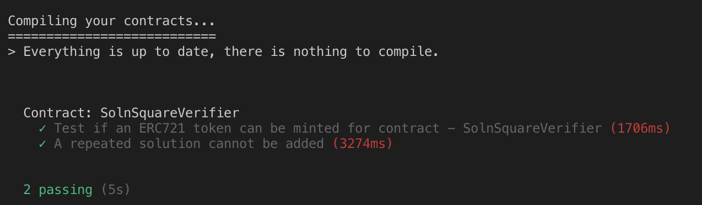

# Udacity Blockchain Capstone

The capstone will build upon the knowledge you have gained in the course in order to build a decentralized housing product. 

## Install

Clone this repository: ``` git clone https://github.com/kiyoasis/my_blockchain_capstone.git ```


To install, `npm install`


## Testing

First, in the terminal, run ganache-cli:
`ganache-cli`

In another terminal, change directory to eth-contracts by `cd eth-contracts`

Make sure that smart contracts can be compiled:
`truffle compile`

And then migrate the compiled contracts:
`truffle migrate`

Then, test each file:

`truffle test test/TestERC721Mintable.js`

`truffle test test/TestSquareVerifier.js`

`truffle test test/TestSolnSquareVerifier.js`

For example, the test cases of TestSolnSquareVerifier.js pass as follows:




## Renkeby Deployment

In the eth-contracts folder, deploy the contracts in the Rinkeby test network as
```
truffle migrate —-network rinkeby
```

It shows something like...
```

em19-nb1:eth-contracts knakayama$ truffle migrate --network rinkeby

Compiling your contracts...
===========================
> Compiling ./contracts/ERC721Mintable.sol
> Compiling ./contracts/Migrations.sol
> Compiling ./contracts/Oraclize.sol
> Compiling ./contracts/SolnSquareVerifier.sol
> Compiling ./contracts/SquareVerifier.sol
> Compiling ./contracts/Verifier.sol
> Compiling openzeppelin-solidity/contracts/drafts/Counters.sol
> Compiling openzeppelin-solidity/contracts/math/SafeMath.sol
> Compiling openzeppelin-solidity/contracts/token/ERC721/IERC721Receiver.sol
> Compiling openzeppelin-solidity/contracts/utils/Address.sol

    > compilation warnings encountered:

...

> Artifacts written to /Users/knakayama/git/udacity_blockchain/My-Blockchain-Capstone/eth-contracts/build/contracts
> Compiled successfully using:
   - solc: 0.5.7+commit.6da8b019.Emscripten.clang


Migrations dry-run (simulation)
===============================
> Network name:    'rinkeby-fork'
> Network id:      4
> Block gas limit: 0x6ab6ed


1_initial_migration.js
======================

   Deploying 'Migrations'
    ...
    ...

Summary
=======
> Total deployments:   3
> Final cost:          0.05709812 ETH

```

## Etherscan: Record of Transactions


### SquareVerifier contract address
0x65cE1B65781725ea5E511F65f381fb55D4615308
<!-- 0x245B84Aa41745Ad3de5F4005918f386d2D28e256 -->

https://rinkeby.etherscan.io/address/0x65cE1B65781725ea5E511F65f381fb55D4615308
<!-- 0x245B84Aa41745Ad3de5F4005918f386d2D28e256 -->


#### contract hash
0xdeeff81e9c9417c33c4efc08411b91e79e65d12165056f94e183faf4fe23dc3e
<!-- 0xa18a0d87d305710326107d48455d980a4e09c777d175f99556109595e89ebcad -->

https://rinkeby.etherscan.io/tx/0xdeeff81e9c9417c33c4efc08411b91e79e65d12165056f94e183faf4fe23dc3e
<!-- 0xa18a0d87d305710326107d48455d980a4e09c777d175f99556109595e89ebcad -->


### SolnSquareVerifier contract address
<!-- 0x31654cf800F64BF2f16d4231806F86cA766257A4 -->
0x15056286DAb7d2e59c5b95119803ea241078a945

https://rinkeby.etherscan.io/address/0x15056286DAb7d2e59c5b95119803ea241078a945
<!-- 0x31654cf800f64bf2f16d4231806f86ca766257a4 -->


#### contract hash
0xf008007aaf074fc44481ebbea55e05b8271f0b0d0852be557dc63ebb4b4b5041
<!-- 0x0c38247aa6eb17473621b772ccd040c5b66adc742f5298e5df663eedc1e0e75c -->

https://rinkeby.etherscan.io/tx/0xf008007aaf074fc44481ebbea55e05b8271f0b0d0852be557dc63ebb4b4b5041
<!-- 0x0c38247aa6eb17473621b772ccd040c5b66adc742f5298e5df663eedc1e0e75c -->

#### contract's ABI:
See below for Appendix.
<!--   -->


## Client App for Minting

<!-- Change directory: ```cd src```. 

Install hapi and inert just by:

```
npm install
``` -->

Run the server by:
```
node src/server.js
```

Access http://localhost:8080 and input necessary information.

The DApp User Interface when running should look like...

<!--  -->


In  order to mint 10 tokens, click the ```Mint 10 Tokens``` button on the UI.

Check the number of minted tokens by clicking `Get Balance`  button.

## OpenSea MarketPlace Storefront

Generated Opensea Marketplace: https://rinkeby.opensea.io/category/decentralizedhousingcapstoneprojectv2

To access an asset: `https://rinkeby.opensea.io/assets/<your_contract_address>/<token_id>`


### Listed 5 Properties

- Asset with Token ID 1: https://rinkeby.opensea.io/assets/0x15056286DAb7d2e59c5b95119803ea241078a945/1


- Asset with Token ID 2: https://rinkeby.opensea.io/assets/0x15056286dab7d2e59c5b95119803ea241078a945/2


- Asset with Token ID 3: https://rinkeby.opensea.io/assets/0x15056286dab7d2e59c5b95119803ea241078a945/3


- Asset with Token ID 4: https://rinkeby.opensea.io/assets/0x15056286dab7d2e59c5b95119803ea241078a945/4


- Asset with Token ID 5: https://rinkeby.opensea.io/assets/0x15056286dab7d2e59c5b95119803ea241078a945/5

For example, for the asset with token ID 5, this is the transaction:

https://rinkeby.etherscan.io/tx/0x0c971655794e1965643ca5e2815d53422956df795fb8688a232c1b55fa42a103

Ethers are transferred from 0x76b81A74a9ae629e767B4602319BA8531BBE13a8 to 0x59f275DCCf83e221Cde29cCE787708B764aFf1D8


# Project Resources

* [Remix - Solidity IDE](https://remix.ethereum.org/)
* [Visual Studio Code](https://code.visualstudio.com/)
* [Truffle Framework](https://truffleframework.com/)
* [Ganache - One Click Blockchain](https://truffleframework.com/ganache)
* [Open Zeppelin ](https://openzeppelin.org/)
* [Interactive zero knowledge 3-colorability demonstration](http://web.mit.edu/~ezyang/Public/graph/svg.html)
* [Docker](https://docs.docker.com/install/)
* [ZoKrates](https://github.com/Zokrates/ZoKrates)


# Appendix

SolnSquareVerifier contract's ABI: SolnSquareVerifier.json

```
{
  "contractName": "SolnSquareVerifier",
  "abi": [
    {
      "constant": true,
      "inputs": [
        {
          "name": "interfaceId",
          "type": "bytes4"
        }
      ],
      "name": "supportsInterface",
      "outputs": [
        {
          "name": "",
          "type": "bool"
        }
      ],
      "payable": false,
      "stateMutability": "view",
      "type": "function",
      "signature": "0x01ffc9a7"
    },
    {
      "constant": true,
      "inputs": [
        {
          "name": "tokenId",
          "type": "uint256"
        }
      ],
      "name": "getApproved",
      "outputs": [
        {
          "name": "",
          "type": "address"
        }
      ],
      "payable": false,
      "stateMutability": "view",
      "type": "function",
      "signature": "0x081812fc"
    },
    {
      "constant": false,
      "inputs": [
        {
          "name": "to",
          "type": "address"
        },
        {
          "name": "tokenId",
          "type": "uint256"
        }
      ],
      "name": "approve",
      "outputs": [],
      "payable": false,
      "stateMutability": "nonpayable",
      "type": "function",
      "signature": "0x095ea7b3"
    },
    {
      "constant": true,
      "inputs": [],
      "name": "getSymbol",
      "outputs": [
        {
          "name": "",
          "type": "string"
        }
      ],
      "payable": false,
      "stateMutability": "view",
      "type": "function",
      "signature": "0x15070401"
    },
    {
      "constant": true,
      "inputs": [],
      "name": "getName",
      "outputs": [
        {
          "name": "",
          "type": "string"
        }
      ],
      "payable": false,
      "stateMutability": "view",
      "type": "function",
      "signature": "0x17d7de7c"
    },
    {
      "constant": true,
      "inputs": [],
      "name": "totalSupply",
      "outputs": [
        {
          "name": "",
          "type": "uint256"
        }
      ],
      "payable": false,
      "stateMutability": "view",
      "type": "function",
      "signature": "0x18160ddd"
    },
    {
      "constant": false,
      "inputs": [
        {
          "name": "from",
          "type": "address"
        },
        {
          "name": "to",
          "type": "address"
        },
        {
          "name": "tokenId",
          "type": "uint256"
        }
      ],
      "name": "transferFrom",
      "outputs": [],
      "payable": false,
      "stateMutability": "nonpayable",
      "type": "function",
      "signature": "0x23b872dd"
    },
    {
      "constant": false,
      "inputs": [
        {
          "name": "_myid",
          "type": "bytes32"
        },
        {
          "name": "_result",
          "type": "string"
        }
      ],
      "name": "__callback",
      "outputs": [],
      "payable": false,
      "stateMutability": "nonpayable",
      "type": "function",
      "signature": "0x27dc297e"
    },
    {
      "constant": true,
      "inputs": [],
      "name": "verifier",
      "outputs": [
        {
          "name": "",
          "type": "address"
        }
      ],
      "payable": false,
      "stateMutability": "view",
      "type": "function",
      "signature": "0x2b7ac3f3"
    },
    {
      "constant": true,
      "inputs": [
        {
          "name": "owner",
          "type": "address"
        },
        {
          "name": "index",
          "type": "uint256"
        }
      ],
      "name": "tokenOfOwnerByIndex",
      "outputs": [
        {
          "name": "",
          "type": "uint256"
        }
      ],
      "payable": false,
      "stateMutability": "view",
      "type": "function",
      "signature": "0x2f745c59"
    },
    {
      "constant": false,
      "inputs": [
        {
          "name": "_myid",
          "type": "bytes32"
        },
        {
          "name": "_result",
          "type": "string"
        },
        {
          "name": "_proof",
          "type": "bytes"
        }
      ],
      "name": "__callback",
      "outputs": [],
      "payable": false,
      "stateMutability": "nonpayable",
      "type": "function",
      "signature": "0x38bbfa50"
    },
    {
      "constant": false,
      "inputs": [],
      "name": "unpause",
      "outputs": [],
      "payable": false,
      "stateMutability": "nonpayable",
      "type": "function",
      "signature": "0x3f4ba83a"
    },
    {
      "constant": false,
      "inputs": [
        {
          "name": "to",
          "type": "address"
        },
        {
          "name": "tokenId",
          "type": "uint256"
        }
      ],
      "name": "mint",
      "outputs": [
        {
          "name": "",
          "type": "bool"
        }
      ],
      "payable": false,
      "stateMutability": "nonpayable",
      "type": "function",
      "signature": "0x40c10f19"
    },
    {
      "constant": false,
      "inputs": [
        {
          "name": "from",
          "type": "address"
        },
        {
          "name": "to",
          "type": "address"
        },
        {
          "name": "tokenId",
          "type": "uint256"
        }
      ],
      "name": "safeTransferFrom",
      "outputs": [],
      "payable": false,
      "stateMutability": "nonpayable",
      "type": "function",
      "signature": "0x42842e0e"
    },
    {
      "constant": true,
      "inputs": [
        {
          "name": "index",
          "type": "uint256"
        }
      ],
      "name": "tokenByIndex",
      "outputs": [
        {
          "name": "",
          "type": "uint256"
        }
      ],
      "payable": false,
      "stateMutability": "view",
      "type": "function",
      "signature": "0x4f6ccce7"
    },
    {
      "constant": true,
      "inputs": [
        {
          "name": "tokenId",
          "type": "uint256"
        }
      ],
      "name": "ownerOf",
      "outputs": [
        {
          "name": "",
          "type": "address"
        }
      ],
      "payable": false,
      "stateMutability": "view",
      "type": "function",
      "signature": "0x6352211e"
    },
    {
      "constant": true,
      "inputs": [
        {
          "name": "owner",
          "type": "address"
        }
      ],
      "name": "balanceOf",
      "outputs": [
        {
          "name": "",
          "type": "uint256"
        }
      ],
      "payable": false,
      "stateMutability": "view",
      "type": "function",
      "signature": "0x70a08231"
    },
    {
      "constant": false,
      "inputs": [],
      "name": "pause",
      "outputs": [],
      "payable": false,
      "stateMutability": "nonpayable",
      "type": "function",
      "signature": "0x8456cb59"
    },
    {
      "constant": false,
      "inputs": [
        {
          "name": "to",
          "type": "address"
        },
        {
          "name": "approved",
          "type": "bool"
        }
      ],
      "name": "setApprovalForAll",
      "outputs": [],
      "payable": false,
      "stateMutability": "nonpayable",
      "type": "function",
      "signature": "0xa22cb465"
    },
    {
      "constant": true,
      "inputs": [],
      "name": "_owner",
      "outputs": [
        {
          "name": "",
          "type": "address"
        }
      ],
      "payable": false,
      "stateMutability": "view",
      "type": "function",
      "signature": "0xb2bdfa7b"
    },
    {
      "constant": false,
      "inputs": [
        {
          "name": "from",
          "type": "address"
        },
        {
          "name": "to",
          "type": "address"
        },
        {
          "name": "tokenId",
          "type": "uint256"
        },
        {
          "name": "_data",
          "type": "bytes"
        }
      ],
      "name": "safeTransferFrom",
      "outputs": [],
      "payable": false,
      "stateMutability": "nonpayable",
      "type": "function",
      "signature": "0xb88d4fde"
    },
    {
      "constant": true,
      "inputs": [],
      "name": "getBaseTokenURI",
      "outputs": [
        {
          "name": "",
          "type": "string"
        }
      ],
      "payable": false,
      "stateMutability": "view",
      "type": "function",
      "signature": "0xbdc32be0"
    },
    {
      "constant": true,
      "inputs": [
        {
          "name": "tokenId",
          "type": "uint256"
        }
      ],
      "name": "tokenURI",
      "outputs": [
        {
          "name": "",
          "type": "string"
        }
      ],
      "payable": false,
      "stateMutability": "view",
      "type": "function",
      "signature": "0xc87b56dd"
    },
    {
      "constant": true,
      "inputs": [
        {
          "name": "owner",
          "type": "address"
        },
        {
          "name": "operator",
          "type": "address"
        }
      ],
      "name": "isApprovedForAll",
      "outputs": [
        {
          "name": "",
          "type": "bool"
        }
      ],
      "payable": false,
      "stateMutability": "view",
      "type": "function",
      "signature": "0xe985e9c5"
    },
    {
      "constant": false,
      "inputs": [
        {
          "name": "newOwner",
          "type": "address"
        }
      ],
      "name": "transferOwnership",
      "outputs": [],
      "payable": false,
      "stateMutability": "nonpayable",
      "type": "function",
      "signature": "0xf2fde38b"
    },
    {
      "inputs": [
        {
          "name": "verifierAddress",
          "type": "address"
        }
      ],
      "payable": false,
      "stateMutability": "nonpayable",
      "type": "constructor",
      "signature": "constructor"
    },
    {
      "anonymous": false,
      "inputs": [
        {
          "indexed": false,
          "name": "addr",
          "type": "address"
        },
        {
          "indexed": false,
          "name": "tokenId",
          "type": "uint256"
        }
      ],
      "name": "SolutionAdded",
      "type": "event",
      "signature": "0x3a01cc868bdb36c1d9b8a262a8ad25064b23ac175b3f8e4453f1daf8ff6bac0d"
    },
    {
      "anonymous": false,
      "inputs": [
        {
          "indexed": true,
          "name": "from",
          "type": "address"
        },
        {
          "indexed": true,
          "name": "to",
          "type": "address"
        },
        {
          "indexed": true,
          "name": "tokenId",
          "type": "uint256"
        }
      ],
      "name": "Transfer",
      "type": "event",
      "signature": "0xddf252ad1be2c89b69c2b068fc378daa952ba7f163c4a11628f55a4df523b3ef"
    },
    {
      "anonymous": false,
      "inputs": [
        {
          "indexed": true,
          "name": "owner",
          "type": "address"
        },
        {
          "indexed": true,
          "name": "approved",
          "type": "address"
        },
        {
          "indexed": true,
          "name": "tokenId",
          "type": "uint256"
        }
      ],
      "name": "Approval",
      "type": "event",
      "signature": "0x8c5be1e5ebec7d5bd14f71427d1e84f3dd0314c0f7b2291e5b200ac8c7c3b925"
    },
    {
      "anonymous": false,
      "inputs": [
        {
          "indexed": true,
          "name": "owner",
          "type": "address"
        },
        {
          "indexed": true,
          "name": "operator",
          "type": "address"
        },
        {
          "indexed": false,
          "name": "approved",
          "type": "bool"
        }
      ],
      "name": "ApprovalForAll",
      "type": "event",
      "signature": "0x17307eab39ab6107e8899845ad3d59bd9653f200f220920489ca2b5937696c31"
    },
    {
      "anonymous": false,
      "inputs": [
        {
          "indexed": false,
          "name": "addr",
          "type": "address"
        }
      ],
      "name": "Paused",
      "type": "event",
      "signature": "0x62e78cea01bee320cd4e420270b5ea74000d11b0c9f74754ebdbfc544b05a258"
    },
    {
      "anonymous": false,
      "inputs": [
        {
          "indexed": false,
          "name": "addr",
          "type": "address"
        }
      ],
      "name": "Unpaused",
      "type": "event",
      "signature": "0x5db9ee0a495bf2e6ff9c91a7834c1ba4fdd244a5e8aa4e537bd38aeae4b073aa"
    },
    {
      "anonymous": false,
      "inputs": [
        {
          "indexed": false,
          "name": "newOwner",
          "type": "address"
        }
      ],
      "name": "ownerShipTransfered",
      "type": "event",
      "signature": "0xadb4af5322c8fb2ce1cc1aedd7c530fdab5e7f66897e6ab4b14ef8f0ae8d3c8d"
    },
    {
      "constant": false,
      "inputs": [
        {
          "name": "addr",
          "type": "address"
        },
        {
          "name": "tokenId",
          "type": "uint256"
        },
        {
          "name": "a",
          "type": "uint256[2]"
        },
        {
          "name": "a_p",
          "type": "uint256[2]"
        },
        {
          "name": "b",
          "type": "uint256[2][2]"
        },
        {
          "name": "b_p",
          "type": "uint256[2]"
        },
        {
          "name": "c",
          "type": "uint256[2]"
        },
        {
          "name": "c_p",
          "type": "uint256[2]"
        },
        {
          "name": "h",
          "type": "uint256[2]"
        },
        {
          "name": "k",
          "type": "uint256[2]"
        },
        {
          "name": "input",
          "type": "uint256[2]"
        }
      ],
      "name": "mintVerifiedTokenTo",
      "outputs": [],
      "payable": false,
      "stateMutability": "nonpayable",
      "type": "function",
      "signature": "0xe14941bd"
    }
  ],
  "bytecode": "0x60806040523480156200001157600080fd5b5060405160208062003eb7833981018060405260208110156200003357600080fd5b81019080805190602001909291905050506040518060400160405280600f81526020017f43617073746f6e6550726f6475637400000000000000000000000000000000008152506040518060400160405280600481526020017f54455354000000000000000000000000000000000000000000000000000000008152506040518060600160405280603f815260200162003e78603f9139336000806101000a81548173ffffffffffffffffffffffffffffffffffffffff021916908373ffffffffffffffffffffffffffffffffffffffff1602179055507fadb4af5322c8fb2ce1cc1aedd7c530fdab5e7f66897e6ab4b14ef8f0ae8d3c8d33604051808273ffffffffffffffffffffffffffffffffffffffff1673ffffffffffffffffffffffffffffffffffffffff16815260200191505060405180910390a160008060146101000a81548160ff021916908315150217905550620001c46301ffc9a77c01000000000000000000000000000000000000000000000000000000000262000311640100000000026401000000009004565b620002016380ac58cd7c01000000000000000000000000000000000000000000000000000000000262000311640100000000026401000000009004565b6200023e63780e9d637c01000000000000000000000000000000000000000000000000000000000262000311640100000000026401000000009004565b82600f908051906020019062000256929190620003cd565b5081601090805190602001906200026f929190620003cd565b50806011908051906020019062000288929190620003cd565b50620002c6635b5e139f7c01000000000000000000000000000000000000000000000000000000000262000311640100000000026401000000009004565b50505080601360006101000a81548173ffffffffffffffffffffffffffffffffffffffff021916908373ffffffffffffffffffffffffffffffffffffffff160217905550506200047c565b63ffffffff7c010000000000000000000000000000000000000000000000000000000002817bffffffffffffffffffffffffffffffffffffffffffffffffffffffff191614156200036157600080fd5b6001806000837bffffffffffffffffffffffffffffffffffffffffffffffffffffffff19167bffffffffffffffffffffffffffffffffffffffffffffffffffffffff1916815260200190815260200160002060006101000a81548160ff02191690831515021790555050565b828054600181600116156101000203166002900490600052602060002090601f016020900481019282601f106200041057805160ff191683800117855562000441565b8280016001018555821562000441579182015b828111156200044057825182559160200191906001019062000423565b5b50905062000450919062000454565b5090565b6200047991905b80821115620004755760008160009055506001016200045b565b5090565b90565b6139ec806200048c6000396000f3fe608060405234801561001057600080fd5b50600436106101ab576000357c01000000000000000000000000000000000000000000000000000000009004806342842e0e116100fb578063b2bdfa7b116100b4578063c87b56dd1161008e578063c87b56dd14610b42578063e14941bd14610be9578063e985e9c514610eb9578063f2fde38b14610f35576101ab565b8063b2bdfa7b14610970578063b88d4fde146109ba578063bdc32be014610abf576101ab565b806342842e0e146107a05780634f6ccce71461080e5780636352211e1461085057806370a08231146108be5780638456cb5914610916578063a22cb46514610920576101ab565b806323b872dd116101685780632f745c59116101425780632f745c591461057257806338bbfa50146105d45780633f4ba83a1461073057806340c10f191461073a576101ab565b806323b872dd146103f557806327dc297e146104635780632b7ac3f314610528576101ab565b806301ffc9a7146101b0578063081812fc14610215578063095ea7b31461028357806315070401146102d157806317d7de7c1461035457806318160ddd146103d7575b600080fd5b6101fb600480360360208110156101c657600080fd5b8101908080357bffffffffffffffffffffffffffffffffffffffffffffffffffffffff19169060200190929190505050610f79565b604051808215151515815260200191505060405180910390f35b6102416004803603602081101561022b57600080fd5b8101908080359060200190929190505050610fe1565b604051808273ffffffffffffffffffffffffffffffffffffffff1673ffffffffffffffffffffffffffffffffffffffff16815260200191505060405180910390f35b6102cf6004803603604081101561029957600080fd5b81019080803573ffffffffffffffffffffffffffffffffffffffff16906020019092919080359060200190929190505050611030565b005b6102d96112e4565b6040518080602001828103825283818151815260200191508051906020019080838360005b838110156103195780820151818401526020810190506102fe565b50505050905090810190601f1680156103465780820380516001836020036101000a031916815260200191505b509250505060405180910390f35b61035c611386565b6040518080602001828103825283818151815260200191508051906020019080838360005b8381101561039c578082015181840152602081019050610381565b50505050905090810190601f1680156103c95780820380516001836020036101000a031916815260200191505b509250505060405180910390f35b6103df611428565b6040518082815260200191505060405180910390f35b6104616004803603606081101561040b57600080fd5b81019080803573ffffffffffffffffffffffffffffffffffffffff169060200190929190803573ffffffffffffffffffffffffffffffffffffffff16906020019092919080359060200190929190505050611435565b005b6105266004803603604081101561047957600080fd5b8101908080359060200190929190803590602001906401000000008111156104a057600080fd5b8201836020820111156104b257600080fd5b803590602001918460018302840111640100000000831117156104d457600080fd5b91908080601f016020809104026020016040519081016040528093929190818152602001838380828437600081840152601f19601f820116905080830192505050505050509192919290505050611458565b005b61053061149b565b604051808273ffffffffffffffffffffffffffffffffffffffff1673ffffffffffffffffffffffffffffffffffffffff16815260200191505060405180910390f35b6105be6004803603604081101561058857600080fd5b81019080803573ffffffffffffffffffffffffffffffffffffffff169060200190929190803590602001909291905050506114c1565b6040518082815260200191505060405180910390f35b61072e600480360360608110156105ea57600080fd5b81019080803590602001909291908035906020019064010000000081111561061157600080fd5b82018360208201111561062357600080fd5b8035906020019184600183028401116401000000008311171561064557600080fd5b91908080601f016020809104026020016040519081016040528093929190818152602001838380828437600081840152601f19601f820116905080830192505050505050509192919290803590602001906401000000008111156106a857600080fd5b8201836020820111156106ba57600080fd5b803590602001918460018302840111640100000000831117156106dc57600080fd5b91908080601f016020809104026020016040519081016040528093929190818152602001838380828437600081840152601f19601f820116905080830192505050505050509192919290505050611534565b005b610738611539565b005b6107866004803603604081101561075057600080fd5b81019080803573ffffffffffffffffffffffffffffffffffffffff169060200190929190803590602001909291905050506116df565b604051808215151515815260200191505060405180910390f35b61080c600480360360608110156107b657600080fd5b81019080803573ffffffffffffffffffffffffffffffffffffffff169060200190929190803573ffffffffffffffffffffffffffffffffffffffff169060200190929190803590602001909291905050506117a3565b005b61083a6004803603602081101561082457600080fd5b81019080803590602001909291905050506117c3565b6040518082815260200191505060405180910390f35b61087c6004803603602081101561086657600080fd5b81019080803590602001909291905050506117f7565b604051808273ffffffffffffffffffffffffffffffffffffffff1673ffffffffffffffffffffffffffffffffffffffff16815260200191505060405180910390f35b610900600480360360208110156108d457600080fd5b81019080803573ffffffffffffffffffffffffffffffffffffffff169060200190929190505050611834565b6040518082815260200191505060405180910390f35b61091e61190c565b005b61096e6004803603604081101561093657600080fd5b81019080803573ffffffffffffffffffffffffffffffffffffffff169060200190929190803515159060200190929190505050611ab4565b005b610978611bee565b604051808273ffffffffffffffffffffffffffffffffffffffff1673ffffffffffffffffffffffffffffffffffffffff16815260200191505060405180910390f35b610abd600480360360808110156109d057600080fd5b81019080803573ffffffffffffffffffffffffffffffffffffffff169060200190929190803573ffffffffffffffffffffffffffffffffffffffff1690602001909291908035906020019092919080359060200190640100000000811115610a3757600080fd5b820183602082011115610a4957600080fd5b80359060200191846001830284011164010000000083111715610a6b57600080fd5b91908080601f016020809104026020016040519081016040528093929190818152602001838380828437600081840152601f19601f820116905080830192505050505050509192919290505050611c13565b005b610ac7611c39565b6040518080602001828103825283818151815260200191508051906020019080838360005b83811015610b07578082015181840152602081019050610aec565b50505050905090810190601f168015610b345780820380516001836020036101000a031916815260200191505b509250505060405180910390f35b610b6e60048036036020811015610b5857600080fd5b8101908080359060200190929190505050611cdb565b6040518080602001828103825283818151815260200191508051906020019080838360005b83811015610bae578082015181840152602081019050610b93565b50505050905090810190601f168015610bdb5780820380516001836020036101000a031916815260200191505b509250505060405180910390f35b610eb760048036036102c0811015610c0057600080fd5b81019080803573ffffffffffffffffffffffffffffffffffffffff1690602001909291908035906020019092919080604001906002806020026040519081016040528092919082600260200280828437600081840152601f19601f820116905080830192505050505050919291929080604001906002806020026040519081016040528092919082600260200280828437600081840152601f19601f82011690508083019250505050505091929192908060800190600280602002604051908101604052809291906000905b82821015610d20578382604002016002806020026040519081016040528092919082600260200280828437600081840152601f19601f82011690508083019250505050505081526020019060010190610ccc565b50505050919291929080604001906002806020026040519081016040528092919082600260200280828437600081840152601f19601f820116905080830192505050505050919291929080604001906002806020026040519081016040528092919082600260200280828437600081840152601f19601f820116905080830192505050505050919291929080604001906002806020026040519081016040528092919082600260200280828437600081840152601f19601f820116905080830192505050505050919291929080604001906002806020026040519081016040528092919082600260200280828437600081840152601f19601f820116905080830192505050505050919291929080604001906002806020026040519081016040528092919082600260200280828437600081840152601f19601f820116905080830192505050505050919291929080604001906002806020026040519081016040528092919082600260200280828437600081840152601f19601f8201169050808301925050505050509192919290505050611da2565b005b610f1b60048036036040811015610ecf57600080fd5b81019080803573ffffffffffffffffffffffffffffffffffffffff169060200190929190803573ffffffffffffffffffffffffffffffffffffffff1690602001909291905050506121d5565b604051808215151515815260200191505060405180910390f35b610f7760048036036020811015610f4b57600080fd5b81019080803573ffffffffffffffffffffffffffffffffffffffff169060200190929190505050612269565b005b600060016000837bffffffffffffffffffffffffffffffffffffffffffffffffffffffff19167bffffffffffffffffffffffffffffffffffffffffffffffffffffffff1916815260200190815260200160002060009054906101000a900460ff169050919050565b6000610fec8261243a565b610ff557600080fd5b6003600083815260200190815260200160002060009054906101000a900473ffffffffffffffffffffffffffffffffffffffff169050919050565b6002600082815260200190815260200160002060009054906101000a900473ffffffffffffffffffffffffffffffffffffffff1673ffffffffffffffffffffffffffffffffffffffff168273ffffffffffffffffffffffffffffffffffffffff1614156110e8576040517f08c379a000000000000000000000000000000000000000000000000000000000815260040180806020018281038252602981526020018061396d6029913960400191505060405180910390fd5b6002600082815260200190815260200160002060009054906101000a900473ffffffffffffffffffffffffffffffffffffffff1673ffffffffffffffffffffffffffffffffffffffff163373ffffffffffffffffffffffffffffffffffffffff16148061118e575061118d6002600083815260200190815260200160002060009054906101000a900473ffffffffffffffffffffffffffffffffffffffff16336121d5565b5b611200576040517f08c379a000000000000000000000000000000000000000000000000000000000815260040180806020018281038252600c8152602001807f4e6f7420617070726f766564000000000000000000000000000000000000000081525060200191505060405180910390fd5b816003600083815260200190815260200160002060006101000a81548173ffffffffffffffffffffffffffffffffffffffff021916908373ffffffffffffffffffffffffffffffffffffffff160217905550808273ffffffffffffffffffffffffffffffffffffffff166002600084815260200190815260200160002060009054906101000a900473ffffffffffffffffffffffffffffffffffffffff1673ffffffffffffffffffffffffffffffffffffffff167f8c5be1e5ebec7d5bd14f71427d1e84f3dd0314c0f7b2291e5b200ac8c7c3b92560405160405180910390a45050565b606060108054600181600116156101000203166002900480601f01602080910402602001604051908101604052809291908181526020018280546001816001161561010002031660029004801561137c5780601f106113515761010080835404028352916020019161137c565b820191906000526020600020905b81548152906001019060200180831161135f57829003601f168201915b5050505050905090565b6060600f8054600181600116156101000203166002900480601f01602080910402602001604051908101604052809291908181526020018280546001816001161561010002031660029004801561141e5780601f106113f35761010080835404028352916020019161141e565b820191906000526020600020905b81548152906001019060200180831161140157829003601f168201915b5050505050905090565b6000600880549050905090565b61143f33826124ac565b61144857600080fd5b611453838383612541565b505050565b611497828260006040519080825280601f01601f1916602001820160405280156114915781602001600182028038833980820191505090505b50611534565b5050565b601360009054906101000a900473ffffffffffffffffffffffffffffffffffffffff1681565b60006114cc83611834565b82106114d757600080fd5b600660008473ffffffffffffffffffffffffffffffffffffffff1673ffffffffffffffffffffffffffffffffffffffff168152602001908152602001600020828154811061152157fe5b9060005260206000200154905092915050565b505050565b6000809054906101000a900473ffffffffffffffffffffffffffffffffffffffff1673ffffffffffffffffffffffffffffffffffffffff163373ffffffffffffffffffffffffffffffffffffffff16146115de576040517f08c379a00000000000000000000000000000000000000000000000000000000081526004018080602001828103825260258152602001806139486025913960400191505060405180910390fd5b600060149054906101000a900460ff16611660576040517f08c379a00000000000000000000000000000000000000000000000000000000081526004018080602001828103825260198152602001807f436f6e74726163742073686f756c64206265207061757365640000000000000081525060200191505060405180910390fd5b60008060146101000a81548160ff0219169083151502179055507f5db9ee0a495bf2e6ff9c91a7834c1ba4fdd244a5e8aa4e537bd38aeae4b073aa33604051808273ffffffffffffffffffffffffffffffffffffffff1673ffffffffffffffffffffffffffffffffffffffff16815260200191505060405180910390a1565b60008060009054906101000a900473ffffffffffffffffffffffffffffffffffffffff1673ffffffffffffffffffffffffffffffffffffffff163373ffffffffffffffffffffffffffffffffffffffff1614611786576040517f08c379a00000000000000000000000000000000000000000000000000000000081526004018080602001828103825260258152602001806139486025913960400191505060405180910390fd5b6117908383612565565b61179982612586565b6001905092915050565b6117be83838360405180602001604052806000815250611c13565b505050565b60006117cd611428565b82106117d857600080fd5b600882815481106117e557fe5b90600052602060002001549050919050565b60006002600083815260200190815260200160002060009054906101000a900473ffffffffffffffffffffffffffffffffffffffff169050919050565b600081600073ffffffffffffffffffffffffffffffffffffffff168173ffffffffffffffffffffffffffffffffffffffff1614156118bd576040517f08c379a00000000000000000000000000000000000000000000000000000000081526004018080602001828103825260288152602001806139206028913960400191505060405180910390fd5b611904600460008573ffffffffffffffffffffffffffffffffffffffff1673ffffffffffffffffffffffffffffffffffffffff16815260200190815260200160002061266e565b915050919050565b6000809054906101000a900473ffffffffffffffffffffffffffffffffffffffff1673ffffffffffffffffffffffffffffffffffffffff163373ffffffffffffffffffffffffffffffffffffffff16146119b1576040517f08c379a00000000000000000000000000000000000000000000000000000000081526004018080602001828103825260258152602001806139486025913960400191505060405180910390fd5b600060149054906101000a900460ff1615611a34576040517f08c379a000000000000000000000000000000000000000000000000000000000815260040180806020018281038252601d8152602001807f436f6e74726163742073686f756c64206e6f742062652070617573656400000081525060200191505060405180910390fd5b6001600060146101000a81548160ff0219169083151502179055507f62e78cea01bee320cd4e420270b5ea74000d11b0c9f74754ebdbfc544b05a25833604051808273ffffffffffffffffffffffffffffffffffffffff1673ffffffffffffffffffffffffffffffffffffffff16815260200191505060405180910390a1565b3373ffffffffffffffffffffffffffffffffffffffff168273ffffffffffffffffffffffffffffffffffffffff161415611aed57600080fd5b80600560003373ffffffffffffffffffffffffffffffffffffffff1673ffffffffffffffffffffffffffffffffffffffff16815260200190815260200160002060008473ffffffffffffffffffffffffffffffffffffffff1673ffffffffffffffffffffffffffffffffffffffff16815260200190815260200160002060006101000a81548160ff0219169083151502179055508173ffffffffffffffffffffffffffffffffffffffff163373ffffffffffffffffffffffffffffffffffffffff167f17307eab39ab6107e8899845ad3d59bd9653f200f220920489ca2b5937696c3183604051808215151515815260200191505060405180910390a35050565b6000809054906101000a900473ffffffffffffffffffffffffffffffffffffffff1681565b611c1e848484611435565b611c2a8484848461267c565b611c3357600080fd5b50505050565b606060118054600181600116156101000203166002900480601f016020809104026020016040519081016040528092919081815260200182805460018160011615610100020316600290048015611cd15780601f10611ca657610100808354040283529160200191611cd1565b820191906000526020600020905b815481529060010190602001808311611cb457829003601f168201915b5050505050905090565b6060611ce68261243a565b611cef57600080fd5b601260008381526020019081526020016000208054600181600116156101000203166002900480601f016020809104026020016040519081016040528092919081815260200182805460018160011615610100020316600290048015611d965780601f10611d6b57610100808354040283529160200191611d96565b820191906000526020600020905b815481529060010190602001808311611d7957829003601f168201915b50505050509050919050565b601360009054906101000a900473ffffffffffffffffffffffffffffffffffffffff1673ffffffffffffffffffffffffffffffffffffffff1663fe01ff628a8a8a8a8a8a8a8a8a6040518a63ffffffff167c0100000000000000000000000000000000000000000000000000000000028152600401808a600260200280838360005b83811015611e3f578082015181840152602081019050611e24565b5050505090500189600260200280838360005b83811015611e6d578082015181840152602081019050611e52565b505050509050018860026000925b81841015611ec15782846020020151600260200280838360005b83811015611eb0578082015181840152602081019050611e95565b505050509050019260010192611e7b565b9250505087600260200280838360005b83811015611eec578082015181840152602081019050611ed1565b5050505090500186600260200280838360005b83811015611f1a578082015181840152602081019050611eff565b5050505090500185600260200280838360005b83811015611f48578082015181840152602081019050611f2d565b5050505090500184600260200280838360005b83811015611f76578082015181840152602081019050611f5b565b5050505090500183600260200280838360005b83811015611fa4578082015181840152602081019050611f89565b5050505090500182600260200280838360005b83811015611fd2578082015181840152602081019050611fb7565b505050509050019950505050505050505050602060405180830381600087803b158015611ffe57600080fd5b505af1158015612012573d6000803e3d6000fd5b505050506040513d602081101561202857600080fd5b81019080805190602001909291905050506120ab576040517f08c379a00000000000000000000000000000000000000000000000000000000081526004018080602001828103825260128152602001807f536f6c7574696f6e206e6f742076616c6964000000000000000000000000000081525060200191505060405180910390fd5b6000898887846040516020018085600260200280838360005b838110156120df5780820151818401526020810190506120c4565b505050509050018460026000925b818410156121335782846020020151600260200280838360005b83811015612122578082015181840152602081019050612107565b5050505090500192600101926120ed565b9250505083600260200280838360005b8381101561215e578082015181840152602081019050612143565b5050505090500182600260200280838360005b8381101561218c578082015181840152602081019050612171565b505050509050019450505050506040516020818303038152906040528051906020012090506121bc818d8d61289d565b6121c68c8c6116df565b50505050505050505050505050565b6000600560008473ffffffffffffffffffffffffffffffffffffffff1673ffffffffffffffffffffffffffffffffffffffff16815260200190815260200160002060008373ffffffffffffffffffffffffffffffffffffffff1673ffffffffffffffffffffffffffffffffffffffff16815260200190815260200160002060009054906101000a900460ff16905092915050565b6000809054906101000a900473ffffffffffffffffffffffffffffffffffffffff1673ffffffffffffffffffffffffffffffffffffffff163373ffffffffffffffffffffffffffffffffffffffff161461230e576040517f08c379a00000000000000000000000000000000000000000000000000000000081526004018080602001828103825260258152602001806139486025913960400191505060405180910390fd5b600073ffffffffffffffffffffffffffffffffffffffff168173ffffffffffffffffffffffffffffffffffffffff161415612394576040517f08c379a00000000000000000000000000000000000000000000000000000000081526004018080602001828103825260248152602001806138fc6024913960400191505060405180910390fd5b806000806101000a81548173ffffffffffffffffffffffffffffffffffffffff021916908373ffffffffffffffffffffffffffffffffffffffff1602179055507fadb4af5322c8fb2ce1cc1aedd7c530fdab5e7f66897e6ab4b14ef8f0ae8d3c8d81604051808273ffffffffffffffffffffffffffffffffffffffff1673ffffffffffffffffffffffffffffffffffffffff16815260200191505060405180910390a150565b6000806002600084815260200190815260200160002060009054906101000a900473ffffffffffffffffffffffffffffffffffffffff169050600073ffffffffffffffffffffffffffffffffffffffff168173ffffffffffffffffffffffffffffffffffffffff161415915050919050565b6000806124b8836117f7565b90508073ffffffffffffffffffffffffffffffffffffffff168473ffffffffffffffffffffffffffffffffffffffff16148061252757508373ffffffffffffffffffffffffffffffffffffffff1661250f84610fe1565b73ffffffffffffffffffffffffffffffffffffffff16145b80612538575061253781856121d5565b5b91505092915050565b61254c83838361297d565b6125568382612c8d565b6125608282612e2b565b505050565b61256f8282612ef2565b6125798282612e2b565b61258281613127565b5050565b61258f8161243a565b61259857600080fd5b61264460118054600181600116156101000203166002900480601f0160208091040260200160405190810160405280929190818152602001828054600181600116156101000203166002900480156126315780601f1061260657610100808354040283529160200191612631565b820191906000526020600020905b81548152906001019060200180831161261457829003601f168201915b505050505061263f83613173565b6132bf565b60126000838152602001908152602001600020908051906020019061266a92919061382a565b5050565b600081600001549050919050565b600061269d8473ffffffffffffffffffffffffffffffffffffffff16613303565b6126aa5760019050612895565b60008473ffffffffffffffffffffffffffffffffffffffff1663150b7a02338887876040518563ffffffff167c0100000000000000000000000000000000000000000000000000000000028152600401808573ffffffffffffffffffffffffffffffffffffffff1673ffffffffffffffffffffffffffffffffffffffff1681526020018473ffffffffffffffffffffffffffffffffffffffff1673ffffffffffffffffffffffffffffffffffffffff16815260200183815260200180602001828103825283818151815260200191508051906020019080838360005b838110156127a1578082015181840152602081019050612786565b50505050905090810190601f1680156127ce5780820380516001836020036101000a031916815260200191505b5095505050505050602060405180830381600087803b1580156127f057600080fd5b505af1158015612804573d6000803e3d6000fd5b505050506040513d602081101561281a57600080fd5b8101908080519060200190929190505050905063150b7a027c0100000000000000000000000000000000000000000000000000000000027bffffffffffffffffffffffffffffffffffffffffffffffffffffffff1916817bffffffffffffffffffffffffffffffffffffffffffffffffffffffff1916149150505b949350505050565b816015600085815260200190815260200160002060010160006101000a81548173ffffffffffffffffffffffffffffffffffffffff021916908373ffffffffffffffffffffffffffffffffffffffff1602179055508060156000858152602001908152602001600020600001819055507f3a01cc868bdb36c1d9b8a262a8ad25064b23ac175b3f8e4453f1daf8ff6bac0d8282604051808373ffffffffffffffffffffffffffffffffffffffff1673ffffffffffffffffffffffffffffffffffffffff1681526020018281526020019250505060405180910390a1505050565b81600073ffffffffffffffffffffffffffffffffffffffff168173ffffffffffffffffffffffffffffffffffffffff161415612a04576040517f08c379a00000000000000000000000000000000000000000000000000000000081526004018080602001828103825260288152602001806139206028913960400191505060405180910390fd5b83600073ffffffffffffffffffffffffffffffffffffffff168173ffffffffffffffffffffffffffffffffffffffff161415612a8b576040517f08c379a00000000000000000000000000000000000000000000000000000000081526004018080602001828103825260288152602001806139206028913960400191505060405180910390fd5b8473ffffffffffffffffffffffffffffffffffffffff166002600085815260200190815260200160002060009054906101000a900473ffffffffffffffffffffffffffffffffffffffff1673ffffffffffffffffffffffffffffffffffffffff1614612b42576040517f08c379a000000000000000000000000000000000000000000000000000000000815260040180806020018281038252602b815260200180613996602b913960400191505060405180910390fd5b612b4b83613316565b612b92600460008773ffffffffffffffffffffffffffffffffffffffff1673ffffffffffffffffffffffffffffffffffffffff1681526020019081526020016000206133d4565b612bd9600460008673ffffffffffffffffffffffffffffffffffffffff1673ffffffffffffffffffffffffffffffffffffffff1681526020019081526020016000206133f7565b836002600085815260200190815260200160002060006101000a81548173ffffffffffffffffffffffffffffffffffffffff021916908373ffffffffffffffffffffffffffffffffffffffff160217905550828473ffffffffffffffffffffffffffffffffffffffff168673ffffffffffffffffffffffffffffffffffffffff167fddf252ad1be2c89b69c2b068fc378daa952ba7f163c4a11628f55a4df523b3ef60405160405180910390a45050505050565b6000612ce56001600660008673ffffffffffffffffffffffffffffffffffffffff1673ffffffffffffffffffffffffffffffffffffffff1681526020019081526020016000208054905061340d90919063ffffffff16565b9050600060076000848152602001908152602001600020549050818114612dd2576000600660008673ffffffffffffffffffffffffffffffffffffffff1673ffffffffffffffffffffffffffffffffffffffff1681526020019081526020016000208381548110612d5257fe5b9060005260206000200154905080600660008773ffffffffffffffffffffffffffffffffffffffff1673ffffffffffffffffffffffffffffffffffffffff1681526020019081526020016000208381548110612daa57fe5b9060005260206000200181905550816007600083815260200190815260200160002081905550505b600660008573ffffffffffffffffffffffffffffffffffffffff1673ffffffffffffffffffffffffffffffffffffffff168152602001908152602001600020805480919060019003612e2491906138aa565b5050505050565b600660008373ffffffffffffffffffffffffffffffffffffffff1673ffffffffffffffffffffffffffffffffffffffff168152602001908152602001600020805490506007600083815260200190815260200160002081905550600660008373ffffffffffffffffffffffffffffffffffffffff1673ffffffffffffffffffffffffffffffffffffffff1681526020019081526020016000208190806001815401808255809150509060018203906000526020600020016000909192909190915055505050565b81600073ffffffffffffffffffffffffffffffffffffffff168173ffffffffffffffffffffffffffffffffffffffff161415612f79576040517f08c379a00000000000000000000000000000000000000000000000000000000081526004018080602001828103825260288152602001806139206028913960400191505060405180910390fd5b612f828261243a565b15612ff5576040517f08c379a00000000000000000000000000000000000000000000000000000000081526004018080602001828103825260168152602001807f746f6b656e496420616c7265616479206578697374730000000000000000000081525060200191505060405180910390fd5b60006002600084815260200190815260200160002060009054906101000a900473ffffffffffffffffffffffffffffffffffffffff169050836002600085815260200190815260200160002060006101000a81548173ffffffffffffffffffffffffffffffffffffffff021916908373ffffffffffffffffffffffffffffffffffffffff1602179055506130c6600460008673ffffffffffffffffffffffffffffffffffffffff1673ffffffffffffffffffffffffffffffffffffffff1681526020019081526020016000206133f7565b828473ffffffffffffffffffffffffffffffffffffffff168273ffffffffffffffffffffffffffffffffffffffff167fddf252ad1be2c89b69c2b068fc378daa952ba7f163c4a11628f55a4df523b3ef60405160405180910390a450505050565b6008805490506009600083815260200190815260200160002081905550600881908060018154018082558091505090600182039060005260206000200160009091929091909150555050565b606060008214156131bb576040518060400160405280600181526020017f300000000000000000000000000000000000000000000000000000000000000081525090506132ba565b600082905060005b600082146131e5578080600101915050600a82816131dd57fe5b0491506131c3565b6060816040519080825280601f01601f19166020018201604052801561321a5781602001600182028038833980820191505090505b50905060006001830390505b600086146132b257600a868161323857fe5b066030017f0100000000000000000000000000000000000000000000000000000000000000028282806001900393508151811061327157fe5b60200101907effffffffffffffffffffffffffffffffffffffffffffffffffffffffffffff1916908160001a905350600a86816132aa57fe5b049550613226565b819450505050505b919050565b60606132fb838360405180602001604052806000815250604051806020016040528060008152506040518060200160405280600081525061342d565b905092915050565b600080823b905060008111915050919050565b600073ffffffffffffffffffffffffffffffffffffffff166003600083815260200190815260200160002060009054906101000a900473ffffffffffffffffffffffffffffffffffffffff1673ffffffffffffffffffffffffffffffffffffffff16146133d15760006003600083815260200190815260200160002060006101000a81548173ffffffffffffffffffffffffffffffffffffffff021916908373ffffffffffffffffffffffffffffffffffffffff1602179055505b50565b6133ec6001826000015461340d90919063ffffffff16565b816000018190555050565b6001816000016000828254019250508190555050565b60008282111561341c57600080fd5b600082840390508091505092915050565b6060808690506060869050606086905060608690506060869050606081518351855187518951010101016040519080825280601f01601f1916602001820160405280156134895781602001600182028038833980820191505090505b509050606081905060008090506000809050600090505b885181101561354d578881815181106134b557fe5b60200101517f010000000000000000000000000000000000000000000000000000000000000090047f01000000000000000000000000000000000000000000000000000000000000000283838060010194508151811061351157fe5b60200101907effffffffffffffffffffffffffffffffffffffffffffffffffffffffffffff1916908160001a90535080806001019150506134a0565b600090505b87518110156135ff5787818151811061356757fe5b60200101517f010000000000000000000000000000000000000000000000000000000000000090047f0100000000000000000000000000000000000000000000000000000000000000028383806001019450815181106135c357fe5b60200101907effffffffffffffffffffffffffffffffffffffffffffffffffffffffffffff1916908160001a9053508080600101915050613552565b600090505b86518110156136b15786818151811061361957fe5b60200101517f010000000000000000000000000000000000000000000000000000000000000090047f01000000000000000000000000000000000000000000000000000000000000000283838060010194508151811061367557fe5b60200101907effffffffffffffffffffffffffffffffffffffffffffffffffffffffffffff1916908160001a9053508080600101915050613604565b600090505b8551811015613763578581815181106136cb57fe5b60200101517f010000000000000000000000000000000000000000000000000000000000000090047f01000000000000000000000000000000000000000000000000000000000000000283838060010194508151811061372757fe5b60200101907effffffffffffffffffffffffffffffffffffffffffffffffffffffffffffff1916908160001a90535080806001019150506136b6565b600090505b84518110156138155784818151811061377d57fe5b60200101517f010000000000000000000000000000000000000000000000000000000000000090047f0100000000000000000000000000000000000000000000000000000000000000028383806001019450815181106137d957fe5b60200101907effffffffffffffffffffffffffffffffffffffffffffffffffffffffffffff1916908160001a9053508080600101915050613768565b82995050505050505050505095945050505050565b828054600181600116156101000203166002900490600052602060002090601f016020900481019282601f1061386b57805160ff1916838001178555613899565b82800160010185558215613899579182015b8281111561389857825182559160200191906001019061387d565b5b5090506138a691906138d6565b5090565b8154818355818111156138d1578183600052602060002091820191016138d091906138d6565b5b505050565b6138f891905b808211156138f45760008160009055506001016138dc565b5090565b9056fe6e65772061646472657373206d75737420626520612076616c696420616464726573732e41646472657373206973206e6f7420612076616c6964206f72206e6f742072656769737465726564546865722073656e646572206973206e6f742074686520636f6e7472616374206f776e6572476976656e206164647265737320697320746865206f776e6572206f662074686520746f6b656e496441646472657373206973206e6f7420746865206f776e6572206f662074686520676976656e20746f6b656ea165627a7a723058205894e543dfedad588bfe562dc42531e06ebb60a77a33fbf4732c916efa7fd6c1002968747470733a2f2f73332d75732d776573742d322e616d617a6f6e6177732e636f6d2f756461636974792d626c6f636b636861696e2f63617073746f6e652f",
  "deployedBytecode": "0x608060405234801561001057600080fd5b50600436106101ab576000357c01000000000000000000000000000000000000000000000000000000009004806342842e0e116100fb578063b2bdfa7b116100b4578063c87b56dd1161008e578063c87b56dd14610b42578063e14941bd14610be9578063e985e9c514610eb9578063f2fde38b14610f35576101ab565b8063b2bdfa7b14610970578063b88d4fde146109ba578063bdc32be014610abf576101ab565b806342842e0e146107a05780634f6ccce71461080e5780636352211e1461085057806370a08231146108be5780638456cb5914610916578063a22cb46514610920576101ab565b806323b872dd116101685780632f745c59116101425780632f745c591461057257806338bbfa50146105d45780633f4ba83a1461073057806340c10f191461073a576101ab565b806323b872dd146103f557806327dc297e146104635780632b7ac3f314610528576101ab565b806301ffc9a7146101b0578063081812fc14610215578063095ea7b31461028357806315070401146102d157806317d7de7c1461035457806318160ddd146103d7575b600080fd5b6101fb600480360360208110156101c657600080fd5b8101908080357bffffffffffffffffffffffffffffffffffffffffffffffffffffffff19169060200190929190505050610f79565b604051808215151515815260200191505060405180910390f35b6102416004803603602081101561022b57600080fd5b8101908080359060200190929190505050610fe1565b604051808273ffffffffffffffffffffffffffffffffffffffff1673ffffffffffffffffffffffffffffffffffffffff16815260200191505060405180910390f35b6102cf6004803603604081101561029957600080fd5b81019080803573ffffffffffffffffffffffffffffffffffffffff16906020019092919080359060200190929190505050611030565b005b6102d96112e4565b6040518080602001828103825283818151815260200191508051906020019080838360005b838110156103195780820151818401526020810190506102fe565b50505050905090810190601f1680156103465780820380516001836020036101000a031916815260200191505b509250505060405180910390f35b61035c611386565b6040518080602001828103825283818151815260200191508051906020019080838360005b8381101561039c578082015181840152602081019050610381565b50505050905090810190601f1680156103c95780820380516001836020036101000a031916815260200191505b509250505060405180910390f35b6103df611428565b6040518082815260200191505060405180910390f35b6104616004803603606081101561040b57600080fd5b81019080803573ffffffffffffffffffffffffffffffffffffffff169060200190929190803573ffffffffffffffffffffffffffffffffffffffff16906020019092919080359060200190929190505050611435565b005b6105266004803603604081101561047957600080fd5b8101908080359060200190929190803590602001906401000000008111156104a057600080fd5b8201836020820111156104b257600080fd5b803590602001918460018302840111640100000000831117156104d457600080fd5b91908080601f016020809104026020016040519081016040528093929190818152602001838380828437600081840152601f19601f820116905080830192505050505050509192919290505050611458565b005b61053061149b565b604051808273ffffffffffffffffffffffffffffffffffffffff1673ffffffffffffffffffffffffffffffffffffffff16815260200191505060405180910390f35b6105be6004803603604081101561058857600080fd5b81019080803573ffffffffffffffffffffffffffffffffffffffff169060200190929190803590602001909291905050506114c1565b6040518082815260200191505060405180910390f35b61072e600480360360608110156105ea57600080fd5b81019080803590602001909291908035906020019064010000000081111561061157600080fd5b82018360208201111561062357600080fd5b8035906020019184600183028401116401000000008311171561064557600080fd5b91908080601f016020809104026020016040519081016040528093929190818152602001838380828437600081840152601f19601f820116905080830192505050505050509192919290803590602001906401000000008111156106a857600080fd5b8201836020820111156106ba57600080fd5b803590602001918460018302840111640100000000831117156106dc57600080fd5b91908080601f016020809104026020016040519081016040528093929190818152602001838380828437600081840152601f19601f820116905080830192505050505050509192919290505050611534565b005b610738611539565b005b6107866004803603604081101561075057600080fd5b81019080803573ffffffffffffffffffffffffffffffffffffffff169060200190929190803590602001909291905050506116df565b604051808215151515815260200191505060405180910390f35b61080c600480360360608110156107b657600080fd5b81019080803573ffffffffffffffffffffffffffffffffffffffff169060200190929190803573ffffffffffffffffffffffffffffffffffffffff169060200190929190803590602001909291905050506117a3565b005b61083a6004803603602081101561082457600080fd5b81019080803590602001909291905050506117c3565b6040518082815260200191505060405180910390f35b61087c6004803603602081101561086657600080fd5b81019080803590602001909291905050506117f7565b604051808273ffffffffffffffffffffffffffffffffffffffff1673ffffffffffffffffffffffffffffffffffffffff16815260200191505060405180910390f35b610900600480360360208110156108d457600080fd5b81019080803573ffffffffffffffffffffffffffffffffffffffff169060200190929190505050611834565b6040518082815260200191505060405180910390f35b61091e61190c565b005b61096e6004803603604081101561093657600080fd5b81019080803573ffffffffffffffffffffffffffffffffffffffff169060200190929190803515159060200190929190505050611ab4565b005b610978611bee565b604051808273ffffffffffffffffffffffffffffffffffffffff1673ffffffffffffffffffffffffffffffffffffffff16815260200191505060405180910390f35b610abd600480360360808110156109d057600080fd5b81019080803573ffffffffffffffffffffffffffffffffffffffff169060200190929190803573ffffffffffffffffffffffffffffffffffffffff1690602001909291908035906020019092919080359060200190640100000000811115610a3757600080fd5b820183602082011115610a4957600080fd5b80359060200191846001830284011164010000000083111715610a6b57600080fd5b91908080601f016020809104026020016040519081016040528093929190818152602001838380828437600081840152601f19601f820116905080830192505050505050509192919290505050611c13565b005b610ac7611c39565b6040518080602001828103825283818151815260200191508051906020019080838360005b83811015610b07578082015181840152602081019050610aec565b50505050905090810190601f168015610b345780820380516001836020036101000a031916815260200191505b509250505060405180910390f35b610b6e60048036036020811015610b5857600080fd5b8101908080359060200190929190505050611cdb565b6040518080602001828103825283818151815260200191508051906020019080838360005b83811015610bae578082015181840152602081019050610b93565b50505050905090810190601f168015610bdb5780820380516001836020036101000a031916815260200191505b509250505060405180910390f35b610eb760048036036102c0811015610c0057600080fd5b81019080803573ffffffffffffffffffffffffffffffffffffffff1690602001909291908035906020019092919080604001906002806020026040519081016040528092919082600260200280828437600081840152601f19601f820116905080830192505050505050919291929080604001906002806020026040519081016040528092919082600260200280828437600081840152601f19601f82011690508083019250505050505091929192908060800190600280602002604051908101604052809291906000905b82821015610d20578382604002016002806020026040519081016040528092919082600260200280828437600081840152601f19601f82011690508083019250505050505081526020019060010190610ccc565b50505050919291929080604001906002806020026040519081016040528092919082600260200280828437600081840152601f19601f820116905080830192505050505050919291929080604001906002806020026040519081016040528092919082600260200280828437600081840152601f19601f820116905080830192505050505050919291929080604001906002806020026040519081016040528092919082600260200280828437600081840152601f19601f820116905080830192505050505050919291929080604001906002806020026040519081016040528092919082600260200280828437600081840152601f19601f820116905080830192505050505050919291929080604001906002806020026040519081016040528092919082600260200280828437600081840152601f19601f820116905080830192505050505050919291929080604001906002806020026040519081016040528092919082600260200280828437600081840152601f19601f8201169050808301925050505050509192919290505050611da2565b005b610f1b60048036036040811015610ecf57600080fd5b81019080803573ffffffffffffffffffffffffffffffffffffffff169060200190929190803573ffffffffffffffffffffffffffffffffffffffff1690602001909291905050506121d5565b604051808215151515815260200191505060405180910390f35b610f7760048036036020811015610f4b57600080fd5b81019080803573ffffffffffffffffffffffffffffffffffffffff169060200190929190505050612269565b005b600060016000837bffffffffffffffffffffffffffffffffffffffffffffffffffffffff19167bffffffffffffffffffffffffffffffffffffffffffffffffffffffff1916815260200190815260200160002060009054906101000a900460ff169050919050565b6000610fec8261243a565b610ff557600080fd5b6003600083815260200190815260200160002060009054906101000a900473ffffffffffffffffffffffffffffffffffffffff169050919050565b6002600082815260200190815260200160002060009054906101000a900473ffffffffffffffffffffffffffffffffffffffff1673ffffffffffffffffffffffffffffffffffffffff168273ffffffffffffffffffffffffffffffffffffffff1614156110e8576040517f08c379a000000000000000000000000000000000000000000000000000000000815260040180806020018281038252602981526020018061396d6029913960400191505060405180910390fd5b6002600082815260200190815260200160002060009054906101000a900473ffffffffffffffffffffffffffffffffffffffff1673ffffffffffffffffffffffffffffffffffffffff163373ffffffffffffffffffffffffffffffffffffffff16148061118e575061118d6002600083815260200190815260200160002060009054906101000a900473ffffffffffffffffffffffffffffffffffffffff16336121d5565b5b611200576040517f08c379a000000000000000000000000000000000000000000000000000000000815260040180806020018281038252600c8152602001807f4e6f7420617070726f766564000000000000000000000000000000000000000081525060200191505060405180910390fd5b816003600083815260200190815260200160002060006101000a81548173ffffffffffffffffffffffffffffffffffffffff021916908373ffffffffffffffffffffffffffffffffffffffff160217905550808273ffffffffffffffffffffffffffffffffffffffff166002600084815260200190815260200160002060009054906101000a900473ffffffffffffffffffffffffffffffffffffffff1673ffffffffffffffffffffffffffffffffffffffff167f8c5be1e5ebec7d5bd14f71427d1e84f3dd0314c0f7b2291e5b200ac8c7c3b92560405160405180910390a45050565b606060108054600181600116156101000203166002900480601f01602080910402602001604051908101604052809291908181526020018280546001816001161561010002031660029004801561137c5780601f106113515761010080835404028352916020019161137c565b820191906000526020600020905b81548152906001019060200180831161135f57829003601f168201915b5050505050905090565b6060600f8054600181600116156101000203166002900480601f01602080910402602001604051908101604052809291908181526020018280546001816001161561010002031660029004801561141e5780601f106113f35761010080835404028352916020019161141e565b820191906000526020600020905b81548152906001019060200180831161140157829003601f168201915b5050505050905090565b6000600880549050905090565b61143f33826124ac565b61144857600080fd5b611453838383612541565b505050565b611497828260006040519080825280601f01601f1916602001820160405280156114915781602001600182028038833980820191505090505b50611534565b5050565b601360009054906101000a900473ffffffffffffffffffffffffffffffffffffffff1681565b60006114cc83611834565b82106114d757600080fd5b600660008473ffffffffffffffffffffffffffffffffffffffff1673ffffffffffffffffffffffffffffffffffffffff168152602001908152602001600020828154811061152157fe5b9060005260206000200154905092915050565b505050565b6000809054906101000a900473ffffffffffffffffffffffffffffffffffffffff1673ffffffffffffffffffffffffffffffffffffffff163373ffffffffffffffffffffffffffffffffffffffff16146115de576040517f08c379a00000000000000000000000000000000000000000000000000000000081526004018080602001828103825260258152602001806139486025913960400191505060405180910390fd5b600060149054906101000a900460ff16611660576040517f08c379a00000000000000000000000000000000000000000000000000000000081526004018080602001828103825260198152602001807f436f6e74726163742073686f756c64206265207061757365640000000000000081525060200191505060405180910390fd5b60008060146101000a81548160ff0219169083151502179055507f5db9ee0a495bf2e6ff9c91a7834c1ba4fdd244a5e8aa4e537bd38aeae4b073aa33604051808273ffffffffffffffffffffffffffffffffffffffff1673ffffffffffffffffffffffffffffffffffffffff16815260200191505060405180910390a1565b60008060009054906101000a900473ffffffffffffffffffffffffffffffffffffffff1673ffffffffffffffffffffffffffffffffffffffff163373ffffffffffffffffffffffffffffffffffffffff1614611786576040517f08c379a00000000000000000000000000000000000000000000000000000000081526004018080602001828103825260258152602001806139486025913960400191505060405180910390fd5b6117908383612565565b61179982612586565b6001905092915050565b6117be83838360405180602001604052806000815250611c13565b505050565b60006117cd611428565b82106117d857600080fd5b600882815481106117e557fe5b90600052602060002001549050919050565b60006002600083815260200190815260200160002060009054906101000a900473ffffffffffffffffffffffffffffffffffffffff169050919050565b600081600073ffffffffffffffffffffffffffffffffffffffff168173ffffffffffffffffffffffffffffffffffffffff1614156118bd576040517f08c379a00000000000000000000000000000000000000000000000000000000081526004018080602001828103825260288152602001806139206028913960400191505060405180910390fd5b611904600460008573ffffffffffffffffffffffffffffffffffffffff1673ffffffffffffffffffffffffffffffffffffffff16815260200190815260200160002061266e565b915050919050565b6000809054906101000a900473ffffffffffffffffffffffffffffffffffffffff1673ffffffffffffffffffffffffffffffffffffffff163373ffffffffffffffffffffffffffffffffffffffff16146119b1576040517f08c379a00000000000000000000000000000000000000000000000000000000081526004018080602001828103825260258152602001806139486025913960400191505060405180910390fd5b600060149054906101000a900460ff1615611a34576040517f08c379a000000000000000000000000000000000000000000000000000000000815260040180806020018281038252601d8152602001807f436f6e74726163742073686f756c64206e6f742062652070617573656400000081525060200191505060405180910390fd5b6001600060146101000a81548160ff0219169083151502179055507f62e78cea01bee320cd4e420270b5ea74000d11b0c9f74754ebdbfc544b05a25833604051808273ffffffffffffffffffffffffffffffffffffffff1673ffffffffffffffffffffffffffffffffffffffff16815260200191505060405180910390a1565b3373ffffffffffffffffffffffffffffffffffffffff168273ffffffffffffffffffffffffffffffffffffffff161415611aed57600080fd5b80600560003373ffffffffffffffffffffffffffffffffffffffff1673ffffffffffffffffffffffffffffffffffffffff16815260200190815260200160002060008473ffffffffffffffffffffffffffffffffffffffff1673ffffffffffffffffffffffffffffffffffffffff16815260200190815260200160002060006101000a81548160ff0219169083151502179055508173ffffffffffffffffffffffffffffffffffffffff163373ffffffffffffffffffffffffffffffffffffffff167f17307eab39ab6107e8899845ad3d59bd9653f200f220920489ca2b5937696c3183604051808215151515815260200191505060405180910390a35050565b6000809054906101000a900473ffffffffffffffffffffffffffffffffffffffff1681565b611c1e848484611435565b611c2a8484848461267c565b611c3357600080fd5b50505050565b606060118054600181600116156101000203166002900480601f016020809104026020016040519081016040528092919081815260200182805460018160011615610100020316600290048015611cd15780601f10611ca657610100808354040283529160200191611cd1565b820191906000526020600020905b815481529060010190602001808311611cb457829003601f168201915b5050505050905090565b6060611ce68261243a565b611cef57600080fd5b601260008381526020019081526020016000208054600181600116156101000203166002900480601f016020809104026020016040519081016040528092919081815260200182805460018160011615610100020316600290048015611d965780601f10611d6b57610100808354040283529160200191611d96565b820191906000526020600020905b815481529060010190602001808311611d7957829003601f168201915b50505050509050919050565b601360009054906101000a900473ffffffffffffffffffffffffffffffffffffffff1673ffffffffffffffffffffffffffffffffffffffff1663fe01ff628a8a8a8a8a8a8a8a8a6040518a63ffffffff167c0100000000000000000000000000000000000000000000000000000000028152600401808a600260200280838360005b83811015611e3f578082015181840152602081019050611e24565b5050505090500189600260200280838360005b83811015611e6d578082015181840152602081019050611e52565b505050509050018860026000925b81841015611ec15782846020020151600260200280838360005b83811015611eb0578082015181840152602081019050611e95565b505050509050019260010192611e7b565b9250505087600260200280838360005b83811015611eec578082015181840152602081019050611ed1565b5050505090500186600260200280838360005b83811015611f1a578082015181840152602081019050611eff565b5050505090500185600260200280838360005b83811015611f48578082015181840152602081019050611f2d565b5050505090500184600260200280838360005b83811015611f76578082015181840152602081019050611f5b565b5050505090500183600260200280838360005b83811015611fa4578082015181840152602081019050611f89565b5050505090500182600260200280838360005b83811015611fd2578082015181840152602081019050611fb7565b505050509050019950505050505050505050602060405180830381600087803b158015611ffe57600080fd5b505af1158015612012573d6000803e3d6000fd5b505050506040513d602081101561202857600080fd5b81019080805190602001909291905050506120ab576040517f08c379a00000000000000000000000000000000000000000000000000000000081526004018080602001828103825260128152602001807f536f6c7574696f6e206e6f742076616c6964000000000000000000000000000081525060200191505060405180910390fd5b6000898887846040516020018085600260200280838360005b838110156120df5780820151818401526020810190506120c4565b505050509050018460026000925b818410156121335782846020020151600260200280838360005b83811015612122578082015181840152602081019050612107565b5050505090500192600101926120ed565b9250505083600260200280838360005b8381101561215e578082015181840152602081019050612143565b5050505090500182600260200280838360005b8381101561218c578082015181840152602081019050612171565b505050509050019450505050506040516020818303038152906040528051906020012090506121bc818d8d61289d565b6121c68c8c6116df565b50505050505050505050505050565b6000600560008473ffffffffffffffffffffffffffffffffffffffff1673ffffffffffffffffffffffffffffffffffffffff16815260200190815260200160002060008373ffffffffffffffffffffffffffffffffffffffff1673ffffffffffffffffffffffffffffffffffffffff16815260200190815260200160002060009054906101000a900460ff16905092915050565b6000809054906101000a900473ffffffffffffffffffffffffffffffffffffffff1673ffffffffffffffffffffffffffffffffffffffff163373ffffffffffffffffffffffffffffffffffffffff161461230e576040517f08c379a00000000000000000000000000000000000000000000000000000000081526004018080602001828103825260258152602001806139486025913960400191505060405180910390fd5b600073ffffffffffffffffffffffffffffffffffffffff168173ffffffffffffffffffffffffffffffffffffffff161415612394576040517f08c379a00000000000000000000000000000000000000000000000000000000081526004018080602001828103825260248152602001806138fc6024913960400191505060405180910390fd5b806000806101000a81548173ffffffffffffffffffffffffffffffffffffffff021916908373ffffffffffffffffffffffffffffffffffffffff1602179055507fadb4af5322c8fb2ce1cc1aedd7c530fdab5e7f66897e6ab4b14ef8f0ae8d3c8d81604051808273ffffffffffffffffffffffffffffffffffffffff1673ffffffffffffffffffffffffffffffffffffffff16815260200191505060405180910390a150565b6000806002600084815260200190815260200160002060009054906101000a900473ffffffffffffffffffffffffffffffffffffffff169050600073ffffffffffffffffffffffffffffffffffffffff168173ffffffffffffffffffffffffffffffffffffffff161415915050919050565b6000806124b8836117f7565b90508073ffffffffffffffffffffffffffffffffffffffff168473ffffffffffffffffffffffffffffffffffffffff16148061252757508373ffffffffffffffffffffffffffffffffffffffff1661250f84610fe1565b73ffffffffffffffffffffffffffffffffffffffff16145b80612538575061253781856121d5565b5b91505092915050565b61254c83838361297d565b6125568382612c8d565b6125608282612e2b565b505050565b61256f8282612ef2565b6125798282612e2b565b61258281613127565b5050565b61258f8161243a565b61259857600080fd5b61264460118054600181600116156101000203166002900480601f0160208091040260200160405190810160405280929190818152602001828054600181600116156101000203166002900480156126315780601f1061260657610100808354040283529160200191612631565b820191906000526020600020905b81548152906001019060200180831161261457829003601f168201915b505050505061263f83613173565b6132bf565b60126000838152602001908152602001600020908051906020019061266a92919061382a565b5050565b600081600001549050919050565b600061269d8473ffffffffffffffffffffffffffffffffffffffff16613303565b6126aa5760019050612895565b60008473ffffffffffffffffffffffffffffffffffffffff1663150b7a02338887876040518563ffffffff167c0100000000000000000000000000000000000000000000000000000000028152600401808573ffffffffffffffffffffffffffffffffffffffff1673ffffffffffffffffffffffffffffffffffffffff1681526020018473ffffffffffffffffffffffffffffffffffffffff1673ffffffffffffffffffffffffffffffffffffffff16815260200183815260200180602001828103825283818151815260200191508051906020019080838360005b838110156127a1578082015181840152602081019050612786565b50505050905090810190601f1680156127ce5780820380516001836020036101000a031916815260200191505b5095505050505050602060405180830381600087803b1580156127f057600080fd5b505af1158015612804573d6000803e3d6000fd5b505050506040513d602081101561281a57600080fd5b8101908080519060200190929190505050905063150b7a027c0100000000000000000000000000000000000000000000000000000000027bffffffffffffffffffffffffffffffffffffffffffffffffffffffff1916817bffffffffffffffffffffffffffffffffffffffffffffffffffffffff1916149150505b949350505050565b816015600085815260200190815260200160002060010160006101000a81548173ffffffffffffffffffffffffffffffffffffffff021916908373ffffffffffffffffffffffffffffffffffffffff1602179055508060156000858152602001908152602001600020600001819055507f3a01cc868bdb36c1d9b8a262a8ad25064b23ac175b3f8e4453f1daf8ff6bac0d8282604051808373ffffffffffffffffffffffffffffffffffffffff1673ffffffffffffffffffffffffffffffffffffffff1681526020018281526020019250505060405180910390a1505050565b81600073ffffffffffffffffffffffffffffffffffffffff168173ffffffffffffffffffffffffffffffffffffffff161415612a04576040517f08c379a00000000000000000000000000000000000000000000000000000000081526004018080602001828103825260288152602001806139206028913960400191505060405180910390fd5b83600073ffffffffffffffffffffffffffffffffffffffff168173ffffffffffffffffffffffffffffffffffffffff161415612a8b576040517f08c379a00000000000000000000000000000000000000000000000000000000081526004018080602001828103825260288152602001806139206028913960400191505060405180910390fd5b8473ffffffffffffffffffffffffffffffffffffffff166002600085815260200190815260200160002060009054906101000a900473ffffffffffffffffffffffffffffffffffffffff1673ffffffffffffffffffffffffffffffffffffffff1614612b42576040517f08c379a000000000000000000000000000000000000000000000000000000000815260040180806020018281038252602b815260200180613996602b913960400191505060405180910390fd5b612b4b83613316565b612b92600460008773ffffffffffffffffffffffffffffffffffffffff1673ffffffffffffffffffffffffffffffffffffffff1681526020019081526020016000206133d4565b612bd9600460008673ffffffffffffffffffffffffffffffffffffffff1673ffffffffffffffffffffffffffffffffffffffff1681526020019081526020016000206133f7565b836002600085815260200190815260200160002060006101000a81548173ffffffffffffffffffffffffffffffffffffffff021916908373ffffffffffffffffffffffffffffffffffffffff160217905550828473ffffffffffffffffffffffffffffffffffffffff168673ffffffffffffffffffffffffffffffffffffffff167fddf252ad1be2c89b69c2b068fc378daa952ba7f163c4a11628f55a4df523b3ef60405160405180910390a45050505050565b6000612ce56001600660008673ffffffffffffffffffffffffffffffffffffffff1673ffffffffffffffffffffffffffffffffffffffff1681526020019081526020016000208054905061340d90919063ffffffff16565b9050600060076000848152602001908152602001600020549050818114612dd2576000600660008673ffffffffffffffffffffffffffffffffffffffff1673ffffffffffffffffffffffffffffffffffffffff1681526020019081526020016000208381548110612d5257fe5b9060005260206000200154905080600660008773ffffffffffffffffffffffffffffffffffffffff1673ffffffffffffffffffffffffffffffffffffffff1681526020019081526020016000208381548110612daa57fe5b9060005260206000200181905550816007600083815260200190815260200160002081905550505b600660008573ffffffffffffffffffffffffffffffffffffffff1673ffffffffffffffffffffffffffffffffffffffff168152602001908152602001600020805480919060019003612e2491906138aa565b5050505050565b600660008373ffffffffffffffffffffffffffffffffffffffff1673ffffffffffffffffffffffffffffffffffffffff168152602001908152602001600020805490506007600083815260200190815260200160002081905550600660008373ffffffffffffffffffffffffffffffffffffffff1673ffffffffffffffffffffffffffffffffffffffff1681526020019081526020016000208190806001815401808255809150509060018203906000526020600020016000909192909190915055505050565b81600073ffffffffffffffffffffffffffffffffffffffff168173ffffffffffffffffffffffffffffffffffffffff161415612f79576040517f08c379a00000000000000000000000000000000000000000000000000000000081526004018080602001828103825260288152602001806139206028913960400191505060405180910390fd5b612f828261243a565b15612ff5576040517f08c379a00000000000000000000000000000000000000000000000000000000081526004018080602001828103825260168152602001807f746f6b656e496420616c7265616479206578697374730000000000000000000081525060200191505060405180910390fd5b60006002600084815260200190815260200160002060009054906101000a900473ffffffffffffffffffffffffffffffffffffffff169050836002600085815260200190815260200160002060006101000a81548173ffffffffffffffffffffffffffffffffffffffff021916908373ffffffffffffffffffffffffffffffffffffffff1602179055506130c6600460008673ffffffffffffffffffffffffffffffffffffffff1673ffffffffffffffffffffffffffffffffffffffff1681526020019081526020016000206133f7565b828473ffffffffffffffffffffffffffffffffffffffff168273ffffffffffffffffffffffffffffffffffffffff167fddf252ad1be2c89b69c2b068fc378daa952ba7f163c4a11628f55a4df523b3ef60405160405180910390a450505050565b6008805490506009600083815260200190815260200160002081905550600881908060018154018082558091505090600182039060005260206000200160009091929091909150555050565b606060008214156131bb576040518060400160405280600181526020017f300000000000000000000000000000000000000000000000000000000000000081525090506132ba565b600082905060005b600082146131e5578080600101915050600a82816131dd57fe5b0491506131c3565b6060816040519080825280601f01601f19166020018201604052801561321a5781602001600182028038833980820191505090505b50905060006001830390505b600086146132b257600a868161323857fe5b066030017f0100000000000000000000000000000000000000000000000000000000000000028282806001900393508151811061327157fe5b60200101907effffffffffffffffffffffffffffffffffffffffffffffffffffffffffffff1916908160001a905350600a86816132aa57fe5b049550613226565b819450505050505b919050565b60606132fb838360405180602001604052806000815250604051806020016040528060008152506040518060200160405280600081525061342d565b905092915050565b600080823b905060008111915050919050565b600073ffffffffffffffffffffffffffffffffffffffff166003600083815260200190815260200160002060009054906101000a900473ffffffffffffffffffffffffffffffffffffffff1673ffffffffffffffffffffffffffffffffffffffff16146133d15760006003600083815260200190815260200160002060006101000a81548173ffffffffffffffffffffffffffffffffffffffff021916908373ffffffffffffffffffffffffffffffffffffffff1602179055505b50565b6133ec6001826000015461340d90919063ffffffff16565b816000018190555050565b6001816000016000828254019250508190555050565b60008282111561341c57600080fd5b600082840390508091505092915050565b6060808690506060869050606086905060608690506060869050606081518351855187518951010101016040519080825280601f01601f1916602001820160405280156134895781602001600182028038833980820191505090505b509050606081905060008090506000809050600090505b885181101561354d578881815181106134b557fe5b60200101517f010000000000000000000000000000000000000000000000000000000000000090047f01000000000000000000000000000000000000000000000000000000000000000283838060010194508151811061351157fe5b60200101907effffffffffffffffffffffffffffffffffffffffffffffffffffffffffffff1916908160001a90535080806001019150506134a0565b600090505b87518110156135ff5787818151811061356757fe5b60200101517f010000000000000000000000000000000000000000000000000000000000000090047f0100000000000000000000000000000000000000000000000000000000000000028383806001019450815181106135c357fe5b60200101907effffffffffffffffffffffffffffffffffffffffffffffffffffffffffffff1916908160001a9053508080600101915050613552565b600090505b86518110156136b15786818151811061361957fe5b60200101517f010000000000000000000000000000000000000000000000000000000000000090047f01000000000000000000000000000000000000000000000000000000000000000283838060010194508151811061367557fe5b60200101907effffffffffffffffffffffffffffffffffffffffffffffffffffffffffffff1916908160001a9053508080600101915050613604565b600090505b8551811015613763578581815181106136cb57fe5b60200101517f010000000000000000000000000000000000000000000000000000000000000090047f01000000000000000000000000000000000000000000000000000000000000000283838060010194508151811061372757fe5b60200101907effffffffffffffffffffffffffffffffffffffffffffffffffffffffffffff1916908160001a90535080806001019150506136b6565b600090505b84518110156138155784818151811061377d57fe5b60200101517f010000000000000000000000000000000000000000000000000000000000000090047f0100000000000000000000000000000000000000000000000000000000000000028383806001019450815181106137d957fe5b60200101907effffffffffffffffffffffffffffffffffffffffffffffffffffffffffffff1916908160001a9053508080600101915050613768565b82995050505050505050505095945050505050565b828054600181600116156101000203166002900490600052602060002090601f016020900481019282601f1061386b57805160ff1916838001178555613899565b82800160010185558215613899579182015b8281111561389857825182559160200191906001019061387d565b5b5090506138a691906138d6565b5090565b8154818355818111156138d1578183600052602060002091820191016138d091906138d6565b5b505050565b6138f891905b808211156138f45760008160009055506001016138dc565b5090565b9056fe6e65772061646472657373206d75737420626520612076616c696420616464726573732e41646472657373206973206e6f7420612076616c6964206f72206e6f742072656769737465726564546865722073656e646572206973206e6f742074686520636f6e7472616374206f776e6572476976656e206164647265737320697320746865206f776e6572206f662074686520746f6b656e496441646472657373206973206e6f7420746865206f776e6572206f662074686520676976656e20746f6b656ea165627a7a723058205894e543dfedad588bfe562dc42531e06ebb60a77a33fbf4732c916efa7fd6c10029",
  "sourceMap": "200:1894:3:-;;;872:97;8:9:-1;5:2;;;30:1;27;20:12;5:2;872:97:3;;;;;;;;;;;;;13:2:-1;8:3;5:11;2:2;;;29:1;26;19:12;2:2;872:97:3;;;;;;;;;;;;;;;;20281:284:0;;;;;;;;;;;;;;;;;;;;;;;;;;;;;;;;;;;;;;;;;;;;;;;;;;;768:10;759:6;;:19;;;;;;;;;;;;;;;;;;794:31;814:10;794:31;;;;;;;;;;;;;;;;;;;;;;1976:5;1966:7;;:15;;;;;;;;;;;;;;;;;;3088:40;2685:10;3107:20;;3088:18;;;:40;;;:::i;:::-;5234;5108:10;5253:20;;5234:18;;;:40;;;:::i;:::-;12986:51;12592:10;13005:31;;12986:18;;;:51;;;:::i;:::-;20430:4;20422:5;:12;;;;;;;;;;;;:::i;:::-;;20454:6;20444:7;:16;;;;;;;;;;;;:::i;:::-;;20486:12;20470:13;:28;;;;;;;;;;;;:::i;:::-;;20509:49;20092:10;20528:29;;20509:18;;;:49;;;:::i;:::-;20281:284;;;946:15:3;926:8;;:36;;;;;;;;;;;;;;;;;;872:97;200:1894;;3438:158:0;3528:10;3513:25;;:11;:25;;;;;3505:34;;;;;;3585:4;3549:20;:33;3570:11;3549:33;;;;;;;;;;;;;;;;;;:40;;;;;;;;;;;;;;;;;;3438:158;:::o;200:1894:3:-;;;;;;;;;;;;;;;;;;;;;;;;;;;;;;;;;;;;;;;;;;;;;;;;;;;;;;;;;;;;;;;;;;;;;;;;;;;;;;;;;;;;;;;;;;;;;;:::i;:::-;;;:::o;:::-;;;;;;;;;;;;;;;;;;;;;;;;;;;:::o;:::-;;;;;;;",
  "deployedSourceMap": "200:1894:3:-;;;;8:9:-1;5:2;;;30:1;27;20:12;5:2;200:1894:3;;;;;;;;;;;;;;;;;;;;;;;;;;;;;;;;;;;;;;;;;;;;;;;;;;;;;;;;;;;;;;;;;;;;;;;;;;;;;;;;;;;;;;;;;;;;;;;;;;;;;;;;;;;;;;;;;;;;;;;;;;;;;;;;;;;;;;;;;;;;;;;;;;;;;;;;;;;;;;;;;;;;;;;;;;;;;;;;;;;;;;;;;3226:133:0;;;;;;13:2:-1;8:3;5:11;2:2;;;29:1;26;19:12;2:2;3226:133:0;;;;;;;;;;;;;;;;;;;;:::i;:::-;;;;;;;;;;;;;;;;;;;;;;;6635:202;;;;;;13:2:-1;8:3;5:11;2:2;;;29:1;26;19:12;2:2;6635:202:0;;;;;;;;;;;;;;;;;:::i;:::-;;;;;;;;;;;;;;;;;;;;;;;5978:651;;;;;;13:2:-1;8:3;5:11;2:2;;;29:1;26;19:12;2:2;5978:651:0;;;;;;;;;;;;;;;;;;;;;;;;;;;;:::i;:::-;;20744:90;;;:::i;:::-;;;;;;;;;;;;;;;;;;;;;;;;;;;;;;;23:1:-1;8:100;33:3;30:1;27:10;8:100;;;99:1;94:3;90:11;84:18;80:1;75:3;71:11;64:39;52:2;49:1;45:10;40:15;;8:100;;;12:14;20744:90:0;;;;;;;;;;;;;;;;;;;;;;;;;;;;;;;;;;;;;;;;;;;;;;;;20652:86;;;:::i;:::-;;;;;;;;;;;;;;;;;;;;;;;;;;;;;;;23:1:-1;8:100;33:3;30:1;27:10;8:100;;;99:1;94:3;90:11;84:18;80:1;75:3;71:11;64:39;52:2;49:1;45:10;40:15;;8:100;;;12:14;20652:86:0;;;;;;;;;;;;;;;;;;;;;;;;;;;;;;;;;;;;;;;;;;;;;;;;13751:94;;;:::i;:::-;;;;;;;;;;;;;;;;;;;7814:180;;;;;;13:2:-1;8:3;5:11;2:2;;;29:1;26;19:12;2:2;7814:180:0;;;;;;;;;;;;;;;;;;;;;;;;;;;;;;;;;;;;;;;:::i;:::-;;14801:122:2;;;;;;13:2:-1;8:3;5:11;2:2;;;29:1;26;19:12;2:2;14801:122:2;;;;;;;;;;;;;;;;;;;21:11:-1;8;5:28;2:2;;;46:1;43;36:12;2:2;14801:122:2;;35:9:-1;28:4;12:14;8:25;5:40;2:2;;;58:1;55;48:12;2:2;14801:122:2;;;;;;100:9:-1;95:1;81:12;77:20;67:8;63:35;60:50;39:11;25:12;22:29;11:107;8:2;;;131:1;128;121:12;8:2;14801:122:2;;;;;;;;;;;;;;;;;;;;;;;;;;;;;;;;30:3:-1;22:6;14;1:33;99:1;93:3;85:6;81:16;74:27;137:4;133:9;126:4;121:3;117:14;113:30;106:37;;169:3;161:6;157:16;147:26;;14801:122:2;;;;;;;;;;;;;;;:::i;:::-;;372:24:3;;;:::i;:::-;;;;;;;;;;;;;;;;;;;;;;;13417:182:0;;;;;;13:2:-1;8:3;5:11;2:2;;;29:1;26;19:12;2:2;13417:182:0;;;;;;;;;;;;;;;;;;;;;;;;;;;;:::i;:::-;;;;;;;;;;;;;;;;;;;14929:166:2;;;;;;13:2:-1;8:3;5:11;2:2;;;29:1;26;19:12;2:2;14929:166:2;;;;;;;;;;;;;;;;;;;21:11:-1;8;5:28;2:2;;;46:1;43;36:12;2:2;14929:166:2;;35:9:-1;28:4;12:14;8:25;5:40;2:2;;;58:1;55;48:12;2:2;14929:166:2;;;;;;100:9:-1;95:1;81:12;77:20;67:8;63:35;60:50;39:11;25:12;22:29;11:107;8:2;;;131:1;128;121:12;8:2;14929:166:2;;;;;;;;;;;;;;;;;;;;;;;;;;;;;;;;30:3:-1;22:6;14;1:33;99:1;93:3;85:6;81:16;74:27;137:4;133:9;126:4;121:3;117:14;113:30;106:37;;169:3;161:6;157:16;147:26;;14929:166:2;;;;;;;;;;;;;;;;;21:11:-1;8;5:28;2:2;;;46:1;43;36:12;2:2;14929:166:2;;35:9:-1;28:4;12:14;8:25;5:40;2:2;;;58:1;55;48:12;2:2;14929:166:2;;;;;;100:9:-1;95:1;81:12;77:20;67:8;63:35;60:50;39:11;25:12;22:29;11:107;8:2;;;131:1;128;121:12;8:2;14929:166:2;;;;;;;;;;;;;;;;;;;;;;;;;;;;;;;;30:3:-1;22:6;14;1:33;99:1;93:3;85:6;81:16;74:27;137:4;133:9;126:4;121:3;117:14;113:30;106:37;;169:3;161:6;157:16;147:26;;14929:166:2;;;;;;;;;;;;;;;:::i;:::-;;2490:121:0;;;:::i;:::-;;22508:172;;;;;;13:2:-1;8:3;5:11;2:2;;;29:1;26;19:12;2:2;22508:172:0;;;;;;;;;;;;;;;;;;;;;;;;;;;;:::i;:::-;;;;;;;;;;;;;;;;;;;;;;;8000:132;;;;;;13:2:-1;8:3;5:11;2:2;;;29:1;26;19:12;2:2;8000:132:0;;;;;;;;;;;;;;;;;;;;;;;;;;;;;;;;;;;;;;;:::i;:::-;;14182:148;;;;;;13:2:-1;8:3;5:11;2:2;;;29:1;26;19:12;2:2;14182:148:0;;;;;;;;;;;;;;;;;:::i;:::-;;;;;;;;;;;;;;;;;;;5743:162;;;;;;13:2:-1;8:3;5:11;2:2;;;29:1;26;19:12;2:2;5743:162:0;;;;;;;;;;;;;;;;;:::i;:::-;;;;;;;;;;;;;;;;;;;;;;;5430:307;;;;;;13:2:-1;8:3;5:11;2:2;;;29:1;26;19:12;2:2;5430:307:0;;;;;;;;;;;;;;;;;;;:::i;:::-;;;;;;;;;;;;;;;;;;;2369:115;;;:::i;:::-;;7129:213;;;;;;13:2:-1;8:3;5:11;2:2;;;29:1;26;19:12;2:2;7129:213:0;;;;;;;;;;;;;;;;;;;;;;;;;;;;;;:::i;:::-;;438:21;;;:::i;:::-;;;;;;;;;;;;;;;;;;;;;;;8138:211;;;;;;13:3:-1;8;5:12;2:2;;;30:1;27;20:12;2:2;8138:211:0;;;;;;;;;;;;;;;;;;;;;;;;;;;;;;;;;;;;;;;;;21:11:-1;8;5:28;2:2;;;46:1;43;36:12;2:2;8138:211:0;;35:9:-1;28:4;12:14;8:25;5:40;2:2;;;58:1;55;48:12;2:2;8138:211:0;;;;;;100:9:-1;95:1;81:12;77:20;67:8;63:35;60:50;39:11;25:12;22:29;11:107;8:2;;;131:1;128;121:12;8:2;8138:211:0;;;;;;;;;;;;;;;;;;;;;;;;;;;;;;;;30:3:-1;22:6;14;1:33;99:1;93:3;85:6;81:16;74:27;137:4;133:9;126:4;121:3;117:14;113:30;106:37;;169:3;161:6;157:16;147:26;;8138:211:0;;;;;;;;;;;;;;;:::i;:::-;;20840:102;;;:::i;:::-;;;;;;;;;;;;;;;;;;;;;;;;;;;;;;;23:1:-1;8:100;33:3;30:1;27:10;8:100;;;99:1;94:3;90:11;84:18;80:1;75:3;71:11;64:39;52:2;49:1;45:10;40:15;;8:100;;;12:14;20840:102:0;;;;;;;;;;;;;;;;;;;;;;;;;;;;;;;;;;;;;;;;;;;;;;;;20948:151;;;;;;13:2:-1;8:3;5:11;2:2;;;29:1;26;19:12;2:2;20948:151:0;;;;;;;;;;;;;;;;;:::i;:::-;;;;;;;;;;;;;;;;;;;;;;;;;;;;;;;23:1:-1;8:100;33:3;30:1;27:10;8:100;;;99:1;94:3;90:11;84:18;80:1;75:3;71:11;64:39;52:2;49:1;45:10;40:15;;8:100;;;12:14;20948:151:0;;;;;;;;;;;;;;;;;;;;;;;;;;;;;;;;;;;;;;;;;;;;;;;;1484:608:3;;;;;;13:3:-1;8;5:12;2:2;;;30:1;27;20:12;2:2;1484:608:3;;;;;;;;;;;;;;;;;;;;;;;;;;;;;;;;;;;;;;;;;;;;;;;30:3:-1;22:6;14;1:33;99:1;93:3;85:6;81:16;74:27;137:4;133:9;126:4;121:3;117:14;113:30;106:37;;169:3;161:6;157:16;147:26;;1484:608:3;;;;;;;;;;;;;;;;;;;;;;;;;;;;;;;;;30:3:-1;22:6;14;1:33;99:1;93:3;85:6;81:16;74:27;137:4;133:9;126:4;121:3;117:14;113:30;106:37;;169:3;161:6;157:16;147:26;;1484:608:3;;;;;;;;;;;;;;;;;;;;;;;;;;;;;;;;;;;;;;;;;;;;;;;;;;;;;;;;;;;;;;30:3:-1;22:6;14;1:33;99:1;93:3;85:6;81:16;74:27;137:4;133:9;126:4;121:3;117:14;113:30;106:37;;169:3;161:6;157:16;147:26;;1484:608:3;;;;;;;;;;;;;;;;;;;;;;;;;;;;;;;;;;;;;;;;;;;;;;;;30:3:-1;22:6;14;1:33;99:1;93:3;85:6;81:16;74:27;137:4;133:9;126:4;121:3;117:14;113:30;106:37;;169:3;161:6;157:16;147:26;;1484:608:3;;;;;;;;;;;;;;;;;;;;;;;;;;;;;;;;;30:3:-1;22:6;14;1:33;99:1;93:3;85:6;81:16;74:27;137:4;133:9;126:4;121:3;117:14;113:30;106:37;;169:3;161:6;157:16;147:26;;1484:608:3;;;;;;;;;;;;;;;;;;;;;;;;;;;;;;;;;30:3:-1;22:6;14;1:33;99:1;93:3;85:6;81:16;74:27;137:4;133:9;126:4;121:3;117:14;113:30;106:37;;169:3;161:6;157:16;147:26;;1484:608:3;;;;;;;;;;;;;;;;;;;;;;;;;;;;;;;;;30:3:-1;22:6;14;1:33;99:1;93:3;85:6;81:16;74:27;137:4;133:9;126:4;121:3;117:14;113:30;106:37;;169:3;161:6;157:16;147:26;;1484:608:3;;;;;;;;;;;;;;;;;;;;;;;;;;;;;;;;;30:3:-1;22:6;14;1:33;99:1;93:3;85:6;81:16;74:27;137:4;133:9;126:4;121:3;117:14;113:30;106:37;;169:3;161:6;157:16;147:26;;1484:608:3;;;;;;;;;;;;;;;;;;;;;;;;;;;;;;;;;30:3:-1;22:6;14;1:33;99:1;93:3;85:6;81:16;74:27;137:4;133:9;126:4;121:3;117:14;113:30;106:37;;169:3;161:6;157:16;147:26;;1484:608:3;;;;;;;;;;;;;;:::i;:::-;;7663:145:0;;;;;;13:2:-1;8:3;5:11;2:2;;;29:1;26;19:12;2:2;7663:145:0;;;;;;;;;;;;;;;;;;;;;;;;;;;;;;:::i;:::-;;;;;;;;;;;;;;;;;;;;;;;1116:369;;;;;;13:2:-1;8:3;5:11;2:2;;;29:1;26;19:12;2:2;1116:369:0;;;;;;;;;;;;;;;;;;;:::i;:::-;;3226:133;3296:4;3319:20;:33;3340:11;3319:33;;;;;;;;;;;;;;;;;;;;;;;;;;;3312:40;;3226:133;;;:::o;6635:202::-;6694:7;6772:16;6780:7;6772;:16::i;:::-;6764:25;;;;;;6806:15;:24;6822:7;6806:24;;;;;;;;;;;;;;;;;;;;;6799:31;;6635:202;;;:::o;5978:651::-;6141:11;:20;6153:7;6141:20;;;;;;;;;;;;;;;;;;;;;6135:26;;:2;:26;;;;6127:80;;;;;;;;;;;;;;;;;;;;;;;;;;;;;;;;;;;;;;;;;6344:11;:20;6356:7;6344:20;;;;;;;;;;;;;;;;;;;;;6330:34;;:10;:34;;;:88;;;;6368:50;6385:11;:20;6397:7;6385:20;;;;;;;;;;;;;;;;;;;;;6407:10;6368:16;:50::i;:::-;6330:88;6322:113;;;;;;;;;;;;;;;;;;;;;;;;;;;;;;;;;;;;;;;;;6525:2;6498:15;:24;6514:7;6498:24;;;;;;;;;;;;:29;;;;;;;;;;;;;;;;;;6614:7;6610:2;6579:43;;6588:11;:20;6600:7;6588:20;;;;;;;;;;;;;;;;;;;;;6579:43;;;;;;;;;;;;5978:651;;:::o;20744:90::-;20788:13;20820:7;20813:14;;;;;;;;;;;;;;;;;;;;;;;;;;;;;;;;;;;;;;;;;;;;;;;;;;;;;;;;;;;;;;;;;;;;;;;;;;;;;;;;;;;;;;;;;;;;;;;;;;;;;;;;;;;;;;;;;;;;;;;;;20744:90;:::o;20652:86::-;20694:13;20726:5;20719:12;;;;;;;;;;;;;;;;;;;;;;;;;;;;;;;;;;;;;;;;;;;;;;;;;;;;;;;;;;;;;;;;;;;;;;;;;;;;;;;;;;;;;;;;;;;;;;;;;;;;;;;;;;;;;;;;;;;;;;;;;20652:86;:::o;13751:94::-;13795:7;13821:10;:17;;;;13814:24;;13751:94;:::o;7814:180::-;7904:39;7923:10;7935:7;7904:18;:39::i;:::-;7896:48;;;;;;7955:32;7969:4;7975:2;7979:7;7955:13;:32::i;:::-;7814:180;;;:::o;14801:122:2:-;14876:40;14887:5;14894:7;14913:1;14903:12;;;;;;;;;;;;;;;;;;;;;;;;;29:1:-1;21:6;17:14;116:4;104:10;96:6;87:34;147:4;139:6;135:17;125:27;;0:156;14903:12:2;;;;14876:10;:40::i;:::-;14801:122;;:::o;372:24:3:-;;;;;;;;;;;;;:::o;13417:182:0:-;13497:7;13532:16;13542:5;13532:9;:16::i;:::-;13524:5;:24;13516:33;;;;;;13566:12;:19;13579:5;13566:19;;;;;;;;;;;;;;;13586:5;13566:26;;;;;;;;;;;;;;;;13559:33;;13417:182;;;;:::o;14929:166:2:-;;;;:::o;2490:121:0:-;992:6;;;;;;;;;;;978:20;;:10;:20;;;970:70;;;;;;;;;;;;;;;;;;;;;;;;;;;;;;;;;;;;;;;;;2234:7;;;;;;;;;;;2226:45;;;;;;;;;;;;;;;;;;;;;;;;;;;;;;;;;;;;;;;;;2554:5;2544:7;;:15;;;;;;;;;;;;;;;;;;2583:20;2592:10;2583:20;;;;;;;;;;;;;;;;;;;;;;2490:121::o;22508:172::-;22576:4;992:6;;;;;;;;;;;978:20;;:10;:20;;;970:70;;;;;;;;;;;;;;;;;;;;;;;;;;;;;;;;;;;;;;;;;22592:24;22604:2;22608:7;22592:11;:24::i;:::-;22626:26;22644:7;22626:17;:26::i;:::-;22669:4;22662:11;;22508:172;;;;:::o;8000:132::-;8086:39;8103:4;8109:2;8113:7;8086:39;;;;;;;;;;;;:16;:39::i;:::-;8000:132;;;:::o;14182:148::-;14240:7;14275:13;:11;:13::i;:::-;14267:5;:21;14259:30;;;;;;14306:10;14317:5;14306:17;;;;;;;;;;;;;;;;14299:24;;14182:148;;;:::o;5743:162::-;5798:7;5878:11;:20;5890:7;5878:20;;;;;;;;;;;;;;;;;;;;;5871:27;;5743:162;;;:::o;5430:307::-;5507:7;5491:5;5359:1;5343:18;;:4;:18;;;;5335:71;;;;;;;;;;;;;;;;;;;;;;;;;;;;;;;;;;;;;;;;;5696:34;:17;:24;5714:5;5696:24;;;;;;;;;;;;;;;:32;:34::i;:::-;5689:41;;5430:307;;;;:::o;2369:115::-;992:6;;;;;;;;;;;978:20;;:10;:20;;;970:70;;;;;;;;;;;;;;;;;;;;;;;;;;;;;;;;;;;;;;;;;2133:7;;;;;;;;;;;2132:8;2124:50;;;;;;;;;;;;;;;;;;;;;;;;;;;;;;;;;;;;;;;;;2438:4;2428:7;;:14;;;;;;;;;;;;;;;;;;2458:18;2465:10;2458:18;;;;;;;;;;;;;;;;;;;;;;2369:115::o;7129:213::-;7214:10;7208:16;;:2;:16;;;;7200:25;;;;;;7272:8;7235:18;:30;7254:10;7235:30;;;;;;;;;;;;;;;:34;7266:2;7235:34;;;;;;;;;;;;;;;;:45;;;;;;;;;;;;;;;;;;7322:2;7295:40;;7310:10;7295:40;;;7326:8;7295:40;;;;;;;;;;;;;;;;;;;;;;7129:213;;:::o;438:21::-;;;;;;;;;;;;;:::o;8138:211::-;8244:31;8257:4;8263:2;8267:7;8244:12;:31::i;:::-;8293:48;8316:4;8322:2;8326:7;8335:5;8293:22;:48::i;:::-;8285:57;;;;;;8138:211;;;;:::o;20840:102::-;20890:13;20922;20915:20;;;;;;;;;;;;;;;;;;;;;;;;;;;;;;;;;;;;;;;;;;;;;;;;;;;;;;;;;;;;;;;;;;;;;;;;;;;;;;;;;;;;;;;;;;;;;;;;;;;;;;;;;;;;;;;;;;;;;;;;;20840:102;:::o;20948:151::-;21006:13;21039:16;21047:7;21039;:16::i;:::-;21031:25;;;;;;21073:10;:19;21084:7;21073:19;;;;;;;;;;;21066:26;;;;;;;;;;;;;;;;;;;;;;;;;;;;;;;;;;;;;;;;;;;;;;;;;;;;;;;;;;;;;;;;;;;;;;;;;;;;;;;;;;;;;;;;;;;;;;;;;;;;;;;;;;;;;;;;;;;;;;;;;20948:151;;;:::o;1484:608:3:-;1862:8;;;;;;;;;;;:17;;;1880:1;1883:3;1888:1;1891:3;1896:1;1899:3;1904:1;1907;1910:5;1862:54;;;;;;;;;;;;;;;;;;;23:1:-1;8:100;33:3;30:1;27:10;8:100;;;99:1;94:3;90:11;84:18;80:1;75:3;71:11;64:39;52:2;49:1;45:10;40:15;;8:100;;;12:14;1862:54:3;;;;;;;;;;;;;23:1:-1;8:100;33:3;30:1;27:10;8:100;;;99:1;94:3;90:11;84:18;80:1;75:3;71:11;64:39;52:2;49:1;45:10;40:15;;8:100;;;12:14;1862:54:3;;;;;;;;;;;;;;;;;;;;;;;;;;;;;23:1:-1;8:100;33:3;30:1;27:10;8:100;;;99:1;94:3;90:11;84:18;80:1;75:3;71:11;64:39;52:2;49:1;45:10;40:15;;8:100;;;12:14;1862:54:3;;;;;;;;;;;;;;;;;;;;;;;;23:1:-1;8:100;33:3;30:1;27:10;8:100;;;99:1;94:3;90:11;84:18;80:1;75:3;71:11;64:39;52:2;49:1;45:10;40:15;;8:100;;;12:14;1862:54:3;;;;;;;;;;;;;23:1:-1;8:100;33:3;30:1;27:10;8:100;;;99:1;94:3;90:11;84:18;80:1;75:3;71:11;64:39;52:2;49:1;45:10;40:15;;8:100;;;12:14;1862:54:3;;;;;;;;;;;;;23:1:-1;8:100;33:3;30:1;27:10;8:100;;;99:1;94:3;90:11;84:18;80:1;75:3;71:11;64:39;52:2;49:1;45:10;40:15;;8:100;;;12:14;1862:54:3;;;;;;;;;;;;;23:1:-1;8:100;33:3;30:1;27:10;8:100;;;99:1;94:3;90:11;84:18;80:1;75:3;71:11;64:39;52:2;49:1;45:10;40:15;;8:100;;;12:14;1862:54:3;;;;;;;;;;;;;23:1:-1;8:100;33:3;30:1;27:10;8:100;;;99:1;94:3;90:11;84:18;80:1;75:3;71:11;64:39;52:2;49:1;45:10;40:15;;8:100;;;12:14;1862:54:3;;;;;;;;;;;;;23:1:-1;8:100;33:3;30:1;27:10;8:100;;;99:1;94:3;90:11;84:18;80:1;75:3;71:11;64:39;52:2;49:1;45:10;40:15;;8:100;;;12:14;1862:54:3;;;;;;;;;;;;;;;;;;;;;;;;;;;;;8:9:-1;5:2;;;30:1;27;20:12;5:2;1862:54:3;;;;8:9:-1;5:2;;;45:16;42:1;39;24:38;77:16;74:1;67:27;5:2;1862:54:3;;;;;;;13:2:-1;8:3;5:11;2:2;;;29:1;26;19:12;2:2;1862:54:3;;;;;;;;;;;;;;;;1854:85;;;;;;;;;;;;;;;;;;;;;;;;;;;;;;;;;;;;;;;;;1950:11;1991:1;1994;1997;2000:5;1974:32;;;;;;;;;;;;23:1:-1;8:100;33:3;30:1;27:10;8:100;;;99:1;94:3;90:11;84:18;80:1;75:3;71:11;64:39;52:2;49:1;45:10;40:15;;8:100;;;12:14;1974:32:3;;;;;;;;;;;;;;;;;;;;;;;;;;;;;23:1:-1;8:100;33:3;30:1;27:10;8:100;;;99:1;94:3;90:11;84:18;80:1;75:3;71:11;64:39;52:2;49:1;45:10;40:15;;8:100;;;12:14;1974:32:3;;;;;;;;;;;;;;;;;;;;;;;;23:1:-1;8:100;33:3;30:1;27:10;8:100;;;99:1;94:3;90:11;84:18;80:1;75:3;71:11;64:39;52:2;49:1;45:10;40:15;;8:100;;;12:14;1974:32:3;;;;;;;;;;;;;23:1:-1;8:100;33:3;30:1;27:10;8:100;;;99:1;94:3;90:11;84:18;80:1;75:3;71:11;64:39;52:2;49:1;45:10;40:15;;8:100;;;12:14;1974:32:3;;;;;;;;;;;;;;49:4:-1;39:7;30;26:21;22:32;13:7;6:49;1974:32:3;;;1964:43;;;;;;1950:57;;2018:31;2030:3;2035:4;2041:7;2018:11;:31::i;:::-;2060:25;2071:4;2077:7;2060:10;:25::i;:::-;;1484:608;;;;;;;;;;;;:::o;7663:145:0:-;7743:4;7766:18;:25;7785:5;7766:25;;;;;;;;;;;;;;;:35;7792:8;7766:35;;;;;;;;;;;;;;;;;;;;;;;;;7759:42;;7663:145;;;;:::o;1116:369::-;992:6;;;;;;;;;;;978:20;;:10;:20;;;970:70;;;;;;;;;;;;;;;;;;;;;;;;;;;;;;;;;;;;;;;;;1354:1;1334:22;;:8;:22;;;;1326:71;;;;;;;;;;;;;;;;;;;;;;;;;;;;;;;;;;;;;;;;;1425:8;1416:6;;:17;;;;;;;;;;;;;;;;;;1449:29;1469:8;1449:29;;;;;;;;;;;;;;;;;;;;;;1116:369;:::o;8543:152::-;8600:4;8616:13;8632:11;:20;8644:7;8632:20;;;;;;;;;;;;;;;;;;;;;8616:36;;8686:1;8669:19;;:5;:19;;;;8662:26;;;8543:152;;;:::o;9055:246::-;9140:4;9156:13;9172:16;9180:7;9172;:16::i;:::-;9156:32;;9217:5;9206:16;;:7;:16;;;:51;;;;9250:7;9226:31;;:20;9238:7;9226:11;:20::i;:::-;:31;;;9206:51;:87;;;;9261:32;9278:5;9285:7;9261:16;:32::i;:::-;9206:87;9198:96;;;9055:246;;;;:::o;14705:239::-;14790:38;14810:4;14816:2;14820:7;14790:19;:38::i;:::-;14839:47;14872:4;14878:7;14839:32;:47::i;:::-;14897:40;14925:2;14929:7;14897:27;:40::i;:::-;14705:239;;;:::o;15199:196::-;15262:24;15274:2;15278:7;15262:11;:24::i;:::-;15297:40;15325:2;15329:7;15297:27;:40::i;:::-;15348;15380:7;15348:31;:40::i;:::-;15199:196;;:::o;21576:164::-;21641:16;21649:7;21641;:16::i;:::-;21633:25;;;;;;21690:43;21700:13;21690:43;;;;;;;;;;;;;;;;;;;;;;;;;;;;;;;;;;;;;;;;;;;;;;;;;;;;;;;;;;;;;;;;;;;;;;;;;;;;;;;;;;;;;;;;;;;;;;;;;;;;;;;;;;;;;;;;;;;;;;;21715:17;21724:7;21715:8;:17::i;:::-;21690:9;:43::i;:::-;21668:10;:19;21679:7;21668:19;;;;;;;;;;;:65;;;;;;;;;;;;:::i;:::-;;21576:164;:::o;1062:112:6:-;1127:7;1153;:14;;;1146:21;;1062:112;;;:::o;11437:347:0:-;11558:4;11583:15;:2;:13;;;:15::i;:::-;11578:58;;11621:4;11614:11;;;;11578:58;11646:13;11678:2;11662:36;;;11699:10;11711:4;11717:7;11726:5;11662:70;;;;;;;;;;;;;;;;;;;;;;;;;;;;;;;;;;;;;;;;;;;;;;;;;;;;;;;;;;;;;;23:1:-1;8:100;33:3;30:1;27:10;8:100;;;99:1;94:3;90:11;84:18;80:1;75:3;71:11;64:39;52:2;49:1;45:10;40:15;;8:100;;;12:14;11662:70:0;;;;;;;;;;;;;;;;;;;;;;;;;;;;;;;;;;;;;;;;;;;;;;;;;;;;;;;;8:9:-1;5:2;;;30:1;27;20:12;5:2;11662:70:0;;;;8:9:-1;5:2;;;45:16;42:1;39;24:38;77:16;74:1;67:27;5:2;11662:70:0;;;;;;;13:2:-1;8:3;5:11;2:2;;;29:1;26;19:12;2:2;11662:70:0;;;;;;;;;;;;;;;;11646:86;;4241:10;11760:16;;11750:26;;;:6;:26;;;;11742:35;;;11437:347;;;;;;;:::o;1059:198:3:-;1164:2;1142:9;:14;1152:3;1142:14;;;;;;;;;;;:19;;;:24;;;;;;;;;;;;;;;;;;1201:7;1176:9;:14;1186:3;1176:14;;;;;;;;;;;:22;;:32;;;;1224:26;1238:2;1242:7;1224:26;;;;;;;;;;;;;;;;;;;;;;;;;;;;1059:198;;;:::o;10171:738:0:-;10261:2;5359:1;5343:18;;:4;:18;;;;5335:71;;;;;;;;;;;;;;;;;;;;;;;;;;;;;;;;;;;;;;;;;10280:4;5359:1;5343:18;;:4;:18;;;;5335:71;;;;;;;;;;;;;;;;;;;;;;;;;;;;;;;;;;;;;;;;;10399:4;10375:28;;:11;:20;10387:7;10375:20;;;;;;;;;;;;;;;;;;;;;:28;;;10367:84;;;;;;;;;;;;;;;;;;;;;;;;;;;;;;;;;;;;;;;;;10600:23;10615:7;10600:14;:23::i;:::-;10709:35;:17;:23;10727:4;10709:23;;;;;;;;;;;;;;;:33;:35::i;:::-;10754:33;:17;:21;10772:2;10754:21;;;;;;;;;;;;;;;:31;:33::i;:::-;10820:2;10797:11;:20;10809:7;10797:20;;;;;;;;;;;;:25;;;;;;;;;;;;;;;;;;10893:7;10889:2;10874:27;;10883:4;10874:27;;;;;;;;;;;;5416:1;10171:738;;;;:::o;17171:1128::-;17433:22;17458:32;17488:1;17458:12;:18;17471:4;17458:18;;;;;;;;;;;;;;;:25;;;;:29;;:32;;;;:::i;:::-;17433:57;;17500:18;17521:17;:26;17539:7;17521:26;;;;;;;;;;;;17500:47;;17665:14;17651:10;:28;17647:323;;17695:19;17717:12;:18;17730:4;17717:18;;;;;;;;;;;;;;;17736:14;17717:34;;;;;;;;;;;;;;;;17695:56;;17799:11;17766:12;:18;17779:4;17766:18;;;;;;;;;;;;;;;17785:10;17766:30;;;;;;;;;;;;;;;:44;;;;17915:10;17882:17;:30;17900:11;17882:30;;;;;;;;;;;:43;;;;17647:323;;18056:12;:18;18069:4;18056:18;;;;;;;;;;;;;;;:27;;;;;;;;;;;;:::i;:::-;;17171:1128;;;;:::o;16017:183::-;16130:12;:16;16143:2;16130:16;;;;;;;;;;;;;;;:23;;;;16101:17;:26;16119:7;16101:26;;;;;;;;;;;:52;;;;16163:12;:16;16176:2;16163:16;;;;;;;;;;;;;;;16185:7;16163:30;;39:1:-1;33:3;27:10;23:18;57:10;52:3;45:23;79:10;72:17;;0:93;16163:30:0;;;;;;;;;;;;;;;;;;;;;;16017:183;;:::o;9458:514::-;9526:2;5359:1;5343:18;;:4;:18;;;;5335:71;;;;;;;;;;;;;;;;;;;;;;;;;;;;;;;;;;;;;;;;;9633:16;9641:7;9633;:16::i;:::-;9632:17;9624:52;;;;;;;;;;;;;;;;;;;;;;;;;;;;;;;;;;;;;;;;;9767:12;9782:11;:20;9794:7;9782:20;;;;;;;;;;;;;;;;;;;;;9767:35;;9835:2;9812:11;:20;9824:7;9812:20;;;;;;;;;;;;:25;;;;;;;;;;;;;;;;;;9847:33;:17;:21;9865:2;9847:21;;;;;;;;;;;;;;;:31;:33::i;:::-;9951:7;9947:2;9932:27;;9941:4;9932:27;;;;;;;;;;;;5416:1;9458:514;;;:::o;16395:161::-;16498:10;:17;;;;16471:15;:24;16487:7;16471:24;;;;;;;;;;;:44;;;;16525:10;16541:7;16525:24;;39:1:-1;33:3;27:10;23:18;57:10;52:3;45:23;79:10;72:17;;0:93;16525:24:0;;;;;;;;;;;;;;;;;;;;;;16395:161;:::o;43271:465:2:-;43321:27;43370:1;43364:2;:7;43360:48;;;43387:10;;;;;;;;;;;;;;;;;;;;;43360:48;43417:6;43426:2;43417:11;;43438:8;43456:66;43468:1;43463;:6;43456:66;;43485:5;;;;;;;43509:2;43504:7;;;;;;;;;43456:66;;;43531:17;43561:3;43551:14;;;;;;;;;;;;;;;;;;;;;;;;;29:1:-1;21:6;17:14;116:4;104:10;96:6;87:34;147:4;139:6;135:17;125:27;;0:156;43551:14:2;;;;43531:34;;43575:6;43590:1;43584:3;:7;43575:16;;43601:100;43614:1;43608:2;:7;43601:100;;43664:2;43659;:7;;;;;;43654:2;:12;43643:25;;43631:4;43636:3;;;;;;;43631:9;;;;;;;;;;;:37;;;;;;;;;;;43688:2;43682:8;;;;;;;;;43601:100;;;43724:4;43710:19;;;;;;43271:465;;;;:::o;39712:166::-;39790:33;39842:29;39852:2;39856;39842:29;;;;;;;;;;;;;;;;;;;;;;;;;;;;;;;;;;;;:9;:29::i;:::-;39835:36;;39712:166;;;;:::o;463:616:9:-;523:4;539:12;1038:7;1026:20;1018:28;;1071:1;1064:4;:8;1057:15;;;463:616;;;:::o;11865:171:0:-;11964:1;11928:38;;:15;:24;11944:7;11928:24;;;;;;;;;;;;;;;;;;;;;:38;;;11924:106;;12017:1;11982:15;:24;11998:7;11982:24;;;;;;;;;;;;:37;;;;;;;;;;;;;;;;;;11924:106;11865:171;:::o;1275:108:6:-;1355:21;1374:1;1355:7;:14;;;:18;;:21;;;;:::i;:::-;1338:7;:14;;:38;;;;1275:108;:::o;1180:89::-;1261:1;1243:7;:14;;;:19;;;;;;;;;;;1180:89;:::o;1211:145:7:-;1269:7;1301:1;1296;:6;;1288:15;;;;;;1313:9;1329:1;1325;:5;1313:17;;1348:1;1341:8;;;1211:145;;;;:::o;40282:1020:2:-;40414:33;40459:16;40484:2;40459:28;;40497:16;40522:2;40497:28;;40535:16;40560:2;40535:28;;40573:16;40598:2;40573:28;;40611:16;40636:2;40611:28;;40649:19;40734:3;:10;40721:3;:10;40708:3;:10;40695:3;:10;40682:3;:10;:23;:36;:49;:62;40671:74;;;;;;;;;;;;;;;;;;;;;;;;;29:1:-1;21:6;17:14;116:4;104:10;96:6;87:34;147:4;139:6;135:17;125:27;;0:156;40671:74:2;;;;40649:96;;40755:19;40783:5;40755:34;;40799:6;40808:1;40799:10;;40819:6;40828:1;40819:10;;40848:1;40844:5;;40839:78;40855:3;:10;40851:1;:14;40839:78;;;40900:3;40904:1;40900:6;;;;;;;;;;;;;;;;;40886;40893:3;;;;;;40886:11;;;;;;;;;;;:20;;;;;;;;;;;40867:3;;;;;;;40839:78;;;40935:1;40931:5;;40926:78;40942:3;:10;40938:1;:14;40926:78;;;40987:3;40991:1;40987:6;;;;;;;;;;;;;;;;;40973;40980:3;;;;;;40973:11;;;;;;;;;;;:20;;;;;;;;;;;40954:3;;;;;;;40926:78;;;41022:1;41018:5;;41013:78;41029:3;:10;41025:1;:14;41013:78;;;41074:3;41078:1;41074:6;;;;;;;;;;;;;;;;;41060;41067:3;;;;;;41060:11;;;;;;;;;;;:20;;;;;;;;;;;41041:3;;;;;;;41013:78;;;41109:1;41105:5;;41100:78;41116:3;:10;41112:1;:14;41100:78;;;41161:3;41165:1;41161:6;;;;;;;;;;;;;;;;;41147;41154:3;;;;;;41147:11;;;;;;;;;;;:20;;;;;;;;;;;41128:3;;;;;;;41100:78;;;41196:1;41192:5;;41187:78;41203:3;:10;41199:1;:14;41187:78;;;41248:3;41252:1;41248:6;;;;;;;;;;;;;;;;;41234;41241:3;;;;;;41234:11;;;;;;;;;;;:20;;;;;;;;;;;41215:3;;;;;;;41187:78;;;41288:6;41274:21;;;;;;;;;;;40282:1020;;;;;;;:::o;200:1894:3:-;;;;;;;;;;;;;;;;;;;;;;;;;;;;;;;;;;;;;;;;;;;;;;;;;;;;;;;;;;;;;;;;;;;;;;;;;;;;;;;;;;;;;;;;;;;;;;:::i;:::-;;;:::o;:::-;;;;;;;;;;;;;;;;;;;;;;;;;;;;:::i;:::-;;;;;:::o;:::-;;;;;;;;;;;;;;;;;;;;;;;;;;;:::o",
  "source": "pragma solidity >=0.4.21 <0.6.0;\n\nimport './ERC721Mintable.sol';\nimport './SquareVerifier.sol';\n\n\n// TODO define another contract named SolnSquareVerifier that inherits from your ERC721Mintable class\ncontract SolnSquareVerifier is ERC721MintableComplete {\n\n    // TODO define a contract call to the zokrates generated solidity contract <Verifier> or <renamedVerifier>\n    Verifier public verifier;\n\n    // TODO define a solutions struct that can hold an index & an address\n    struct Solution {\n        uint tokenId;\n        address addr;\n    }\n\n\n    // TODO define an array of the above struct\n    Solution[] private solutionArray;\n\n    // TODO define a mapping to store unique solutions submitted\n    mapping(bytes32 => Solution) private solutions;\n\n\n    // TODO Create an event to emit when a solution is added\n    event SolutionAdded(address addr, uint tokenId);\n\n    constructor(address verifierAddress) public {\n        verifier = Verifier(verifierAddress);\n    }\n\n\n    // TODO Create a function to add the solutions to the array and emit the event\n    function addSolution(bytes32 key, address to, uint256 tokenId) internal {\n\n        solutions[key].addr = to;\n        solutions[key].tokenId = tokenId;\n\n        emit SolutionAdded(to, tokenId);\n    }\n\n    // TODO Create a function to mint new NFT only after the solution has been verified\n    //  - make sure the solution is unique (has not been used before)\n    //  - make sure you handle metadata as well as tokenSuplly\n    function mintVerifiedTokenTo(address addr, uint256 tokenId,\n            uint[2] memory a,\n            uint[2] memory a_p,\n            uint[2][2] memory b,\n            uint[2] memory b_p,\n            uint[2] memory c,\n            uint[2] memory c_p,\n            uint[2] memory h,\n            uint[2] memory k,\n            uint[2] memory input\n        ) public {\n\n        require(verifier.verifyTx(a, a_p, b, b_p, c, c_p, h, k, input), \"Solution not valid\");\n\n        bytes32 key = keccak256(abi.encodePacked(a, b, c, input));\n\n        addSolution(key, addr, tokenId);\n\n        super.mint(addr, tokenId);\n    }\n}",
  "sourcePath": "/Users/knakayama/git/udacity_blockchain/My-Blockchain-Capstone/eth-contracts/contracts/SolnSquareVerifier.sol",
  "ast": {
    "absolutePath": "/Users/knakayama/git/udacity_blockchain/My-Blockchain-Capstone/eth-contracts/contracts/SolnSquareVerifier.sol",
    "exportedSymbols": {
      "SolnSquareVerifier": [
        7611
      ]
    },
    "id": 7612,
    "nodeType": "SourceUnit",
    "nodes": [
      {
        "id": 7458,
        "literals": [
          "solidity",
          ">=",
          "0.4",
          ".21",
          "<",
          "0.6",
          ".0"
        ],
        "nodeType": "PragmaDirective",
        "src": "0:32:3"
      },
      {
        "absolutePath": "/Users/knakayama/git/udacity_blockchain/My-Blockchain-Capstone/eth-contracts/contracts/ERC721Mintable.sol",
        "file": "./ERC721Mintable.sol",
        "id": 7459,
        "nodeType": "ImportDirective",
        "scope": 7612,
        "sourceUnit": 1132,
        "src": "34:30:3",
        "symbolAliases": [],
        "unitAlias": ""
      },
      {
        "absolutePath": "/Users/knakayama/git/udacity_blockchain/My-Blockchain-Capstone/eth-contracts/contracts/SquareVerifier.sol",
        "file": "./SquareVerifier.sol",
        "id": 7460,
        "nodeType": "ImportDirective",
        "scope": 7612,
        "sourceUnit": 8796,
        "src": "65:30:3",
        "symbolAliases": [],
        "unitAlias": ""
      },
      {
        "baseContracts": [
          {
            "arguments": null,
            "baseName": {
              "contractScope": null,
              "id": 7461,
              "name": "ERC721MintableComplete",
              "nodeType": "UserDefinedTypeName",
              "referencedDeclaration": 1131,
              "src": "231:22:3",
              "typeDescriptions": {
                "typeIdentifier": "t_contract$_ERC721MintableComplete_$1131",
                "typeString": "contract ERC721MintableComplete"
              }
            },
            "id": 7462,
            "nodeType": "InheritanceSpecifier",
            "src": "231:22:3"
          }
        ],
        "contractDependencies": [
          184,
          64,
          691,
          1098,
          1131,
          989,
          138,
          7456
        ],
        "contractKind": "contract",
        "documentation": null,
        "fullyImplemented": true,
        "id": 7611,
        "linearizedBaseContracts": [
          7611,
          1131,
          1098,
          7456,
          989,
          691,
          184,
          138,
          64
        ],
        "name": "SolnSquareVerifier",
        "nodeType": "ContractDefinition",
        "nodes": [
          {
            "constant": false,
            "id": 7464,
            "name": "verifier",
            "nodeType": "VariableDeclaration",
            "scope": 7611,
            "src": "372:24:3",
            "stateVariable": true,
            "storageLocation": "default",
            "typeDescriptions": {
              "typeIdentifier": "t_contract$_Verifier_$8795",
              "typeString": "contract Verifier"
            },
            "typeName": {
              "contractScope": null,
              "id": 7463,
              "name": "Verifier",
              "nodeType": "UserDefinedTypeName",
              "referencedDeclaration": 8795,
              "src": "372:8:3",
              "typeDescriptions": {
                "typeIdentifier": "t_contract$_Verifier_$8795",
                "typeString": "contract Verifier"
              }
            },
            "value": null,
            "visibility": "public"
          },
          {
            "canonicalName": "SolnSquareVerifier.Solution",
            "id": 7469,
            "members": [
              {
                "constant": false,
                "id": 7466,
                "name": "tokenId",
                "nodeType": "VariableDeclaration",
                "scope": 7469,
                "src": "503:12:3",
                "stateVariable": false,
                "storageLocation": "default",
                "typeDescriptions": {
                  "typeIdentifier": "t_uint256",
                  "typeString": "uint256"
                },
                "typeName": {
                  "id": 7465,
                  "name": "uint",
                  "nodeType": "ElementaryTypeName",
                  "src": "503:4:3",
                  "typeDescriptions": {
                    "typeIdentifier": "t_uint256",
                    "typeString": "uint256"
                  }
                },
                "value": null,
                "visibility": "internal"
              },
              {
                "constant": false,
                "id": 7468,
                "name": "addr",
                "nodeType": "VariableDeclaration",
                "scope": 7469,
                "src": "525:12:3",
                "stateVariable": false,
                "storageLocation": "default",
                "typeDescriptions": {
                  "typeIdentifier": "t_address",
                  "typeString": "address"
                },
                "typeName": {
                  "id": 7467,
                  "name": "address",
                  "nodeType": "ElementaryTypeName",
                  "src": "525:7:3",
                  "stateMutability": "nonpayable",
                  "typeDescriptions": {
                    "typeIdentifier": "t_address",
                    "typeString": "address"
                  }
                },
                "value": null,
                "visibility": "internal"
              }
            ],
            "name": "Solution",
            "nodeType": "StructDefinition",
            "scope": 7611,
            "src": "477:67:3",
            "visibility": "public"
          },
          {
            "constant": false,
            "id": 7472,
            "name": "solutionArray",
            "nodeType": "VariableDeclaration",
            "scope": 7611,
            "src": "599:32:3",
            "stateVariable": true,
            "storageLocation": "default",
            "typeDescriptions": {
              "typeIdentifier": "t_array$_t_struct$_Solution_$7469_storage_$dyn_storage",
              "typeString": "struct SolnSquareVerifier.Solution[]"
            },
            "typeName": {
              "baseType": {
                "contractScope": null,
                "id": 7470,
                "name": "Solution",
                "nodeType": "UserDefinedTypeName",
                "referencedDeclaration": 7469,
                "src": "599:8:3",
                "typeDescriptions": {
                  "typeIdentifier": "t_struct$_Solution_$7469_storage_ptr",
                  "typeString": "struct SolnSquareVerifier.Solution"
                }
              },
              "id": 7471,
              "length": null,
              "nodeType": "ArrayTypeName",
              "src": "599:10:3",
              "typeDescriptions": {
                "typeIdentifier": "t_array$_t_struct$_Solution_$7469_storage_$dyn_storage_ptr",
                "typeString": "struct SolnSquareVerifier.Solution[]"
              }
            },
            "value": null,
            "visibility": "private"
          },
          {
            "constant": false,
            "id": 7476,
            "name": "solutions",
            "nodeType": "VariableDeclaration",
            "scope": 7611,
            "src": "703:46:3",
            "stateVariable": true,
            "storageLocation": "default",
            "typeDescriptions": {
              "typeIdentifier": "t_mapping$_t_bytes32_$_t_struct$_Solution_$7469_storage_$",
              "typeString": "mapping(bytes32 => struct SolnSquareVerifier.Solution)"
            },
            "typeName": {
              "id": 7475,
              "keyType": {
                "id": 7473,
                "name": "bytes32",
                "nodeType": "ElementaryTypeName",
                "src": "711:7:3",
                "typeDescriptions": {
                  "typeIdentifier": "t_bytes32",
                  "typeString": "bytes32"
                }
              },
              "nodeType": "Mapping",
              "src": "703:28:3",
              "typeDescriptions": {
                "typeIdentifier": "t_mapping$_t_bytes32_$_t_struct$_Solution_$7469_storage_$",
                "typeString": "mapping(bytes32 => struct SolnSquareVerifier.Solution)"
              },
              "valueType": {
                "contractScope": null,
                "id": 7474,
                "name": "Solution",
                "nodeType": "UserDefinedTypeName",
                "referencedDeclaration": 7469,
                "src": "722:8:3",
                "typeDescriptions": {
                  "typeIdentifier": "t_struct$_Solution_$7469_storage_ptr",
                  "typeString": "struct SolnSquareVerifier.Solution"
                }
              }
            },
            "value": null,
            "visibility": "private"
          },
          {
            "anonymous": false,
            "documentation": null,
            "id": 7482,
            "name": "SolutionAdded",
            "nodeType": "EventDefinition",
            "parameters": {
              "id": 7481,
              "nodeType": "ParameterList",
              "parameters": [
                {
                  "constant": false,
                  "id": 7478,
                  "indexed": false,
                  "name": "addr",
                  "nodeType": "VariableDeclaration",
                  "scope": 7482,
                  "src": "838:12:3",
                  "stateVariable": false,
                  "storageLocation": "default",
                  "typeDescriptions": {
                    "typeIdentifier": "t_address",
                    "typeString": "address"
                  },
                  "typeName": {
                    "id": 7477,
                    "name": "address",
                    "nodeType": "ElementaryTypeName",
                    "src": "838:7:3",
                    "stateMutability": "nonpayable",
                    "typeDescriptions": {
                      "typeIdentifier": "t_address",
                      "typeString": "address"
                    }
                  },
                  "value": null,
                  "visibility": "internal"
                },
                {
                  "constant": false,
                  "id": 7480,
                  "indexed": false,
                  "name": "tokenId",
                  "nodeType": "VariableDeclaration",
                  "scope": 7482,
                  "src": "852:12:3",
                  "stateVariable": false,
                  "storageLocation": "default",
                  "typeDescriptions": {
                    "typeIdentifier": "t_uint256",
                    "typeString": "uint256"
                  },
                  "typeName": {
                    "id": 7479,
                    "name": "uint",
                    "nodeType": "ElementaryTypeName",
                    "src": "852:4:3",
                    "typeDescriptions": {
                      "typeIdentifier": "t_uint256",
                      "typeString": "uint256"
                    }
                  },
                  "value": null,
                  "visibility": "internal"
                }
              ],
              "src": "837:28:3"
            },
            "src": "818:48:3"
          },
          {
            "body": {
              "id": 7493,
              "nodeType": "Block",
              "src": "916:53:3",
              "statements": [
                {
                  "expression": {
                    "argumentTypes": null,
                    "id": 7491,
                    "isConstant": false,
                    "isLValue": false,
                    "isPure": false,
                    "lValueRequested": false,
                    "leftHandSide": {
                      "argumentTypes": null,
                      "id": 7487,
                      "name": "verifier",
                      "nodeType": "Identifier",
                      "overloadedDeclarations": [],
                      "referencedDeclaration": 7464,
                      "src": "926:8:3",
                      "typeDescriptions": {
                        "typeIdentifier": "t_contract$_Verifier_$8795",
                        "typeString": "contract Verifier"
                      }
                    },
                    "nodeType": "Assignment",
                    "operator": "=",
                    "rightHandSide": {
                      "argumentTypes": null,
                      "arguments": [
                        {
                          "argumentTypes": null,
                          "id": 7489,
                          "name": "verifierAddress",
                          "nodeType": "Identifier",
                          "overloadedDeclarations": [],
                          "referencedDeclaration": 7484,
                          "src": "946:15:3",
                          "typeDescriptions": {
                            "typeIdentifier": "t_address",
                            "typeString": "address"
                          }
                        }
                      ],
                      "expression": {
                        "argumentTypes": [
                          {
                            "typeIdentifier": "t_address",
                            "typeString": "address"
                          }
                        ],
                        "id": 7488,
                        "name": "Verifier",
                        "nodeType": "Identifier",
                        "overloadedDeclarations": [],
                        "referencedDeclaration": 8795,
                        "src": "937:8:3",
                        "typeDescriptions": {
                          "typeIdentifier": "t_type$_t_contract$_Verifier_$8795_$",
                          "typeString": "type(contract Verifier)"
                        }
                      },
                      "id": 7490,
                      "isConstant": false,
                      "isLValue": false,
                      "isPure": false,
                      "kind": "typeConversion",
                      "lValueRequested": false,
                      "names": [],
                      "nodeType": "FunctionCall",
                      "src": "937:25:3",
                      "typeDescriptions": {
                        "typeIdentifier": "t_contract$_Verifier_$8795",
                        "typeString": "contract Verifier"
                      }
                    },
                    "src": "926:36:3",
                    "typeDescriptions": {
                      "typeIdentifier": "t_contract$_Verifier_$8795",
                      "typeString": "contract Verifier"
                    }
                  },
                  "id": 7492,
                  "nodeType": "ExpressionStatement",
                  "src": "926:36:3"
                }
              ]
            },
            "documentation": null,
            "id": 7494,
            "implemented": true,
            "kind": "constructor",
            "modifiers": [],
            "name": "",
            "nodeType": "FunctionDefinition",
            "parameters": {
              "id": 7485,
              "nodeType": "ParameterList",
              "parameters": [
                {
                  "constant": false,
                  "id": 7484,
                  "name": "verifierAddress",
                  "nodeType": "VariableDeclaration",
                  "scope": 7494,
                  "src": "884:23:3",
                  "stateVariable": false,
                  "storageLocation": "default",
                  "typeDescriptions": {
                    "typeIdentifier": "t_address",
                    "typeString": "address"
                  },
                  "typeName": {
                    "id": 7483,
                    "name": "address",
                    "nodeType": "ElementaryTypeName",
                    "src": "884:7:3",
                    "stateMutability": "nonpayable",
                    "typeDescriptions": {
                      "typeIdentifier": "t_address",
                      "typeString": "address"
                    }
                  },
                  "value": null,
                  "visibility": "internal"
                }
              ],
              "src": "883:25:3"
            },
            "returnParameters": {
              "id": 7486,
              "nodeType": "ParameterList",
              "parameters": [],
              "src": "916:0:3"
            },
            "scope": 7611,
            "src": "872:97:3",
            "stateMutability": "nonpayable",
            "superFunction": null,
            "visibility": "public"
          },
          {
            "body": {
              "id": 7522,
              "nodeType": "Block",
              "src": "1131:126:3",
              "statements": [
                {
                  "expression": {
                    "argumentTypes": null,
                    "id": 7508,
                    "isConstant": false,
                    "isLValue": false,
                    "isPure": false,
                    "lValueRequested": false,
                    "leftHandSide": {
                      "argumentTypes": null,
                      "expression": {
                        "argumentTypes": null,
                        "baseExpression": {
                          "argumentTypes": null,
                          "id": 7503,
                          "name": "solutions",
                          "nodeType": "Identifier",
                          "overloadedDeclarations": [],
                          "referencedDeclaration": 7476,
                          "src": "1142:9:3",
                          "typeDescriptions": {
                            "typeIdentifier": "t_mapping$_t_bytes32_$_t_struct$_Solution_$7469_storage_$",
                            "typeString": "mapping(bytes32 => struct SolnSquareVerifier.Solution storage ref)"
                          }
                        },
                        "id": 7505,
                        "indexExpression": {
                          "argumentTypes": null,
                          "id": 7504,
                          "name": "key",
                          "nodeType": "Identifier",
                          "overloadedDeclarations": [],
                          "referencedDeclaration": 7496,
                          "src": "1152:3:3",
                          "typeDescriptions": {
                            "typeIdentifier": "t_bytes32",
                            "typeString": "bytes32"
                          }
                        },
                        "isConstant": false,
                        "isLValue": true,
                        "isPure": false,
                        "lValueRequested": false,
                        "nodeType": "IndexAccess",
                        "src": "1142:14:3",
                        "typeDescriptions": {
                          "typeIdentifier": "t_struct$_Solution_$7469_storage",
                          "typeString": "struct SolnSquareVerifier.Solution storage ref"
                        }
                      },
                      "id": 7506,
                      "isConstant": false,
                      "isLValue": true,
                      "isPure": false,
                      "lValueRequested": true,
                      "memberName": "addr",
                      "nodeType": "MemberAccess",
                      "referencedDeclaration": 7468,
                      "src": "1142:19:3",
                      "typeDescriptions": {
                        "typeIdentifier": "t_address",
                        "typeString": "address"
                      }
                    },
                    "nodeType": "Assignment",
                    "operator": "=",
                    "rightHandSide": {
                      "argumentTypes": null,
                      "id": 7507,
                      "name": "to",
                      "nodeType": "Identifier",
                      "overloadedDeclarations": [],
                      "referencedDeclaration": 7498,
                      "src": "1164:2:3",
                      "typeDescriptions": {
                        "typeIdentifier": "t_address",
                        "typeString": "address"
                      }
                    },
                    "src": "1142:24:3",
                    "typeDescriptions": {
                      "typeIdentifier": "t_address",
                      "typeString": "address"
                    }
                  },
                  "id": 7509,
                  "nodeType": "ExpressionStatement",
                  "src": "1142:24:3"
                },
                {
                  "expression": {
                    "argumentTypes": null,
                    "id": 7515,
                    "isConstant": false,
                    "isLValue": false,
                    "isPure": false,
                    "lValueRequested": false,
                    "leftHandSide": {
                      "argumentTypes": null,
                      "expression": {
                        "argumentTypes": null,
                        "baseExpression": {
                          "argumentTypes": null,
                          "id": 7510,
                          "name": "solutions",
                          "nodeType": "Identifier",
                          "overloadedDeclarations": [],
                          "referencedDeclaration": 7476,
                          "src": "1176:9:3",
                          "typeDescriptions": {
                            "typeIdentifier": "t_mapping$_t_bytes32_$_t_struct$_Solution_$7469_storage_$",
                            "typeString": "mapping(bytes32 => struct SolnSquareVerifier.Solution storage ref)"
                          }
                        },
                        "id": 7512,
                        "indexExpression": {
                          "argumentTypes": null,
                          "id": 7511,
                          "name": "key",
                          "nodeType": "Identifier",
                          "overloadedDeclarations": [],
                          "referencedDeclaration": 7496,
                          "src": "1186:3:3",
                          "typeDescriptions": {
                            "typeIdentifier": "t_bytes32",
                            "typeString": "bytes32"
                          }
                        },
                        "isConstant": false,
                        "isLValue": true,
                        "isPure": false,
                        "lValueRequested": false,
                        "nodeType": "IndexAccess",
                        "src": "1176:14:3",
                        "typeDescriptions": {
                          "typeIdentifier": "t_struct$_Solution_$7469_storage",
                          "typeString": "struct SolnSquareVerifier.Solution storage ref"
                        }
                      },
                      "id": 7513,
                      "isConstant": false,
                      "isLValue": true,
                      "isPure": false,
                      "lValueRequested": true,
                      "memberName": "tokenId",
                      "nodeType": "MemberAccess",
                      "referencedDeclaration": 7466,
                      "src": "1176:22:3",
                      "typeDescriptions": {
                        "typeIdentifier": "t_uint256",
                        "typeString": "uint256"
                      }
                    },
                    "nodeType": "Assignment",
                    "operator": "=",
                    "rightHandSide": {
                      "argumentTypes": null,
                      "id": 7514,
                      "name": "tokenId",
                      "nodeType": "Identifier",
                      "overloadedDeclarations": [],
                      "referencedDeclaration": 7500,
                      "src": "1201:7:3",
                      "typeDescriptions": {
                        "typeIdentifier": "t_uint256",
                        "typeString": "uint256"
                      }
                    },
                    "src": "1176:32:3",
                    "typeDescriptions": {
                      "typeIdentifier": "t_uint256",
                      "typeString": "uint256"
                    }
                  },
                  "id": 7516,
                  "nodeType": "ExpressionStatement",
                  "src": "1176:32:3"
                },
                {
                  "eventCall": {
                    "argumentTypes": null,
                    "arguments": [
                      {
                        "argumentTypes": null,
                        "id": 7518,
                        "name": "to",
                        "nodeType": "Identifier",
                        "overloadedDeclarations": [],
                        "referencedDeclaration": 7498,
                        "src": "1238:2:3",
                        "typeDescriptions": {
                          "typeIdentifier": "t_address",
                          "typeString": "address"
                        }
                      },
                      {
                        "argumentTypes": null,
                        "id": 7519,
                        "name": "tokenId",
                        "nodeType": "Identifier",
                        "overloadedDeclarations": [],
                        "referencedDeclaration": 7500,
                        "src": "1242:7:3",
                        "typeDescriptions": {
                          "typeIdentifier": "t_uint256",
                          "typeString": "uint256"
                        }
                      }
                    ],
                    "expression": {
                      "argumentTypes": [
                        {
                          "typeIdentifier": "t_address",
                          "typeString": "address"
                        },
                        {
                          "typeIdentifier": "t_uint256",
                          "typeString": "uint256"
                        }
                      ],
                      "id": 7517,
                      "name": "SolutionAdded",
                      "nodeType": "Identifier",
                      "overloadedDeclarations": [],
                      "referencedDeclaration": 7482,
                      "src": "1224:13:3",
                      "typeDescriptions": {
                        "typeIdentifier": "t_function_event_nonpayable$_t_address_$_t_uint256_$returns$__$",
                        "typeString": "function (address,uint256)"
                      }
                    },
                    "id": 7520,
                    "isConstant": false,
                    "isLValue": false,
                    "isPure": false,
                    "kind": "functionCall",
                    "lValueRequested": false,
                    "names": [],
                    "nodeType": "FunctionCall",
                    "src": "1224:26:3",
                    "typeDescriptions": {
                      "typeIdentifier": "t_tuple$__$",
                      "typeString": "tuple()"
                    }
                  },
                  "id": 7521,
                  "nodeType": "EmitStatement",
                  "src": "1219:31:3"
                }
              ]
            },
            "documentation": null,
            "id": 7523,
            "implemented": true,
            "kind": "function",
            "modifiers": [],
            "name": "addSolution",
            "nodeType": "FunctionDefinition",
            "parameters": {
              "id": 7501,
              "nodeType": "ParameterList",
              "parameters": [
                {
                  "constant": false,
                  "id": 7496,
                  "name": "key",
                  "nodeType": "VariableDeclaration",
                  "scope": 7523,
                  "src": "1080:11:3",
                  "stateVariable": false,
                  "storageLocation": "default",
                  "typeDescriptions": {
                    "typeIdentifier": "t_bytes32",
                    "typeString": "bytes32"
                  },
                  "typeName": {
                    "id": 7495,
                    "name": "bytes32",
                    "nodeType": "ElementaryTypeName",
                    "src": "1080:7:3",
                    "typeDescriptions": {
                      "typeIdentifier": "t_bytes32",
                      "typeString": "bytes32"
                    }
                  },
                  "value": null,
                  "visibility": "internal"
                },
                {
                  "constant": false,
                  "id": 7498,
                  "name": "to",
                  "nodeType": "VariableDeclaration",
                  "scope": 7523,
                  "src": "1093:10:3",
                  "stateVariable": false,
                  "storageLocation": "default",
                  "typeDescriptions": {
                    "typeIdentifier": "t_address",
                    "typeString": "address"
                  },
                  "typeName": {
                    "id": 7497,
                    "name": "address",
                    "nodeType": "ElementaryTypeName",
                    "src": "1093:7:3",
                    "stateMutability": "nonpayable",
                    "typeDescriptions": {
                      "typeIdentifier": "t_address",
                      "typeString": "address"
                    }
                  },
                  "value": null,
                  "visibility": "internal"
                },
                {
                  "constant": false,
                  "id": 7500,
                  "name": "tokenId",
                  "nodeType": "VariableDeclaration",
                  "scope": 7523,
                  "src": "1105:15:3",
                  "stateVariable": false,
                  "storageLocation": "default",
                  "typeDescriptions": {
                    "typeIdentifier": "t_uint256",
                    "typeString": "uint256"
                  },
                  "typeName": {
                    "id": 7499,
                    "name": "uint256",
                    "nodeType": "ElementaryTypeName",
                    "src": "1105:7:3",
                    "typeDescriptions": {
                      "typeIdentifier": "t_uint256",
                      "typeString": "uint256"
                    }
                  },
                  "value": null,
                  "visibility": "internal"
                }
              ],
              "src": "1079:42:3"
            },
            "returnParameters": {
              "id": 7502,
              "nodeType": "ParameterList",
              "parameters": [],
              "src": "1131:0:3"
            },
            "scope": 7611,
            "src": "1059:198:3",
            "stateMutability": "nonpayable",
            "superFunction": null,
            "visibility": "internal"
          },
          {
            "body": {
              "id": 7609,
              "nodeType": "Block",
              "src": "1843:249:3",
              "statements": [
                {
                  "expression": {
                    "argumentTypes": null,
                    "arguments": [
                      {
                        "argumentTypes": null,
                        "arguments": [
                          {
                            "argumentTypes": null,
                            "id": 7571,
                            "name": "a",
                            "nodeType": "Identifier",
                            "overloadedDeclarations": [],
                            "referencedDeclaration": 7531,
                            "src": "1880:1:3",
                            "typeDescriptions": {
                              "typeIdentifier": "t_array$_t_uint256_$2_memory_ptr",
                              "typeString": "uint256[2] memory"
                            }
                          },
                          {
                            "argumentTypes": null,
                            "id": 7572,
                            "name": "a_p",
                            "nodeType": "Identifier",
                            "overloadedDeclarations": [],
                            "referencedDeclaration": 7535,
                            "src": "1883:3:3",
                            "typeDescriptions": {
                              "typeIdentifier": "t_array$_t_uint256_$2_memory_ptr",
                              "typeString": "uint256[2] memory"
                            }
                          },
                          {
                            "argumentTypes": null,
                            "id": 7573,
                            "name": "b",
                            "nodeType": "Identifier",
                            "overloadedDeclarations": [],
                            "referencedDeclaration": 7541,
                            "src": "1888:1:3",
                            "typeDescriptions": {
                              "typeIdentifier": "t_array$_t_array$_t_uint256_$2_memory_$2_memory_ptr",
                              "typeString": "uint256[2] memory[2] memory"
                            }
                          },
                          {
                            "argumentTypes": null,
                            "id": 7574,
                            "name": "b_p",
                            "nodeType": "Identifier",
                            "overloadedDeclarations": [],
                            "referencedDeclaration": 7545,
                            "src": "1891:3:3",
                            "typeDescriptions": {
                              "typeIdentifier": "t_array$_t_uint256_$2_memory_ptr",
                              "typeString": "uint256[2] memory"
                            }
                          },
                          {
                            "argumentTypes": null,
                            "id": 7575,
                            "name": "c",
                            "nodeType": "Identifier",
                            "overloadedDeclarations": [],
                            "referencedDeclaration": 7549,
                            "src": "1896:1:3",
                            "typeDescriptions": {
                              "typeIdentifier": "t_array$_t_uint256_$2_memory_ptr",
                              "typeString": "uint256[2] memory"
                            }
                          },
                          {
                            "argumentTypes": null,
                            "id": 7576,
                            "name": "c_p",
                            "nodeType": "Identifier",
                            "overloadedDeclarations": [],
                            "referencedDeclaration": 7553,
                            "src": "1899:3:3",
                            "typeDescriptions": {
                              "typeIdentifier": "t_array$_t_uint256_$2_memory_ptr",
                              "typeString": "uint256[2] memory"
                            }
                          },
                          {
                            "argumentTypes": null,
                            "id": 7577,
                            "name": "h",
                            "nodeType": "Identifier",
                            "overloadedDeclarations": [],
                            "referencedDeclaration": 7557,
                            "src": "1904:1:3",
                            "typeDescriptions": {
                              "typeIdentifier": "t_array$_t_uint256_$2_memory_ptr",
                              "typeString": "uint256[2] memory"
                            }
                          },
                          {
                            "argumentTypes": null,
                            "id": 7578,
                            "name": "k",
                            "nodeType": "Identifier",
                            "overloadedDeclarations": [],
                            "referencedDeclaration": 7561,
                            "src": "1907:1:3",
                            "typeDescriptions": {
                              "typeIdentifier": "t_array$_t_uint256_$2_memory_ptr",
                              "typeString": "uint256[2] memory"
                            }
                          },
                          {
                            "argumentTypes": null,
                            "id": 7579,
                            "name": "input",
                            "nodeType": "Identifier",
                            "overloadedDeclarations": [],
                            "referencedDeclaration": 7565,
                            "src": "1910:5:3",
                            "typeDescriptions": {
                              "typeIdentifier": "t_array$_t_uint256_$2_memory_ptr",
                              "typeString": "uint256[2] memory"
                            }
                          }
                        ],
                        "expression": {
                          "argumentTypes": [
                            {
                              "typeIdentifier": "t_array$_t_uint256_$2_memory_ptr",
                              "typeString": "uint256[2] memory"
                            },
                            {
                              "typeIdentifier": "t_array$_t_uint256_$2_memory_ptr",
                              "typeString": "uint256[2] memory"
                            },
                            {
                              "typeIdentifier": "t_array$_t_array$_t_uint256_$2_memory_$2_memory_ptr",
                              "typeString": "uint256[2] memory[2] memory"
                            },
                            {
                              "typeIdentifier": "t_array$_t_uint256_$2_memory_ptr",
                              "typeString": "uint256[2] memory"
                            },
                            {
                              "typeIdentifier": "t_array$_t_uint256_$2_memory_ptr",
                              "typeString": "uint256[2] memory"
                            },
                            {
                              "typeIdentifier": "t_array$_t_uint256_$2_memory_ptr",
                              "typeString": "uint256[2] memory"
                            },
                            {
                              "typeIdentifier": "t_array$_t_uint256_$2_memory_ptr",
                              "typeString": "uint256[2] memory"
                            },
                            {
                              "typeIdentifier": "t_array$_t_uint256_$2_memory_ptr",
                              "typeString": "uint256[2] memory"
                            },
                            {
                              "typeIdentifier": "t_array$_t_uint256_$2_memory_ptr",
                              "typeString": "uint256[2] memory"
                            }
                          ],
                          "expression": {
                            "argumentTypes": null,
                            "id": 7569,
                            "name": "verifier",
                            "nodeType": "Identifier",
                            "overloadedDeclarations": [],
                            "referencedDeclaration": 7464,
                            "src": "1862:8:3",
                            "typeDescriptions": {
                              "typeIdentifier": "t_contract$_Verifier_$8795",
                              "typeString": "contract Verifier"
                            }
                          },
                          "id": 7570,
                          "isConstant": false,
                          "isLValue": false,
                          "isPure": false,
                          "lValueRequested": false,
                          "memberName": "verifyTx",
                          "nodeType": "MemberAccess",
                          "referencedDeclaration": 8794,
                          "src": "1862:17:3",
                          "typeDescriptions": {
                            "typeIdentifier": "t_function_external_nonpayable$_t_array$_t_uint256_$2_memory_ptr_$_t_array$_t_uint256_$2_memory_ptr_$_t_array$_t_array$_t_uint256_$2_memory_$2_memory_ptr_$_t_array$_t_uint256_$2_memory_ptr_$_t_array$_t_uint256_$2_memory_ptr_$_t_array$_t_uint256_$2_memory_ptr_$_t_array$_t_uint256_$2_memory_ptr_$_t_array$_t_uint256_$2_memory_ptr_$_t_array$_t_uint256_$2_memory_ptr_$returns$_t_bool_$",
                            "typeString": "function (uint256[2] memory,uint256[2] memory,uint256[2] memory[2] memory,uint256[2] memory,uint256[2] memory,uint256[2] memory,uint256[2] memory,uint256[2] memory,uint256[2] memory) external returns (bool)"
                          }
                        },
                        "id": 7580,
                        "isConstant": false,
                        "isLValue": false,
                        "isPure": false,
                        "kind": "functionCall",
                        "lValueRequested": false,
                        "names": [],
                        "nodeType": "FunctionCall",
                        "src": "1862:54:3",
                        "typeDescriptions": {
                          "typeIdentifier": "t_bool",
                          "typeString": "bool"
                        }
                      },
                      {
                        "argumentTypes": null,
                        "hexValue": "536f6c7574696f6e206e6f742076616c6964",
                        "id": 7581,
                        "isConstant": false,
                        "isLValue": false,
                        "isPure": true,
                        "kind": "string",
                        "lValueRequested": false,
                        "nodeType": "Literal",
                        "src": "1918:20:3",
                        "subdenomination": null,
                        "typeDescriptions": {
                          "typeIdentifier": "t_stringliteral_bb9a2d01e265bb053352ef9fa76c0a676b1ddd0602d33869178e88030b83c3a9",
                          "typeString": "literal_string \"Solution not valid\""
                        },
                        "value": "Solution not valid"
                      }
                    ],
                    "expression": {
                      "argumentTypes": [
                        {
                          "typeIdentifier": "t_bool",
                          "typeString": "bool"
                        },
                        {
                          "typeIdentifier": "t_stringliteral_bb9a2d01e265bb053352ef9fa76c0a676b1ddd0602d33869178e88030b83c3a9",
                          "typeString": "literal_string \"Solution not valid\""
                        }
                      ],
                      "id": 7568,
                      "name": "require",
                      "nodeType": "Identifier",
                      "overloadedDeclarations": [
                        11620,
                        11621
                      ],
                      "referencedDeclaration": 11621,
                      "src": "1854:7:3",
                      "typeDescriptions": {
                        "typeIdentifier": "t_function_require_pure$_t_bool_$_t_string_memory_ptr_$returns$__$",
                        "typeString": "function (bool,string memory) pure"
                      }
                    },
                    "id": 7582,
                    "isConstant": false,
                    "isLValue": false,
                    "isPure": false,
                    "kind": "functionCall",
                    "lValueRequested": false,
                    "names": [],
                    "nodeType": "FunctionCall",
                    "src": "1854:85:3",
                    "typeDescriptions": {
                      "typeIdentifier": "t_tuple$__$",
                      "typeString": "tuple()"
                    }
                  },
                  "id": 7583,
                  "nodeType": "ExpressionStatement",
                  "src": "1854:85:3"
                },
                {
                  "assignments": [
                    7585
                  ],
                  "declarations": [
                    {
                      "constant": false,
                      "id": 7585,
                      "name": "key",
                      "nodeType": "VariableDeclaration",
                      "scope": 7609,
                      "src": "1950:11:3",
                      "stateVariable": false,
                      "storageLocation": "default",
                      "typeDescriptions": {
                        "typeIdentifier": "t_bytes32",
                        "typeString": "bytes32"
                      },
                      "typeName": {
                        "id": 7584,
                        "name": "bytes32",
                        "nodeType": "ElementaryTypeName",
                        "src": "1950:7:3",
                        "typeDescriptions": {
                          "typeIdentifier": "t_bytes32",
                          "typeString": "bytes32"
                        }
                      },
                      "value": null,
                      "visibility": "internal"
                    }
                  ],
                  "id": 7595,
                  "initialValue": {
                    "argumentTypes": null,
                    "arguments": [
                      {
                        "argumentTypes": null,
                        "arguments": [
                          {
                            "argumentTypes": null,
                            "id": 7589,
                            "name": "a",
                            "nodeType": "Identifier",
                            "overloadedDeclarations": [],
                            "referencedDeclaration": 7531,
                            "src": "1991:1:3",
                            "typeDescriptions": {
                              "typeIdentifier": "t_array$_t_uint256_$2_memory_ptr",
                              "typeString": "uint256[2] memory"
                            }
                          },
                          {
                            "argumentTypes": null,
                            "id": 7590,
                            "name": "b",
                            "nodeType": "Identifier",
                            "overloadedDeclarations": [],
                            "referencedDeclaration": 7541,
                            "src": "1994:1:3",
                            "typeDescriptions": {
                              "typeIdentifier": "t_array$_t_array$_t_uint256_$2_memory_$2_memory_ptr",
                              "typeString": "uint256[2] memory[2] memory"
                            }
                          },
                          {
                            "argumentTypes": null,
                            "id": 7591,
                            "name": "c",
                            "nodeType": "Identifier",
                            "overloadedDeclarations": [],
                            "referencedDeclaration": 7549,
                            "src": "1997:1:3",
                            "typeDescriptions": {
                              "typeIdentifier": "t_array$_t_uint256_$2_memory_ptr",
                              "typeString": "uint256[2] memory"
                            }
                          },
                          {
                            "argumentTypes": null,
                            "id": 7592,
                            "name": "input",
                            "nodeType": "Identifier",
                            "overloadedDeclarations": [],
                            "referencedDeclaration": 7565,
                            "src": "2000:5:3",
                            "typeDescriptions": {
                              "typeIdentifier": "t_array$_t_uint256_$2_memory_ptr",
                              "typeString": "uint256[2] memory"
                            }
                          }
                        ],
                        "expression": {
                          "argumentTypes": [
                            {
                              "typeIdentifier": "t_array$_t_uint256_$2_memory_ptr",
                              "typeString": "uint256[2] memory"
                            },
                            {
                              "typeIdentifier": "t_array$_t_array$_t_uint256_$2_memory_$2_memory_ptr",
                              "typeString": "uint256[2] memory[2] memory"
                            },
                            {
                              "typeIdentifier": "t_array$_t_uint256_$2_memory_ptr",
                              "typeString": "uint256[2] memory"
                            },
                            {
                              "typeIdentifier": "t_array$_t_uint256_$2_memory_ptr",
                              "typeString": "uint256[2] memory"
                            }
                          ],
                          "expression": {
                            "argumentTypes": null,
                            "id": 7587,
                            "name": "abi",
                            "nodeType": "Identifier",
                            "overloadedDeclarations": [],
                            "referencedDeclaration": 11604,
                            "src": "1974:3:3",
                            "typeDescriptions": {
                              "typeIdentifier": "t_magic_abi",
                              "typeString": "abi"
                            }
                          },
                          "id": 7588,
                          "isConstant": false,
                          "isLValue": false,
                          "isPure": true,
                          "lValueRequested": false,
                          "memberName": "encodePacked",
                          "nodeType": "MemberAccess",
                          "referencedDeclaration": null,
                          "src": "1974:16:3",
                          "typeDescriptions": {
                            "typeIdentifier": "t_function_abiencodepacked_pure$__$returns$_t_bytes_memory_ptr_$",
                            "typeString": "function () pure returns (bytes memory)"
                          }
                        },
                        "id": 7593,
                        "isConstant": false,
                        "isLValue": false,
                        "isPure": false,
                        "kind": "functionCall",
                        "lValueRequested": false,
                        "names": [],
                        "nodeType": "FunctionCall",
                        "src": "1974:32:3",
                        "typeDescriptions": {
                          "typeIdentifier": "t_bytes_memory_ptr",
                          "typeString": "bytes memory"
                        }
                      }
                    ],
                    "expression": {
                      "argumentTypes": [
                        {
                          "typeIdentifier": "t_bytes_memory_ptr",
                          "typeString": "bytes memory"
                        }
                      ],
                      "id": 7586,
                      "name": "keccak256",
                      "nodeType": "Identifier",
                      "overloadedDeclarations": [],
                      "referencedDeclaration": 11611,
                      "src": "1964:9:3",
                      "typeDescriptions": {
                        "typeIdentifier": "t_function_keccak256_pure$_t_bytes_memory_ptr_$returns$_t_bytes32_$",
                        "typeString": "function (bytes memory) pure returns (bytes32)"
                      }
                    },
                    "id": 7594,
                    "isConstant": false,
                    "isLValue": false,
                    "isPure": false,
                    "kind": "functionCall",
                    "lValueRequested": false,
                    "names": [],
                    "nodeType": "FunctionCall",
                    "src": "1964:43:3",
                    "typeDescriptions": {
                      "typeIdentifier": "t_bytes32",
                      "typeString": "bytes32"
                    }
                  },
                  "nodeType": "VariableDeclarationStatement",
                  "src": "1950:57:3"
                },
                {
                  "expression": {
                    "argumentTypes": null,
                    "arguments": [
                      {
                        "argumentTypes": null,
                        "id": 7597,
                        "name": "key",
                        "nodeType": "Identifier",
                        "overloadedDeclarations": [],
                        "referencedDeclaration": 7585,
                        "src": "2030:3:3",
                        "typeDescriptions": {
                          "typeIdentifier": "t_bytes32",
                          "typeString": "bytes32"
                        }
                      },
                      {
                        "argumentTypes": null,
                        "id": 7598,
                        "name": "addr",
                        "nodeType": "Identifier",
                        "overloadedDeclarations": [],
                        "referencedDeclaration": 7525,
                        "src": "2035:4:3",
                        "typeDescriptions": {
                          "typeIdentifier": "t_address",
                          "typeString": "address"
                        }
                      },
                      {
                        "argumentTypes": null,
                        "id": 7599,
                        "name": "tokenId",
                        "nodeType": "Identifier",
                        "overloadedDeclarations": [],
                        "referencedDeclaration": 7527,
                        "src": "2041:7:3",
                        "typeDescriptions": {
                          "typeIdentifier": "t_uint256",
                          "typeString": "uint256"
                        }
                      }
                    ],
                    "expression": {
                      "argumentTypes": [
                        {
                          "typeIdentifier": "t_bytes32",
                          "typeString": "bytes32"
                        },
                        {
                          "typeIdentifier": "t_address",
                          "typeString": "address"
                        },
                        {
                          "typeIdentifier": "t_uint256",
                          "typeString": "uint256"
                        }
                      ],
                      "id": 7596,
                      "name": "addSolution",
                      "nodeType": "Identifier",
                      "overloadedDeclarations": [],
                      "referencedDeclaration": 7523,
                      "src": "2018:11:3",
                      "typeDescriptions": {
                        "typeIdentifier": "t_function_internal_nonpayable$_t_bytes32_$_t_address_$_t_uint256_$returns$__$",
                        "typeString": "function (bytes32,address,uint256)"
                      }
                    },
                    "id": 7600,
                    "isConstant": false,
                    "isLValue": false,
                    "isPure": false,
                    "kind": "functionCall",
                    "lValueRequested": false,
                    "names": [],
                    "nodeType": "FunctionCall",
                    "src": "2018:31:3",
                    "typeDescriptions": {
                      "typeIdentifier": "t_tuple$__$",
                      "typeString": "tuple()"
                    }
                  },
                  "id": 7601,
                  "nodeType": "ExpressionStatement",
                  "src": "2018:31:3"
                },
                {
                  "expression": {
                    "argumentTypes": null,
                    "arguments": [
                      {
                        "argumentTypes": null,
                        "id": 7605,
                        "name": "addr",
                        "nodeType": "Identifier",
                        "overloadedDeclarations": [],
                        "referencedDeclaration": 7525,
                        "src": "2071:4:3",
                        "typeDescriptions": {
                          "typeIdentifier": "t_address",
                          "typeString": "address"
                        }
                      },
                      {
                        "argumentTypes": null,
                        "id": 7606,
                        "name": "tokenId",
                        "nodeType": "Identifier",
                        "overloadedDeclarations": [],
                        "referencedDeclaration": 7527,
                        "src": "2077:7:3",
                        "typeDescriptions": {
                          "typeIdentifier": "t_uint256",
                          "typeString": "uint256"
                        }
                      }
                    ],
                    "expression": {
                      "argumentTypes": [
                        {
                          "typeIdentifier": "t_address",
                          "typeString": "address"
                        },
                        {
                          "typeIdentifier": "t_uint256",
                          "typeString": "uint256"
                        }
                      ],
                      "expression": {
                        "argumentTypes": null,
                        "id": 7602,
                        "name": "super",
                        "nodeType": "Identifier",
                        "overloadedDeclarations": [],
                        "referencedDeclaration": 11672,
                        "src": "2060:5:3",
                        "typeDescriptions": {
                          "typeIdentifier": "t_super$_SolnSquareVerifier_$7611",
                          "typeString": "contract super SolnSquareVerifier"
                        }
                      },
                      "id": 7604,
                      "isConstant": false,
                      "isLValue": false,
                      "isPure": false,
                      "lValueRequested": false,
                      "memberName": "mint",
                      "nodeType": "MemberAccess",
                      "referencedDeclaration": 1130,
                      "src": "2060:10:3",
                      "typeDescriptions": {
                        "typeIdentifier": "t_function_internal_nonpayable$_t_address_$_t_uint256_$returns$_t_bool_$",
                        "typeString": "function (address,uint256) returns (bool)"
                      }
                    },
                    "id": 7607,
                    "isConstant": false,
                    "isLValue": false,
                    "isPure": false,
                    "kind": "functionCall",
                    "lValueRequested": false,
                    "names": [],
                    "nodeType": "FunctionCall",
                    "src": "2060:25:3",
                    "typeDescriptions": {
                      "typeIdentifier": "t_bool",
                      "typeString": "bool"
                    }
                  },
                  "id": 7608,
                  "nodeType": "ExpressionStatement",
                  "src": "2060:25:3"
                }
              ]
            },
            "documentation": null,
            "id": 7610,
            "implemented": true,
            "kind": "function",
            "modifiers": [],
            "name": "mintVerifiedTokenTo",
            "nodeType": "FunctionDefinition",
            "parameters": {
              "id": 7566,
              "nodeType": "ParameterList",
              "parameters": [
                {
                  "constant": false,
                  "id": 7525,
                  "name": "addr",
                  "nodeType": "VariableDeclaration",
                  "scope": 7610,
                  "src": "1513:12:3",
                  "stateVariable": false,
                  "storageLocation": "default",
                  "typeDescriptions": {
                    "typeIdentifier": "t_address",
                    "typeString": "address"
                  },
                  "typeName": {
                    "id": 7524,
                    "name": "address",
                    "nodeType": "ElementaryTypeName",
                    "src": "1513:7:3",
                    "stateMutability": "nonpayable",
                    "typeDescriptions": {
                      "typeIdentifier": "t_address",
                      "typeString": "address"
                    }
                  },
                  "value": null,
                  "visibility": "internal"
                },
                {
                  "constant": false,
                  "id": 7527,
                  "name": "tokenId",
                  "nodeType": "VariableDeclaration",
                  "scope": 7610,
                  "src": "1527:15:3",
                  "stateVariable": false,
                  "storageLocation": "default",
                  "typeDescriptions": {
                    "typeIdentifier": "t_uint256",
                    "typeString": "uint256"
                  },
                  "typeName": {
                    "id": 7526,
                    "name": "uint256",
                    "nodeType": "ElementaryTypeName",
                    "src": "1527:7:3",
                    "typeDescriptions": {
                      "typeIdentifier": "t_uint256",
                      "typeString": "uint256"
                    }
                  },
                  "value": null,
                  "visibility": "internal"
                },
                {
                  "constant": false,
                  "id": 7531,
                  "name": "a",
                  "nodeType": "VariableDeclaration",
                  "scope": 7610,
                  "src": "1556:16:3",
                  "stateVariable": false,
                  "storageLocation": "memory",
                  "typeDescriptions": {
                    "typeIdentifier": "t_array$_t_uint256_$2_memory_ptr",
                    "typeString": "uint256[2]"
                  },
                  "typeName": {
                    "baseType": {
                      "id": 7528,
                      "name": "uint",
                      "nodeType": "ElementaryTypeName",
                      "src": "1556:4:3",
                      "typeDescriptions": {
                        "typeIdentifier": "t_uint256",
                        "typeString": "uint256"
                      }
                    },
                    "id": 7530,
                    "length": {
                      "argumentTypes": null,
                      "hexValue": "32",
                      "id": 7529,
                      "isConstant": false,
                      "isLValue": false,
                      "isPure": true,
                      "kind": "number",
                      "lValueRequested": false,
                      "nodeType": "Literal",
                      "src": "1561:1:3",
                      "subdenomination": null,
                      "typeDescriptions": {
                        "typeIdentifier": "t_rational_2_by_1",
                        "typeString": "int_const 2"
                      },
                      "value": "2"
                    },
                    "nodeType": "ArrayTypeName",
                    "src": "1556:7:3",
                    "typeDescriptions": {
                      "typeIdentifier": "t_array$_t_uint256_$2_storage_ptr",
                      "typeString": "uint256[2]"
                    }
                  },
                  "value": null,
                  "visibility": "internal"
                },
                {
                  "constant": false,
                  "id": 7535,
                  "name": "a_p",
                  "nodeType": "VariableDeclaration",
                  "scope": 7610,
                  "src": "1586:18:3",
                  "stateVariable": false,
                  "storageLocation": "memory",
                  "typeDescriptions": {
                    "typeIdentifier": "t_array$_t_uint256_$2_memory_ptr",
                    "typeString": "uint256[2]"
                  },
                  "typeName": {
                    "baseType": {
                      "id": 7532,
                      "name": "uint",
                      "nodeType": "ElementaryTypeName",
                      "src": "1586:4:3",
                      "typeDescriptions": {
                        "typeIdentifier": "t_uint256",
                        "typeString": "uint256"
                      }
                    },
                    "id": 7534,
                    "length": {
                      "argumentTypes": null,
                      "hexValue": "32",
                      "id": 7533,
                      "isConstant": false,
                      "isLValue": false,
                      "isPure": true,
                      "kind": "number",
                      "lValueRequested": false,
                      "nodeType": "Literal",
                      "src": "1591:1:3",
                      "subdenomination": null,
                      "typeDescriptions": {
                        "typeIdentifier": "t_rational_2_by_1",
                        "typeString": "int_const 2"
                      },
                      "value": "2"
                    },
                    "nodeType": "ArrayTypeName",
                    "src": "1586:7:3",
                    "typeDescriptions": {
                      "typeIdentifier": "t_array$_t_uint256_$2_storage_ptr",
                      "typeString": "uint256[2]"
                    }
                  },
                  "value": null,
                  "visibility": "internal"
                },
                {
                  "constant": false,
                  "id": 7541,
                  "name": "b",
                  "nodeType": "VariableDeclaration",
                  "scope": 7610,
                  "src": "1618:19:3",
                  "stateVariable": false,
                  "storageLocation": "memory",
                  "typeDescriptions": {
                    "typeIdentifier": "t_array$_t_array$_t_uint256_$2_memory_$2_memory_ptr",
                    "typeString": "uint256[2][2]"
                  },
                  "typeName": {
                    "baseType": {
                      "baseType": {
                        "id": 7536,
                        "name": "uint",
                        "nodeType": "ElementaryTypeName",
                        "src": "1618:4:3",
                        "typeDescriptions": {
                          "typeIdentifier": "t_uint256",
                          "typeString": "uint256"
                        }
                      },
                      "id": 7538,
                      "length": {
                        "argumentTypes": null,
                        "hexValue": "32",
                        "id": 7537,
                        "isConstant": false,
                        "isLValue": false,
                        "isPure": true,
                        "kind": "number",
                        "lValueRequested": false,
                        "nodeType": "Literal",
                        "src": "1623:1:3",
                        "subdenomination": null,
                        "typeDescriptions": {
                          "typeIdentifier": "t_rational_2_by_1",
                          "typeString": "int_const 2"
                        },
                        "value": "2"
                      },
                      "nodeType": "ArrayTypeName",
                      "src": "1618:7:3",
                      "typeDescriptions": {
                        "typeIdentifier": "t_array$_t_uint256_$2_storage_ptr",
                        "typeString": "uint256[2]"
                      }
                    },
                    "id": 7540,
                    "length": {
                      "argumentTypes": null,
                      "hexValue": "32",
                      "id": 7539,
                      "isConstant": false,
                      "isLValue": false,
                      "isPure": true,
                      "kind": "number",
                      "lValueRequested": false,
                      "nodeType": "Literal",
                      "src": "1626:1:3",
                      "subdenomination": null,
                      "typeDescriptions": {
                        "typeIdentifier": "t_rational_2_by_1",
                        "typeString": "int_const 2"
                      },
                      "value": "2"
                    },
                    "nodeType": "ArrayTypeName",
                    "src": "1618:10:3",
                    "typeDescriptions": {
                      "typeIdentifier": "t_array$_t_array$_t_uint256_$2_storage_$2_storage_ptr",
                      "typeString": "uint256[2][2]"
                    }
                  },
                  "value": null,
                  "visibility": "internal"
                },
                {
                  "constant": false,
                  "id": 7545,
                  "name": "b_p",
                  "nodeType": "VariableDeclaration",
                  "scope": 7610,
                  "src": "1651:18:3",
                  "stateVariable": false,
                  "storageLocation": "memory",
                  "typeDescriptions": {
                    "typeIdentifier": "t_array$_t_uint256_$2_memory_ptr",
                    "typeString": "uint256[2]"
                  },
                  "typeName": {
                    "baseType": {
                      "id": 7542,
                      "name": "uint",
                      "nodeType": "ElementaryTypeName",
                      "src": "1651:4:3",
                      "typeDescriptions": {
                        "typeIdentifier": "t_uint256",
                        "typeString": "uint256"
                      }
                    },
                    "id": 7544,
                    "length": {
                      "argumentTypes": null,
                      "hexValue": "32",
                      "id": 7543,
                      "isConstant": false,
                      "isLValue": false,
                      "isPure": true,
                      "kind": "number",
                      "lValueRequested": false,
                      "nodeType": "Literal",
                      "src": "1656:1:3",
                      "subdenomination": null,
                      "typeDescriptions": {
                        "typeIdentifier": "t_rational_2_by_1",
                        "typeString": "int_const 2"
                      },
                      "value": "2"
                    },
                    "nodeType": "ArrayTypeName",
                    "src": "1651:7:3",
                    "typeDescriptions": {
                      "typeIdentifier": "t_array$_t_uint256_$2_storage_ptr",
                      "typeString": "uint256[2]"
                    }
                  },
                  "value": null,
                  "visibility": "internal"
                },
                {
                  "constant": false,
                  "id": 7549,
                  "name": "c",
                  "nodeType": "VariableDeclaration",
                  "scope": 7610,
                  "src": "1683:16:3",
                  "stateVariable": false,
                  "storageLocation": "memory",
                  "typeDescriptions": {
                    "typeIdentifier": "t_array$_t_uint256_$2_memory_ptr",
                    "typeString": "uint256[2]"
                  },
                  "typeName": {
                    "baseType": {
                      "id": 7546,
                      "name": "uint",
                      "nodeType": "ElementaryTypeName",
                      "src": "1683:4:3",
                      "typeDescriptions": {
                        "typeIdentifier": "t_uint256",
                        "typeString": "uint256"
                      }
                    },
                    "id": 7548,
                    "length": {
                      "argumentTypes": null,
                      "hexValue": "32",
                      "id": 7547,
                      "isConstant": false,
                      "isLValue": false,
                      "isPure": true,
                      "kind": "number",
                      "lValueRequested": false,
                      "nodeType": "Literal",
                      "src": "1688:1:3",
                      "subdenomination": null,
                      "typeDescriptions": {
                        "typeIdentifier": "t_rational_2_by_1",
                        "typeString": "int_const 2"
                      },
                      "value": "2"
                    },
                    "nodeType": "ArrayTypeName",
                    "src": "1683:7:3",
                    "typeDescriptions": {
                      "typeIdentifier": "t_array$_t_uint256_$2_storage_ptr",
                      "typeString": "uint256[2]"
                    }
                  },
                  "value": null,
                  "visibility": "internal"
                },
                {
                  "constant": false,
                  "id": 7553,
                  "name": "c_p",
                  "nodeType": "VariableDeclaration",
                  "scope": 7610,
                  "src": "1713:18:3",
                  "stateVariable": false,
                  "storageLocation": "memory",
                  "typeDescriptions": {
                    "typeIdentifier": "t_array$_t_uint256_$2_memory_ptr",
                    "typeString": "uint256[2]"
                  },
                  "typeName": {
                    "baseType": {
                      "id": 7550,
                      "name": "uint",
                      "nodeType": "ElementaryTypeName",
                      "src": "1713:4:3",
                      "typeDescriptions": {
                        "typeIdentifier": "t_uint256",
                        "typeString": "uint256"
                      }
                    },
                    "id": 7552,
                    "length": {
                      "argumentTypes": null,
                      "hexValue": "32",
                      "id": 7551,
                      "isConstant": false,
                      "isLValue": false,
                      "isPure": true,
                      "kind": "number",
                      "lValueRequested": false,
                      "nodeType": "Literal",
                      "src": "1718:1:3",
                      "subdenomination": null,
                      "typeDescriptions": {
                        "typeIdentifier": "t_rational_2_by_1",
                        "typeString": "int_const 2"
                      },
                      "value": "2"
                    },
                    "nodeType": "ArrayTypeName",
                    "src": "1713:7:3",
                    "typeDescriptions": {
                      "typeIdentifier": "t_array$_t_uint256_$2_storage_ptr",
                      "typeString": "uint256[2]"
                    }
                  },
                  "value": null,
                  "visibility": "internal"
                },
                {
                  "constant": false,
                  "id": 7557,
                  "name": "h",
                  "nodeType": "VariableDeclaration",
                  "scope": 7610,
                  "src": "1745:16:3",
                  "stateVariable": false,
                  "storageLocation": "memory",
                  "typeDescriptions": {
                    "typeIdentifier": "t_array$_t_uint256_$2_memory_ptr",
                    "typeString": "uint256[2]"
                  },
                  "typeName": {
                    "baseType": {
                      "id": 7554,
                      "name": "uint",
                      "nodeType": "ElementaryTypeName",
                      "src": "1745:4:3",
                      "typeDescriptions": {
                        "typeIdentifier": "t_uint256",
                        "typeString": "uint256"
                      }
                    },
                    "id": 7556,
                    "length": {
                      "argumentTypes": null,
                      "hexValue": "32",
                      "id": 7555,
                      "isConstant": false,
                      "isLValue": false,
                      "isPure": true,
                      "kind": "number",
                      "lValueRequested": false,
                      "nodeType": "Literal",
                      "src": "1750:1:3",
                      "subdenomination": null,
                      "typeDescriptions": {
                        "typeIdentifier": "t_rational_2_by_1",
                        "typeString": "int_const 2"
                      },
                      "value": "2"
                    },
                    "nodeType": "ArrayTypeName",
                    "src": "1745:7:3",
                    "typeDescriptions": {
                      "typeIdentifier": "t_array$_t_uint256_$2_storage_ptr",
                      "typeString": "uint256[2]"
                    }
                  },
                  "value": null,
                  "visibility": "internal"
                },
                {
                  "constant": false,
                  "id": 7561,
                  "name": "k",
                  "nodeType": "VariableDeclaration",
                  "scope": 7610,
                  "src": "1775:16:3",
                  "stateVariable": false,
                  "storageLocation": "memory",
                  "typeDescriptions": {
                    "typeIdentifier": "t_array$_t_uint256_$2_memory_ptr",
                    "typeString": "uint256[2]"
                  },
                  "typeName": {
                    "baseType": {
                      "id": 7558,
                      "name": "uint",
                      "nodeType": "ElementaryTypeName",
                      "src": "1775:4:3",
                      "typeDescriptions": {
                        "typeIdentifier": "t_uint256",
                        "typeString": "uint256"
                      }
                    },
                    "id": 7560,
                    "length": {
                      "argumentTypes": null,
                      "hexValue": "32",
                      "id": 7559,
                      "isConstant": false,
                      "isLValue": false,
                      "isPure": true,
                      "kind": "number",
                      "lValueRequested": false,
                      "nodeType": "Literal",
                      "src": "1780:1:3",
                      "subdenomination": null,
                      "typeDescriptions": {
                        "typeIdentifier": "t_rational_2_by_1",
                        "typeString": "int_const 2"
                      },
                      "value": "2"
                    },
                    "nodeType": "ArrayTypeName",
                    "src": "1775:7:3",
                    "typeDescriptions": {
                      "typeIdentifier": "t_array$_t_uint256_$2_storage_ptr",
                      "typeString": "uint256[2]"
                    }
                  },
                  "value": null,
                  "visibility": "internal"
                },
                {
                  "constant": false,
                  "id": 7565,
                  "name": "input",
                  "nodeType": "VariableDeclaration",
                  "scope": 7610,
                  "src": "1805:20:3",
                  "stateVariable": false,
                  "storageLocation": "memory",
                  "typeDescriptions": {
                    "typeIdentifier": "t_array$_t_uint256_$2_memory_ptr",
                    "typeString": "uint256[2]"
                  },
                  "typeName": {
                    "baseType": {
                      "id": 7562,
                      "name": "uint",
                      "nodeType": "ElementaryTypeName",
                      "src": "1805:4:3",
                      "typeDescriptions": {
                        "typeIdentifier": "t_uint256",
                        "typeString": "uint256"
                      }
                    },
                    "id": 7564,
                    "length": {
                      "argumentTypes": null,
                      "hexValue": "32",
                      "id": 7563,
                      "isConstant": false,
                      "isLValue": false,
                      "isPure": true,
                      "kind": "number",
                      "lValueRequested": false,
                      "nodeType": "Literal",
                      "src": "1810:1:3",
                      "subdenomination": null,
                      "typeDescriptions": {
                        "typeIdentifier": "t_rational_2_by_1",
                        "typeString": "int_const 2"
                      },
                      "value": "2"
                    },
                    "nodeType": "ArrayTypeName",
                    "src": "1805:7:3",
                    "typeDescriptions": {
                      "typeIdentifier": "t_array$_t_uint256_$2_storage_ptr",
                      "typeString": "uint256[2]"
                    }
                  },
                  "value": null,
                  "visibility": "internal"
                }
              ],
              "src": "1512:323:3"
            },
            "returnParameters": {
              "id": 7567,
              "nodeType": "ParameterList",
              "parameters": [],
              "src": "1843:0:3"
            },
            "scope": 7611,
            "src": "1484:608:3",
            "stateMutability": "nonpayable",
            "superFunction": null,
            "visibility": "public"
          }
        ],
        "scope": 7612,
        "src": "200:1894:3"
      }
    ],
    "src": "0:2094:3"
  },
  "legacyAST": {
    "absolutePath": "/Users/knakayama/git/udacity_blockchain/My-Blockchain-Capstone/eth-contracts/contracts/SolnSquareVerifier.sol",
    "exportedSymbols": {
      "SolnSquareVerifier": [
        7611
      ]
    },
    "id": 7612,
    "nodeType": "SourceUnit",
    "nodes": [
      {
        "id": 7458,
        "literals": [
          "solidity",
          ">=",
          "0.4",
          ".21",
          "<",
          "0.6",
          ".0"
        ],
        "nodeType": "PragmaDirective",
        "src": "0:32:3"
      },
      {
        "absolutePath": "/Users/knakayama/git/udacity_blockchain/My-Blockchain-Capstone/eth-contracts/contracts/ERC721Mintable.sol",
        "file": "./ERC721Mintable.sol",
        "id": 7459,
        "nodeType": "ImportDirective",
        "scope": 7612,
        "sourceUnit": 1132,
        "src": "34:30:3",
        "symbolAliases": [],
        "unitAlias": ""
      },
      {
        "absolutePath": "/Users/knakayama/git/udacity_blockchain/My-Blockchain-Capstone/eth-contracts/contracts/SquareVerifier.sol",
        "file": "./SquareVerifier.sol",
        "id": 7460,
        "nodeType": "ImportDirective",
        "scope": 7612,
        "sourceUnit": 8796,
        "src": "65:30:3",
        "symbolAliases": [],
        "unitAlias": ""
      },
      {
        "baseContracts": [
          {
            "arguments": null,
            "baseName": {
              "contractScope": null,
              "id": 7461,
              "name": "ERC721MintableComplete",
              "nodeType": "UserDefinedTypeName",
              "referencedDeclaration": 1131,
              "src": "231:22:3",
              "typeDescriptions": {
                "typeIdentifier": "t_contract$_ERC721MintableComplete_$1131",
                "typeString": "contract ERC721MintableComplete"
              }
            },
            "id": 7462,
            "nodeType": "InheritanceSpecifier",
            "src": "231:22:3"
          }
        ],
        "contractDependencies": [
          184,
          64,
          691,
          1098,
          1131,
          989,
          138,
          7456
        ],
        "contractKind": "contract",
        "documentation": null,
        "fullyImplemented": true,
        "id": 7611,
        "linearizedBaseContracts": [
          7611,
          1131,
          1098,
          7456,
          989,
          691,
          184,
          138,
          64
        ],
        "name": "SolnSquareVerifier",
        "nodeType": "ContractDefinition",
        "nodes": [
          {
            "constant": false,
            "id": 7464,
            "name": "verifier",
            "nodeType": "VariableDeclaration",
            "scope": 7611,
            "src": "372:24:3",
            "stateVariable": true,
            "storageLocation": "default",
            "typeDescriptions": {
              "typeIdentifier": "t_contract$_Verifier_$8795",
              "typeString": "contract Verifier"
            },
            "typeName": {
              "contractScope": null,
              "id": 7463,
              "name": "Verifier",
              "nodeType": "UserDefinedTypeName",
              "referencedDeclaration": 8795,
              "src": "372:8:3",
              "typeDescriptions": {
                "typeIdentifier": "t_contract$_Verifier_$8795",
                "typeString": "contract Verifier"
              }
            },
            "value": null,
            "visibility": "public"
          },
          {
            "canonicalName": "SolnSquareVerifier.Solution",
            "id": 7469,
            "members": [
              {
                "constant": false,
                "id": 7466,
                "name": "tokenId",
                "nodeType": "VariableDeclaration",
                "scope": 7469,
                "src": "503:12:3",
                "stateVariable": false,
                "storageLocation": "default",
                "typeDescriptions": {
                  "typeIdentifier": "t_uint256",
                  "typeString": "uint256"
                },
                "typeName": {
                  "id": 7465,
                  "name": "uint",
                  "nodeType": "ElementaryTypeName",
                  "src": "503:4:3",
                  "typeDescriptions": {
                    "typeIdentifier": "t_uint256",
                    "typeString": "uint256"
                  }
                },
                "value": null,
                "visibility": "internal"
              },
              {
                "constant": false,
                "id": 7468,
                "name": "addr",
                "nodeType": "VariableDeclaration",
                "scope": 7469,
                "src": "525:12:3",
                "stateVariable": false,
                "storageLocation": "default",
                "typeDescriptions": {
                  "typeIdentifier": "t_address",
                  "typeString": "address"
                },
                "typeName": {
                  "id": 7467,
                  "name": "address",
                  "nodeType": "ElementaryTypeName",
                  "src": "525:7:3",
                  "stateMutability": "nonpayable",
                  "typeDescriptions": {
                    "typeIdentifier": "t_address",
                    "typeString": "address"
                  }
                },
                "value": null,
                "visibility": "internal"
              }
            ],
            "name": "Solution",
            "nodeType": "StructDefinition",
            "scope": 7611,
            "src": "477:67:3",
            "visibility": "public"
          },
          {
            "constant": false,
            "id": 7472,
            "name": "solutionArray",
            "nodeType": "VariableDeclaration",
            "scope": 7611,
            "src": "599:32:3",
            "stateVariable": true,
            "storageLocation": "default",
            "typeDescriptions": {
              "typeIdentifier": "t_array$_t_struct$_Solution_$7469_storage_$dyn_storage",
              "typeString": "struct SolnSquareVerifier.Solution[]"
            },
            "typeName": {
              "baseType": {
                "contractScope": null,
                "id": 7470,
                "name": "Solution",
                "nodeType": "UserDefinedTypeName",
                "referencedDeclaration": 7469,
                "src": "599:8:3",
                "typeDescriptions": {
                  "typeIdentifier": "t_struct$_Solution_$7469_storage_ptr",
                  "typeString": "struct SolnSquareVerifier.Solution"
                }
              },
              "id": 7471,
              "length": null,
              "nodeType": "ArrayTypeName",
              "src": "599:10:3",
              "typeDescriptions": {
                "typeIdentifier": "t_array$_t_struct$_Solution_$7469_storage_$dyn_storage_ptr",
                "typeString": "struct SolnSquareVerifier.Solution[]"
              }
            },
            "value": null,
            "visibility": "private"
          },
          {
            "constant": false,
            "id": 7476,
            "name": "solutions",
            "nodeType": "VariableDeclaration",
            "scope": 7611,
            "src": "703:46:3",
            "stateVariable": true,
            "storageLocation": "default",
            "typeDescriptions": {
              "typeIdentifier": "t_mapping$_t_bytes32_$_t_struct$_Solution_$7469_storage_$",
              "typeString": "mapping(bytes32 => struct SolnSquareVerifier.Solution)"
            },
            "typeName": {
              "id": 7475,
              "keyType": {
                "id": 7473,
                "name": "bytes32",
                "nodeType": "ElementaryTypeName",
                "src": "711:7:3",
                "typeDescriptions": {
                  "typeIdentifier": "t_bytes32",
                  "typeString": "bytes32"
                }
              },
              "nodeType": "Mapping",
              "src": "703:28:3",
              "typeDescriptions": {
                "typeIdentifier": "t_mapping$_t_bytes32_$_t_struct$_Solution_$7469_storage_$",
                "typeString": "mapping(bytes32 => struct SolnSquareVerifier.Solution)"
              },
              "valueType": {
                "contractScope": null,
                "id": 7474,
                "name": "Solution",
                "nodeType": "UserDefinedTypeName",
                "referencedDeclaration": 7469,
                "src": "722:8:3",
                "typeDescriptions": {
                  "typeIdentifier": "t_struct$_Solution_$7469_storage_ptr",
                  "typeString": "struct SolnSquareVerifier.Solution"
                }
              }
            },
            "value": null,
            "visibility": "private"
          },
          {
            "anonymous": false,
            "documentation": null,
            "id": 7482,
            "name": "SolutionAdded",
            "nodeType": "EventDefinition",
            "parameters": {
              "id": 7481,
              "nodeType": "ParameterList",
              "parameters": [
                {
                  "constant": false,
                  "id": 7478,
                  "indexed": false,
                  "name": "addr",
                  "nodeType": "VariableDeclaration",
                  "scope": 7482,
                  "src": "838:12:3",
                  "stateVariable": false,
                  "storageLocation": "default",
                  "typeDescriptions": {
                    "typeIdentifier": "t_address",
                    "typeString": "address"
                  },
                  "typeName": {
                    "id": 7477,
                    "name": "address",
                    "nodeType": "ElementaryTypeName",
                    "src": "838:7:3",
                    "stateMutability": "nonpayable",
                    "typeDescriptions": {
                      "typeIdentifier": "t_address",
                      "typeString": "address"
                    }
                  },
                  "value": null,
                  "visibility": "internal"
                },
                {
                  "constant": false,
                  "id": 7480,
                  "indexed": false,
                  "name": "tokenId",
                  "nodeType": "VariableDeclaration",
                  "scope": 7482,
                  "src": "852:12:3",
                  "stateVariable": false,
                  "storageLocation": "default",
                  "typeDescriptions": {
                    "typeIdentifier": "t_uint256",
                    "typeString": "uint256"
                  },
                  "typeName": {
                    "id": 7479,
                    "name": "uint",
                    "nodeType": "ElementaryTypeName",
                    "src": "852:4:3",
                    "typeDescriptions": {
                      "typeIdentifier": "t_uint256",
                      "typeString": "uint256"
                    }
                  },
                  "value": null,
                  "visibility": "internal"
                }
              ],
              "src": "837:28:3"
            },
            "src": "818:48:3"
          },
          {
            "body": {
              "id": 7493,
              "nodeType": "Block",
              "src": "916:53:3",
              "statements": [
                {
                  "expression": {
                    "argumentTypes": null,
                    "id": 7491,
                    "isConstant": false,
                    "isLValue": false,
                    "isPure": false,
                    "lValueRequested": false,
                    "leftHandSide": {
                      "argumentTypes": null,
                      "id": 7487,
                      "name": "verifier",
                      "nodeType": "Identifier",
                      "overloadedDeclarations": [],
                      "referencedDeclaration": 7464,
                      "src": "926:8:3",
                      "typeDescriptions": {
                        "typeIdentifier": "t_contract$_Verifier_$8795",
                        "typeString": "contract Verifier"
                      }
                    },
                    "nodeType": "Assignment",
                    "operator": "=",
                    "rightHandSide": {
                      "argumentTypes": null,
                      "arguments": [
                        {
                          "argumentTypes": null,
                          "id": 7489,
                          "name": "verifierAddress",
                          "nodeType": "Identifier",
                          "overloadedDeclarations": [],
                          "referencedDeclaration": 7484,
                          "src": "946:15:3",
                          "typeDescriptions": {
                            "typeIdentifier": "t_address",
                            "typeString": "address"
                          }
                        }
                      ],
                      "expression": {
                        "argumentTypes": [
                          {
                            "typeIdentifier": "t_address",
                            "typeString": "address"
                          }
                        ],
                        "id": 7488,
                        "name": "Verifier",
                        "nodeType": "Identifier",
                        "overloadedDeclarations": [],
                        "referencedDeclaration": 8795,
                        "src": "937:8:3",
                        "typeDescriptions": {
                          "typeIdentifier": "t_type$_t_contract$_Verifier_$8795_$",
                          "typeString": "type(contract Verifier)"
                        }
                      },
                      "id": 7490,
                      "isConstant": false,
                      "isLValue": false,
                      "isPure": false,
                      "kind": "typeConversion",
                      "lValueRequested": false,
                      "names": [],
                      "nodeType": "FunctionCall",
                      "src": "937:25:3",
                      "typeDescriptions": {
                        "typeIdentifier": "t_contract$_Verifier_$8795",
                        "typeString": "contract Verifier"
                      }
                    },
                    "src": "926:36:3",
                    "typeDescriptions": {
                      "typeIdentifier": "t_contract$_Verifier_$8795",
                      "typeString": "contract Verifier"
                    }
                  },
                  "id": 7492,
                  "nodeType": "ExpressionStatement",
                  "src": "926:36:3"
                }
              ]
            },
            "documentation": null,
            "id": 7494,
            "implemented": true,
            "kind": "constructor",
            "modifiers": [],
            "name": "",
            "nodeType": "FunctionDefinition",
            "parameters": {
              "id": 7485,
              "nodeType": "ParameterList",
              "parameters": [
                {
                  "constant": false,
                  "id": 7484,
                  "name": "verifierAddress",
                  "nodeType": "VariableDeclaration",
                  "scope": 7494,
                  "src": "884:23:3",
                  "stateVariable": false,
                  "storageLocation": "default",
                  "typeDescriptions": {
                    "typeIdentifier": "t_address",
                    "typeString": "address"
                  },
                  "typeName": {
                    "id": 7483,
                    "name": "address",
                    "nodeType": "ElementaryTypeName",
                    "src": "884:7:3",
                    "stateMutability": "nonpayable",
                    "typeDescriptions": {
                      "typeIdentifier": "t_address",
                      "typeString": "address"
                    }
                  },
                  "value": null,
                  "visibility": "internal"
                }
              ],
              "src": "883:25:3"
            },
            "returnParameters": {
              "id": 7486,
              "nodeType": "ParameterList",
              "parameters": [],
              "src": "916:0:3"
            },
            "scope": 7611,
            "src": "872:97:3",
            "stateMutability": "nonpayable",
            "superFunction": null,
            "visibility": "public"
          },
          {
            "body": {
              "id": 7522,
              "nodeType": "Block",
              "src": "1131:126:3",
              "statements": [
                {
                  "expression": {
                    "argumentTypes": null,
                    "id": 7508,
                    "isConstant": false,
                    "isLValue": false,
                    "isPure": false,
                    "lValueRequested": false,
                    "leftHandSide": {
                      "argumentTypes": null,
                      "expression": {
                        "argumentTypes": null,
                        "baseExpression": {
                          "argumentTypes": null,
                          "id": 7503,
                          "name": "solutions",
                          "nodeType": "Identifier",
                          "overloadedDeclarations": [],
                          "referencedDeclaration": 7476,
                          "src": "1142:9:3",
                          "typeDescriptions": {
                            "typeIdentifier": "t_mapping$_t_bytes32_$_t_struct$_Solution_$7469_storage_$",
                            "typeString": "mapping(bytes32 => struct SolnSquareVerifier.Solution storage ref)"
                          }
                        },
                        "id": 7505,
                        "indexExpression": {
                          "argumentTypes": null,
                          "id": 7504,
                          "name": "key",
                          "nodeType": "Identifier",
                          "overloadedDeclarations": [],
                          "referencedDeclaration": 7496,
                          "src": "1152:3:3",
                          "typeDescriptions": {
                            "typeIdentifier": "t_bytes32",
                            "typeString": "bytes32"
                          }
                        },
                        "isConstant": false,
                        "isLValue": true,
                        "isPure": false,
                        "lValueRequested": false,
                        "nodeType": "IndexAccess",
                        "src": "1142:14:3",
                        "typeDescriptions": {
                          "typeIdentifier": "t_struct$_Solution_$7469_storage",
                          "typeString": "struct SolnSquareVerifier.Solution storage ref"
                        }
                      },
                      "id": 7506,
                      "isConstant": false,
                      "isLValue": true,
                      "isPure": false,
                      "lValueRequested": true,
                      "memberName": "addr",
                      "nodeType": "MemberAccess",
                      "referencedDeclaration": 7468,
                      "src": "1142:19:3",
                      "typeDescriptions": {
                        "typeIdentifier": "t_address",
                        "typeString": "address"
                      }
                    },
                    "nodeType": "Assignment",
                    "operator": "=",
                    "rightHandSide": {
                      "argumentTypes": null,
                      "id": 7507,
                      "name": "to",
                      "nodeType": "Identifier",
                      "overloadedDeclarations": [],
                      "referencedDeclaration": 7498,
                      "src": "1164:2:3",
                      "typeDescriptions": {
                        "typeIdentifier": "t_address",
                        "typeString": "address"
                      }
                    },
                    "src": "1142:24:3",
                    "typeDescriptions": {
                      "typeIdentifier": "t_address",
                      "typeString": "address"
                    }
                  },
                  "id": 7509,
                  "nodeType": "ExpressionStatement",
                  "src": "1142:24:3"
                },
                {
                  "expression": {
                    "argumentTypes": null,
                    "id": 7515,
                    "isConstant": false,
                    "isLValue": false,
                    "isPure": false,
                    "lValueRequested": false,
                    "leftHandSide": {
                      "argumentTypes": null,
                      "expression": {
                        "argumentTypes": null,
                        "baseExpression": {
                          "argumentTypes": null,
                          "id": 7510,
                          "name": "solutions",
                          "nodeType": "Identifier",
                          "overloadedDeclarations": [],
                          "referencedDeclaration": 7476,
                          "src": "1176:9:3",
                          "typeDescriptions": {
                            "typeIdentifier": "t_mapping$_t_bytes32_$_t_struct$_Solution_$7469_storage_$",
                            "typeString": "mapping(bytes32 => struct SolnSquareVerifier.Solution storage ref)"
                          }
                        },
                        "id": 7512,
                        "indexExpression": {
                          "argumentTypes": null,
                          "id": 7511,
                          "name": "key",
                          "nodeType": "Identifier",
                          "overloadedDeclarations": [],
                          "referencedDeclaration": 7496,
                          "src": "1186:3:3",
                          "typeDescriptions": {
                            "typeIdentifier": "t_bytes32",
                            "typeString": "bytes32"
                          }
                        },
                        "isConstant": false,
                        "isLValue": true,
                        "isPure": false,
                        "lValueRequested": false,
                        "nodeType": "IndexAccess",
                        "src": "1176:14:3",
                        "typeDescriptions": {
                          "typeIdentifier": "t_struct$_Solution_$7469_storage",
                          "typeString": "struct SolnSquareVerifier.Solution storage ref"
                        }
                      },
                      "id": 7513,
                      "isConstant": false,
                      "isLValue": true,
                      "isPure": false,
                      "lValueRequested": true,
                      "memberName": "tokenId",
                      "nodeType": "MemberAccess",
                      "referencedDeclaration": 7466,
                      "src": "1176:22:3",
                      "typeDescriptions": {
                        "typeIdentifier": "t_uint256",
                        "typeString": "uint256"
                      }
                    },
                    "nodeType": "Assignment",
                    "operator": "=",
                    "rightHandSide": {
                      "argumentTypes": null,
                      "id": 7514,
                      "name": "tokenId",
                      "nodeType": "Identifier",
                      "overloadedDeclarations": [],
                      "referencedDeclaration": 7500,
                      "src": "1201:7:3",
                      "typeDescriptions": {
                        "typeIdentifier": "t_uint256",
                        "typeString": "uint256"
                      }
                    },
                    "src": "1176:32:3",
                    "typeDescriptions": {
                      "typeIdentifier": "t_uint256",
                      "typeString": "uint256"
                    }
                  },
                  "id": 7516,
                  "nodeType": "ExpressionStatement",
                  "src": "1176:32:3"
                },
                {
                  "eventCall": {
                    "argumentTypes": null,
                    "arguments": [
                      {
                        "argumentTypes": null,
                        "id": 7518,
                        "name": "to",
                        "nodeType": "Identifier",
                        "overloadedDeclarations": [],
                        "referencedDeclaration": 7498,
                        "src": "1238:2:3",
                        "typeDescriptions": {
                          "typeIdentifier": "t_address",
                          "typeString": "address"
                        }
                      },
                      {
                        "argumentTypes": null,
                        "id": 7519,
                        "name": "tokenId",
                        "nodeType": "Identifier",
                        "overloadedDeclarations": [],
                        "referencedDeclaration": 7500,
                        "src": "1242:7:3",
                        "typeDescriptions": {
                          "typeIdentifier": "t_uint256",
                          "typeString": "uint256"
                        }
                      }
                    ],
                    "expression": {
                      "argumentTypes": [
                        {
                          "typeIdentifier": "t_address",
                          "typeString": "address"
                        },
                        {
                          "typeIdentifier": "t_uint256",
                          "typeString": "uint256"
                        }
                      ],
                      "id": 7517,
                      "name": "SolutionAdded",
                      "nodeType": "Identifier",
                      "overloadedDeclarations": [],
                      "referencedDeclaration": 7482,
                      "src": "1224:13:3",
                      "typeDescriptions": {
                        "typeIdentifier": "t_function_event_nonpayable$_t_address_$_t_uint256_$returns$__$",
                        "typeString": "function (address,uint256)"
                      }
                    },
                    "id": 7520,
                    "isConstant": false,
                    "isLValue": false,
                    "isPure": false,
                    "kind": "functionCall",
                    "lValueRequested": false,
                    "names": [],
                    "nodeType": "FunctionCall",
                    "src": "1224:26:3",
                    "typeDescriptions": {
                      "typeIdentifier": "t_tuple$__$",
                      "typeString": "tuple()"
                    }
                  },
                  "id": 7521,
                  "nodeType": "EmitStatement",
                  "src": "1219:31:3"
                }
              ]
            },
            "documentation": null,
            "id": 7523,
            "implemented": true,
            "kind": "function",
            "modifiers": [],
            "name": "addSolution",
            "nodeType": "FunctionDefinition",
            "parameters": {
              "id": 7501,
              "nodeType": "ParameterList",
              "parameters": [
                {
                  "constant": false,
                  "id": 7496,
                  "name": "key",
                  "nodeType": "VariableDeclaration",
                  "scope": 7523,
                  "src": "1080:11:3",
                  "stateVariable": false,
                  "storageLocation": "default",
                  "typeDescriptions": {
                    "typeIdentifier": "t_bytes32",
                    "typeString": "bytes32"
                  },
                  "typeName": {
                    "id": 7495,
                    "name": "bytes32",
                    "nodeType": "ElementaryTypeName",
                    "src": "1080:7:3",
                    "typeDescriptions": {
                      "typeIdentifier": "t_bytes32",
                      "typeString": "bytes32"
                    }
                  },
                  "value": null,
                  "visibility": "internal"
                },
                {
                  "constant": false,
                  "id": 7498,
                  "name": "to",
                  "nodeType": "VariableDeclaration",
                  "scope": 7523,
                  "src": "1093:10:3",
                  "stateVariable": false,
                  "storageLocation": "default",
                  "typeDescriptions": {
                    "typeIdentifier": "t_address",
                    "typeString": "address"
                  },
                  "typeName": {
                    "id": 7497,
                    "name": "address",
                    "nodeType": "ElementaryTypeName",
                    "src": "1093:7:3",
                    "stateMutability": "nonpayable",
                    "typeDescriptions": {
                      "typeIdentifier": "t_address",
                      "typeString": "address"
                    }
                  },
                  "value": null,
                  "visibility": "internal"
                },
                {
                  "constant": false,
                  "id": 7500,
                  "name": "tokenId",
                  "nodeType": "VariableDeclaration",
                  "scope": 7523,
                  "src": "1105:15:3",
                  "stateVariable": false,
                  "storageLocation": "default",
                  "typeDescriptions": {
                    "typeIdentifier": "t_uint256",
                    "typeString": "uint256"
                  },
                  "typeName": {
                    "id": 7499,
                    "name": "uint256",
                    "nodeType": "ElementaryTypeName",
                    "src": "1105:7:3",
                    "typeDescriptions": {
                      "typeIdentifier": "t_uint256",
                      "typeString": "uint256"
                    }
                  },
                  "value": null,
                  "visibility": "internal"
                }
              ],
              "src": "1079:42:3"
            },
            "returnParameters": {
              "id": 7502,
              "nodeType": "ParameterList",
              "parameters": [],
              "src": "1131:0:3"
            },
            "scope": 7611,
            "src": "1059:198:3",
            "stateMutability": "nonpayable",
            "superFunction": null,
            "visibility": "internal"
          },
          {
            "body": {
              "id": 7609,
              "nodeType": "Block",
              "src": "1843:249:3",
              "statements": [
                {
                  "expression": {
                    "argumentTypes": null,
                    "arguments": [
                      {
                        "argumentTypes": null,
                        "arguments": [
                          {
                            "argumentTypes": null,
                            "id": 7571,
                            "name": "a",
                            "nodeType": "Identifier",
                            "overloadedDeclarations": [],
                            "referencedDeclaration": 7531,
                            "src": "1880:1:3",
                            "typeDescriptions": {
                              "typeIdentifier": "t_array$_t_uint256_$2_memory_ptr",
                              "typeString": "uint256[2] memory"
                            }
                          },
                          {
                            "argumentTypes": null,
                            "id": 7572,
                            "name": "a_p",
                            "nodeType": "Identifier",
                            "overloadedDeclarations": [],
                            "referencedDeclaration": 7535,
                            "src": "1883:3:3",
                            "typeDescriptions": {
                              "typeIdentifier": "t_array$_t_uint256_$2_memory_ptr",
                              "typeString": "uint256[2] memory"
                            }
                          },
                          {
                            "argumentTypes": null,
                            "id": 7573,
                            "name": "b",
                            "nodeType": "Identifier",
                            "overloadedDeclarations": [],
                            "referencedDeclaration": 7541,
                            "src": "1888:1:3",
                            "typeDescriptions": {
                              "typeIdentifier": "t_array$_t_array$_t_uint256_$2_memory_$2_memory_ptr",
                              "typeString": "uint256[2] memory[2] memory"
                            }
                          },
                          {
                            "argumentTypes": null,
                            "id": 7574,
                            "name": "b_p",
                            "nodeType": "Identifier",
                            "overloadedDeclarations": [],
                            "referencedDeclaration": 7545,
                            "src": "1891:3:3",
                            "typeDescriptions": {
                              "typeIdentifier": "t_array$_t_uint256_$2_memory_ptr",
                              "typeString": "uint256[2] memory"
                            }
                          },
                          {
                            "argumentTypes": null,
                            "id": 7575,
                            "name": "c",
                            "nodeType": "Identifier",
                            "overloadedDeclarations": [],
                            "referencedDeclaration": 7549,
                            "src": "1896:1:3",
                            "typeDescriptions": {
                              "typeIdentifier": "t_array$_t_uint256_$2_memory_ptr",
                              "typeString": "uint256[2] memory"
                            }
                          },
                          {
                            "argumentTypes": null,
                            "id": 7576,
                            "name": "c_p",
                            "nodeType": "Identifier",
                            "overloadedDeclarations": [],
                            "referencedDeclaration": 7553,
                            "src": "1899:3:3",
                            "typeDescriptions": {
                              "typeIdentifier": "t_array$_t_uint256_$2_memory_ptr",
                              "typeString": "uint256[2] memory"
                            }
                          },
                          {
                            "argumentTypes": null,
                            "id": 7577,
                            "name": "h",
                            "nodeType": "Identifier",
                            "overloadedDeclarations": [],
                            "referencedDeclaration": 7557,
                            "src": "1904:1:3",
                            "typeDescriptions": {
                              "typeIdentifier": "t_array$_t_uint256_$2_memory_ptr",
                              "typeString": "uint256[2] memory"
                            }
                          },
                          {
                            "argumentTypes": null,
                            "id": 7578,
                            "name": "k",
                            "nodeType": "Identifier",
                            "overloadedDeclarations": [],
                            "referencedDeclaration": 7561,
                            "src": "1907:1:3",
                            "typeDescriptions": {
                              "typeIdentifier": "t_array$_t_uint256_$2_memory_ptr",
                              "typeString": "uint256[2] memory"
                            }
                          },
                          {
                            "argumentTypes": null,
                            "id": 7579,
                            "name": "input",
                            "nodeType": "Identifier",
                            "overloadedDeclarations": [],
                            "referencedDeclaration": 7565,
                            "src": "1910:5:3",
                            "typeDescriptions": {
                              "typeIdentifier": "t_array$_t_uint256_$2_memory_ptr",
                              "typeString": "uint256[2] memory"
                            }
                          }
                        ],
                        "expression": {
                          "argumentTypes": [
                            {
                              "typeIdentifier": "t_array$_t_uint256_$2_memory_ptr",
                              "typeString": "uint256[2] memory"
                            },
                            {
                              "typeIdentifier": "t_array$_t_uint256_$2_memory_ptr",
                              "typeString": "uint256[2] memory"
                            },
                            {
                              "typeIdentifier": "t_array$_t_array$_t_uint256_$2_memory_$2_memory_ptr",
                              "typeString": "uint256[2] memory[2] memory"
                            },
                            {
                              "typeIdentifier": "t_array$_t_uint256_$2_memory_ptr",
                              "typeString": "uint256[2] memory"
                            },
                            {
                              "typeIdentifier": "t_array$_t_uint256_$2_memory_ptr",
                              "typeString": "uint256[2] memory"
                            },
                            {
                              "typeIdentifier": "t_array$_t_uint256_$2_memory_ptr",
                              "typeString": "uint256[2] memory"
                            },
                            {
                              "typeIdentifier": "t_array$_t_uint256_$2_memory_ptr",
                              "typeString": "uint256[2] memory"
                            },
                            {
                              "typeIdentifier": "t_array$_t_uint256_$2_memory_ptr",
                              "typeString": "uint256[2] memory"
                            },
                            {
                              "typeIdentifier": "t_array$_t_uint256_$2_memory_ptr",
                              "typeString": "uint256[2] memory"
                            }
                          ],
                          "expression": {
                            "argumentTypes": null,
                            "id": 7569,
                            "name": "verifier",
                            "nodeType": "Identifier",
                            "overloadedDeclarations": [],
                            "referencedDeclaration": 7464,
                            "src": "1862:8:3",
                            "typeDescriptions": {
                              "typeIdentifier": "t_contract$_Verifier_$8795",
                              "typeString": "contract Verifier"
                            }
                          },
                          "id": 7570,
                          "isConstant": false,
                          "isLValue": false,
                          "isPure": false,
                          "lValueRequested": false,
                          "memberName": "verifyTx",
                          "nodeType": "MemberAccess",
                          "referencedDeclaration": 8794,
                          "src": "1862:17:3",
                          "typeDescriptions": {
                            "typeIdentifier": "t_function_external_nonpayable$_t_array$_t_uint256_$2_memory_ptr_$_t_array$_t_uint256_$2_memory_ptr_$_t_array$_t_array$_t_uint256_$2_memory_$2_memory_ptr_$_t_array$_t_uint256_$2_memory_ptr_$_t_array$_t_uint256_$2_memory_ptr_$_t_array$_t_uint256_$2_memory_ptr_$_t_array$_t_uint256_$2_memory_ptr_$_t_array$_t_uint256_$2_memory_ptr_$_t_array$_t_uint256_$2_memory_ptr_$returns$_t_bool_$",
                            "typeString": "function (uint256[2] memory,uint256[2] memory,uint256[2] memory[2] memory,uint256[2] memory,uint256[2] memory,uint256[2] memory,uint256[2] memory,uint256[2] memory,uint256[2] memory) external returns (bool)"
                          }
                        },
                        "id": 7580,
                        "isConstant": false,
                        "isLValue": false,
                        "isPure": false,
                        "kind": "functionCall",
                        "lValueRequested": false,
                        "names": [],
                        "nodeType": "FunctionCall",
                        "src": "1862:54:3",
                        "typeDescriptions": {
                          "typeIdentifier": "t_bool",
                          "typeString": "bool"
                        }
                      },
                      {
                        "argumentTypes": null,
                        "hexValue": "536f6c7574696f6e206e6f742076616c6964",
                        "id": 7581,
                        "isConstant": false,
                        "isLValue": false,
                        "isPure": true,
                        "kind": "string",
                        "lValueRequested": false,
                        "nodeType": "Literal",
                        "src": "1918:20:3",
                        "subdenomination": null,
                        "typeDescriptions": {
                          "typeIdentifier": "t_stringliteral_bb9a2d01e265bb053352ef9fa76c0a676b1ddd0602d33869178e88030b83c3a9",
                          "typeString": "literal_string \"Solution not valid\""
                        },
                        "value": "Solution not valid"
                      }
                    ],
                    "expression": {
                      "argumentTypes": [
                        {
                          "typeIdentifier": "t_bool",
                          "typeString": "bool"
                        },
                        {
                          "typeIdentifier": "t_stringliteral_bb9a2d01e265bb053352ef9fa76c0a676b1ddd0602d33869178e88030b83c3a9",
                          "typeString": "literal_string \"Solution not valid\""
                        }
                      ],
                      "id": 7568,
                      "name": "require",
                      "nodeType": "Identifier",
                      "overloadedDeclarations": [
                        11620,
                        11621
                      ],
                      "referencedDeclaration": 11621,
                      "src": "1854:7:3",
                      "typeDescriptions": {
                        "typeIdentifier": "t_function_require_pure$_t_bool_$_t_string_memory_ptr_$returns$__$",
                        "typeString": "function (bool,string memory) pure"
                      }
                    },
                    "id": 7582,
                    "isConstant": false,
                    "isLValue": false,
                    "isPure": false,
                    "kind": "functionCall",
                    "lValueRequested": false,
                    "names": [],
                    "nodeType": "FunctionCall",
                    "src": "1854:85:3",
                    "typeDescriptions": {
                      "typeIdentifier": "t_tuple$__$",
                      "typeString": "tuple()"
                    }
                  },
                  "id": 7583,
                  "nodeType": "ExpressionStatement",
                  "src": "1854:85:3"
                },
                {
                  "assignments": [
                    7585
                  ],
                  "declarations": [
                    {
                      "constant": false,
                      "id": 7585,
                      "name": "key",
                      "nodeType": "VariableDeclaration",
                      "scope": 7609,
                      "src": "1950:11:3",
                      "stateVariable": false,
                      "storageLocation": "default",
                      "typeDescriptions": {
                        "typeIdentifier": "t_bytes32",
                        "typeString": "bytes32"
                      },
                      "typeName": {
                        "id": 7584,
                        "name": "bytes32",
                        "nodeType": "ElementaryTypeName",
                        "src": "1950:7:3",
                        "typeDescriptions": {
                          "typeIdentifier": "t_bytes32",
                          "typeString": "bytes32"
                        }
                      },
                      "value": null,
                      "visibility": "internal"
                    }
                  ],
                  "id": 7595,
                  "initialValue": {
                    "argumentTypes": null,
                    "arguments": [
                      {
                        "argumentTypes": null,
                        "arguments": [
                          {
                            "argumentTypes": null,
                            "id": 7589,
                            "name": "a",
                            "nodeType": "Identifier",
                            "overloadedDeclarations": [],
                            "referencedDeclaration": 7531,
                            "src": "1991:1:3",
                            "typeDescriptions": {
                              "typeIdentifier": "t_array$_t_uint256_$2_memory_ptr",
                              "typeString": "uint256[2] memory"
                            }
                          },
                          {
                            "argumentTypes": null,
                            "id": 7590,
                            "name": "b",
                            "nodeType": "Identifier",
                            "overloadedDeclarations": [],
                            "referencedDeclaration": 7541,
                            "src": "1994:1:3",
                            "typeDescriptions": {
                              "typeIdentifier": "t_array$_t_array$_t_uint256_$2_memory_$2_memory_ptr",
                              "typeString": "uint256[2] memory[2] memory"
                            }
                          },
                          {
                            "argumentTypes": null,
                            "id": 7591,
                            "name": "c",
                            "nodeType": "Identifier",
                            "overloadedDeclarations": [],
                            "referencedDeclaration": 7549,
                            "src": "1997:1:3",
                            "typeDescriptions": {
                              "typeIdentifier": "t_array$_t_uint256_$2_memory_ptr",
                              "typeString": "uint256[2] memory"
                            }
                          },
                          {
                            "argumentTypes": null,
                            "id": 7592,
                            "name": "input",
                            "nodeType": "Identifier",
                            "overloadedDeclarations": [],
                            "referencedDeclaration": 7565,
                            "src": "2000:5:3",
                            "typeDescriptions": {
                              "typeIdentifier": "t_array$_t_uint256_$2_memory_ptr",
                              "typeString": "uint256[2] memory"
                            }
                          }
                        ],
                        "expression": {
                          "argumentTypes": [
                            {
                              "typeIdentifier": "t_array$_t_uint256_$2_memory_ptr",
                              "typeString": "uint256[2] memory"
                            },
                            {
                              "typeIdentifier": "t_array$_t_array$_t_uint256_$2_memory_$2_memory_ptr",
                              "typeString": "uint256[2] memory[2] memory"
                            },
                            {
                              "typeIdentifier": "t_array$_t_uint256_$2_memory_ptr",
                              "typeString": "uint256[2] memory"
                            },
                            {
                              "typeIdentifier": "t_array$_t_uint256_$2_memory_ptr",
                              "typeString": "uint256[2] memory"
                            }
                          ],
                          "expression": {
                            "argumentTypes": null,
                            "id": 7587,
                            "name": "abi",
                            "nodeType": "Identifier",
                            "overloadedDeclarations": [],
                            "referencedDeclaration": 11604,
                            "src": "1974:3:3",
                            "typeDescriptions": {
                              "typeIdentifier": "t_magic_abi",
                              "typeString": "abi"
                            }
                          },
                          "id": 7588,
                          "isConstant": false,
                          "isLValue": false,
                          "isPure": true,
                          "lValueRequested": false,
                          "memberName": "encodePacked",
                          "nodeType": "MemberAccess",
                          "referencedDeclaration": null,
                          "src": "1974:16:3",
                          "typeDescriptions": {
                            "typeIdentifier": "t_function_abiencodepacked_pure$__$returns$_t_bytes_memory_ptr_$",
                            "typeString": "function () pure returns (bytes memory)"
                          }
                        },
                        "id": 7593,
                        "isConstant": false,
                        "isLValue": false,
                        "isPure": false,
                        "kind": "functionCall",
                        "lValueRequested": false,
                        "names": [],
                        "nodeType": "FunctionCall",
                        "src": "1974:32:3",
                        "typeDescriptions": {
                          "typeIdentifier": "t_bytes_memory_ptr",
                          "typeString": "bytes memory"
                        }
                      }
                    ],
                    "expression": {
                      "argumentTypes": [
                        {
                          "typeIdentifier": "t_bytes_memory_ptr",
                          "typeString": "bytes memory"
                        }
                      ],
                      "id": 7586,
                      "name": "keccak256",
                      "nodeType": "Identifier",
                      "overloadedDeclarations": [],
                      "referencedDeclaration": 11611,
                      "src": "1964:9:3",
                      "typeDescriptions": {
                        "typeIdentifier": "t_function_keccak256_pure$_t_bytes_memory_ptr_$returns$_t_bytes32_$",
                        "typeString": "function (bytes memory) pure returns (bytes32)"
                      }
                    },
                    "id": 7594,
                    "isConstant": false,
                    "isLValue": false,
                    "isPure": false,
                    "kind": "functionCall",
                    "lValueRequested": false,
                    "names": [],
                    "nodeType": "FunctionCall",
                    "src": "1964:43:3",
                    "typeDescriptions": {
                      "typeIdentifier": "t_bytes32",
                      "typeString": "bytes32"
                    }
                  },
                  "nodeType": "VariableDeclarationStatement",
                  "src": "1950:57:3"
                },
                {
                  "expression": {
                    "argumentTypes": null,
                    "arguments": [
                      {
                        "argumentTypes": null,
                        "id": 7597,
                        "name": "key",
                        "nodeType": "Identifier",
                        "overloadedDeclarations": [],
                        "referencedDeclaration": 7585,
                        "src": "2030:3:3",
                        "typeDescriptions": {
                          "typeIdentifier": "t_bytes32",
                          "typeString": "bytes32"
                        }
                      },
                      {
                        "argumentTypes": null,
                        "id": 7598,
                        "name": "addr",
                        "nodeType": "Identifier",
                        "overloadedDeclarations": [],
                        "referencedDeclaration": 7525,
                        "src": "2035:4:3",
                        "typeDescriptions": {
                          "typeIdentifier": "t_address",
                          "typeString": "address"
                        }
                      },
                      {
                        "argumentTypes": null,
                        "id": 7599,
                        "name": "tokenId",
                        "nodeType": "Identifier",
                        "overloadedDeclarations": [],
                        "referencedDeclaration": 7527,
                        "src": "2041:7:3",
                        "typeDescriptions": {
                          "typeIdentifier": "t_uint256",
                          "typeString": "uint256"
                        }
                      }
                    ],
                    "expression": {
                      "argumentTypes": [
                        {
                          "typeIdentifier": "t_bytes32",
                          "typeString": "bytes32"
                        },
                        {
                          "typeIdentifier": "t_address",
                          "typeString": "address"
                        },
                        {
                          "typeIdentifier": "t_uint256",
                          "typeString": "uint256"
                        }
                      ],
                      "id": 7596,
                      "name": "addSolution",
                      "nodeType": "Identifier",
                      "overloadedDeclarations": [],
                      "referencedDeclaration": 7523,
                      "src": "2018:11:3",
                      "typeDescriptions": {
                        "typeIdentifier": "t_function_internal_nonpayable$_t_bytes32_$_t_address_$_t_uint256_$returns$__$",
                        "typeString": "function (bytes32,address,uint256)"
                      }
                    },
                    "id": 7600,
                    "isConstant": false,
                    "isLValue": false,
                    "isPure": false,
                    "kind": "functionCall",
                    "lValueRequested": false,
                    "names": [],
                    "nodeType": "FunctionCall",
                    "src": "2018:31:3",
                    "typeDescriptions": {
                      "typeIdentifier": "t_tuple$__$",
                      "typeString": "tuple()"
                    }
                  },
                  "id": 7601,
                  "nodeType": "ExpressionStatement",
                  "src": "2018:31:3"
                },
                {
                  "expression": {
                    "argumentTypes": null,
                    "arguments": [
                      {
                        "argumentTypes": null,
                        "id": 7605,
                        "name": "addr",
                        "nodeType": "Identifier",
                        "overloadedDeclarations": [],
                        "referencedDeclaration": 7525,
                        "src": "2071:4:3",
                        "typeDescriptions": {
                          "typeIdentifier": "t_address",
                          "typeString": "address"
                        }
                      },
                      {
                        "argumentTypes": null,
                        "id": 7606,
                        "name": "tokenId",
                        "nodeType": "Identifier",
                        "overloadedDeclarations": [],
                        "referencedDeclaration": 7527,
                        "src": "2077:7:3",
                        "typeDescriptions": {
                          "typeIdentifier": "t_uint256",
                          "typeString": "uint256"
                        }
                      }
                    ],
                    "expression": {
                      "argumentTypes": [
                        {
                          "typeIdentifier": "t_address",
                          "typeString": "address"
                        },
                        {
                          "typeIdentifier": "t_uint256",
                          "typeString": "uint256"
                        }
                      ],
                      "expression": {
                        "argumentTypes": null,
                        "id": 7602,
                        "name": "super",
                        "nodeType": "Identifier",
                        "overloadedDeclarations": [],
                        "referencedDeclaration": 11672,
                        "src": "2060:5:3",
                        "typeDescriptions": {
                          "typeIdentifier": "t_super$_SolnSquareVerifier_$7611",
                          "typeString": "contract super SolnSquareVerifier"
                        }
                      },
                      "id": 7604,
                      "isConstant": false,
                      "isLValue": false,
                      "isPure": false,
                      "lValueRequested": false,
                      "memberName": "mint",
                      "nodeType": "MemberAccess",
                      "referencedDeclaration": 1130,
                      "src": "2060:10:3",
                      "typeDescriptions": {
                        "typeIdentifier": "t_function_internal_nonpayable$_t_address_$_t_uint256_$returns$_t_bool_$",
                        "typeString": "function (address,uint256) returns (bool)"
                      }
                    },
                    "id": 7607,
                    "isConstant": false,
                    "isLValue": false,
                    "isPure": false,
                    "kind": "functionCall",
                    "lValueRequested": false,
                    "names": [],
                    "nodeType": "FunctionCall",
                    "src": "2060:25:3",
                    "typeDescriptions": {
                      "typeIdentifier": "t_bool",
                      "typeString": "bool"
                    }
                  },
                  "id": 7608,
                  "nodeType": "ExpressionStatement",
                  "src": "2060:25:3"
                }
              ]
            },
            "documentation": null,
            "id": 7610,
            "implemented": true,
            "kind": "function",
            "modifiers": [],
            "name": "mintVerifiedTokenTo",
            "nodeType": "FunctionDefinition",
            "parameters": {
              "id": 7566,
              "nodeType": "ParameterList",
              "parameters": [
                {
                  "constant": false,
                  "id": 7525,
                  "name": "addr",
                  "nodeType": "VariableDeclaration",
                  "scope": 7610,
                  "src": "1513:12:3",
                  "stateVariable": false,
                  "storageLocation": "default",
                  "typeDescriptions": {
                    "typeIdentifier": "t_address",
                    "typeString": "address"
                  },
                  "typeName": {
                    "id": 7524,
                    "name": "address",
                    "nodeType": "ElementaryTypeName",
                    "src": "1513:7:3",
                    "stateMutability": "nonpayable",
                    "typeDescriptions": {
                      "typeIdentifier": "t_address",
                      "typeString": "address"
                    }
                  },
                  "value": null,
                  "visibility": "internal"
                },
                {
                  "constant": false,
                  "id": 7527,
                  "name": "tokenId",
                  "nodeType": "VariableDeclaration",
                  "scope": 7610,
                  "src": "1527:15:3",
                  "stateVariable": false,
                  "storageLocation": "default",
                  "typeDescriptions": {
                    "typeIdentifier": "t_uint256",
                    "typeString": "uint256"
                  },
                  "typeName": {
                    "id": 7526,
                    "name": "uint256",
                    "nodeType": "ElementaryTypeName",
                    "src": "1527:7:3",
                    "typeDescriptions": {
                      "typeIdentifier": "t_uint256",
                      "typeString": "uint256"
                    }
                  },
                  "value": null,
                  "visibility": "internal"
                },
                {
                  "constant": false,
                  "id": 7531,
                  "name": "a",
                  "nodeType": "VariableDeclaration",
                  "scope": 7610,
                  "src": "1556:16:3",
                  "stateVariable": false,
                  "storageLocation": "memory",
                  "typeDescriptions": {
                    "typeIdentifier": "t_array$_t_uint256_$2_memory_ptr",
                    "typeString": "uint256[2]"
                  },
                  "typeName": {
                    "baseType": {
                      "id": 7528,
                      "name": "uint",
                      "nodeType": "ElementaryTypeName",
                      "src": "1556:4:3",
                      "typeDescriptions": {
                        "typeIdentifier": "t_uint256",
                        "typeString": "uint256"
                      }
                    },
                    "id": 7530,
                    "length": {
                      "argumentTypes": null,
                      "hexValue": "32",
                      "id": 7529,
                      "isConstant": false,
                      "isLValue": false,
                      "isPure": true,
                      "kind": "number",
                      "lValueRequested": false,
                      "nodeType": "Literal",
                      "src": "1561:1:3",
                      "subdenomination": null,
                      "typeDescriptions": {
                        "typeIdentifier": "t_rational_2_by_1",
                        "typeString": "int_const 2"
                      },
                      "value": "2"
                    },
                    "nodeType": "ArrayTypeName",
                    "src": "1556:7:3",
                    "typeDescriptions": {
                      "typeIdentifier": "t_array$_t_uint256_$2_storage_ptr",
                      "typeString": "uint256[2]"
                    }
                  },
                  "value": null,
                  "visibility": "internal"
                },
                {
                  "constant": false,
                  "id": 7535,
                  "name": "a_p",
                  "nodeType": "VariableDeclaration",
                  "scope": 7610,
                  "src": "1586:18:3",
                  "stateVariable": false,
                  "storageLocation": "memory",
                  "typeDescriptions": {
                    "typeIdentifier": "t_array$_t_uint256_$2_memory_ptr",
                    "typeString": "uint256[2]"
                  },
                  "typeName": {
                    "baseType": {
                      "id": 7532,
                      "name": "uint",
                      "nodeType": "ElementaryTypeName",
                      "src": "1586:4:3",
                      "typeDescriptions": {
                        "typeIdentifier": "t_uint256",
                        "typeString": "uint256"
                      }
                    },
                    "id": 7534,
                    "length": {
                      "argumentTypes": null,
                      "hexValue": "32",
                      "id": 7533,
                      "isConstant": false,
                      "isLValue": false,
                      "isPure": true,
                      "kind": "number",
                      "lValueRequested": false,
                      "nodeType": "Literal",
                      "src": "1591:1:3",
                      "subdenomination": null,
                      "typeDescriptions": {
                        "typeIdentifier": "t_rational_2_by_1",
                        "typeString": "int_const 2"
                      },
                      "value": "2"
                    },
                    "nodeType": "ArrayTypeName",
                    "src": "1586:7:3",
                    "typeDescriptions": {
                      "typeIdentifier": "t_array$_t_uint256_$2_storage_ptr",
                      "typeString": "uint256[2]"
                    }
                  },
                  "value": null,
                  "visibility": "internal"
                },
                {
                  "constant": false,
                  "id": 7541,
                  "name": "b",
                  "nodeType": "VariableDeclaration",
                  "scope": 7610,
                  "src": "1618:19:3",
                  "stateVariable": false,
                  "storageLocation": "memory",
                  "typeDescriptions": {
                    "typeIdentifier": "t_array$_t_array$_t_uint256_$2_memory_$2_memory_ptr",
                    "typeString": "uint256[2][2]"
                  },
                  "typeName": {
                    "baseType": {
                      "baseType": {
                        "id": 7536,
                        "name": "uint",
                        "nodeType": "ElementaryTypeName",
                        "src": "1618:4:3",
                        "typeDescriptions": {
                          "typeIdentifier": "t_uint256",
                          "typeString": "uint256"
                        }
                      },
                      "id": 7538,
                      "length": {
                        "argumentTypes": null,
                        "hexValue": "32",
                        "id": 7537,
                        "isConstant": false,
                        "isLValue": false,
                        "isPure": true,
                        "kind": "number",
                        "lValueRequested": false,
                        "nodeType": "Literal",
                        "src": "1623:1:3",
                        "subdenomination": null,
                        "typeDescriptions": {
                          "typeIdentifier": "t_rational_2_by_1",
                          "typeString": "int_const 2"
                        },
                        "value": "2"
                      },
                      "nodeType": "ArrayTypeName",
                      "src": "1618:7:3",
                      "typeDescriptions": {
                        "typeIdentifier": "t_array$_t_uint256_$2_storage_ptr",
                        "typeString": "uint256[2]"
                      }
                    },
                    "id": 7540,
                    "length": {
                      "argumentTypes": null,
                      "hexValue": "32",
                      "id": 7539,
                      "isConstant": false,
                      "isLValue": false,
                      "isPure": true,
                      "kind": "number",
                      "lValueRequested": false,
                      "nodeType": "Literal",
                      "src": "1626:1:3",
                      "subdenomination": null,
                      "typeDescriptions": {
                        "typeIdentifier": "t_rational_2_by_1",
                        "typeString": "int_const 2"
                      },
                      "value": "2"
                    },
                    "nodeType": "ArrayTypeName",
                    "src": "1618:10:3",
                    "typeDescriptions": {
                      "typeIdentifier": "t_array$_t_array$_t_uint256_$2_storage_$2_storage_ptr",
                      "typeString": "uint256[2][2]"
                    }
                  },
                  "value": null,
                  "visibility": "internal"
                },
                {
                  "constant": false,
                  "id": 7545,
                  "name": "b_p",
                  "nodeType": "VariableDeclaration",
                  "scope": 7610,
                  "src": "1651:18:3",
                  "stateVariable": false,
                  "storageLocation": "memory",
                  "typeDescriptions": {
                    "typeIdentifier": "t_array$_t_uint256_$2_memory_ptr",
                    "typeString": "uint256[2]"
                  },
                  "typeName": {
                    "baseType": {
                      "id": 7542,
                      "name": "uint",
                      "nodeType": "ElementaryTypeName",
                      "src": "1651:4:3",
                      "typeDescriptions": {
                        "typeIdentifier": "t_uint256",
                        "typeString": "uint256"
                      }
                    },
                    "id": 7544,
                    "length": {
                      "argumentTypes": null,
                      "hexValue": "32",
                      "id": 7543,
                      "isConstant": false,
                      "isLValue": false,
                      "isPure": true,
                      "kind": "number",
                      "lValueRequested": false,
                      "nodeType": "Literal",
                      "src": "1656:1:3",
                      "subdenomination": null,
                      "typeDescriptions": {
                        "typeIdentifier": "t_rational_2_by_1",
                        "typeString": "int_const 2"
                      },
                      "value": "2"
                    },
                    "nodeType": "ArrayTypeName",
                    "src": "1651:7:3",
                    "typeDescriptions": {
                      "typeIdentifier": "t_array$_t_uint256_$2_storage_ptr",
                      "typeString": "uint256[2]"
                    }
                  },
                  "value": null,
                  "visibility": "internal"
                },
                {
                  "constant": false,
                  "id": 7549,
                  "name": "c",
                  "nodeType": "VariableDeclaration",
                  "scope": 7610,
                  "src": "1683:16:3",
                  "stateVariable": false,
                  "storageLocation": "memory",
                  "typeDescriptions": {
                    "typeIdentifier": "t_array$_t_uint256_$2_memory_ptr",
                    "typeString": "uint256[2]"
                  },
                  "typeName": {
                    "baseType": {
                      "id": 7546,
                      "name": "uint",
                      "nodeType": "ElementaryTypeName",
                      "src": "1683:4:3",
                      "typeDescriptions": {
                        "typeIdentifier": "t_uint256",
                        "typeString": "uint256"
                      }
                    },
                    "id": 7548,
                    "length": {
                      "argumentTypes": null,
                      "hexValue": "32",
                      "id": 7547,
                      "isConstant": false,
                      "isLValue": false,
                      "isPure": true,
                      "kind": "number",
                      "lValueRequested": false,
                      "nodeType": "Literal",
                      "src": "1688:1:3",
                      "subdenomination": null,
                      "typeDescriptions": {
                        "typeIdentifier": "t_rational_2_by_1",
                        "typeString": "int_const 2"
                      },
                      "value": "2"
                    },
                    "nodeType": "ArrayTypeName",
                    "src": "1683:7:3",
                    "typeDescriptions": {
                      "typeIdentifier": "t_array$_t_uint256_$2_storage_ptr",
                      "typeString": "uint256[2]"
                    }
                  },
                  "value": null,
                  "visibility": "internal"
                },
                {
                  "constant": false,
                  "id": 7553,
                  "name": "c_p",
                  "nodeType": "VariableDeclaration",
                  "scope": 7610,
                  "src": "1713:18:3",
                  "stateVariable": false,
                  "storageLocation": "memory",
                  "typeDescriptions": {
                    "typeIdentifier": "t_array$_t_uint256_$2_memory_ptr",
                    "typeString": "uint256[2]"
                  },
                  "typeName": {
                    "baseType": {
                      "id": 7550,
                      "name": "uint",
                      "nodeType": "ElementaryTypeName",
                      "src": "1713:4:3",
                      "typeDescriptions": {
                        "typeIdentifier": "t_uint256",
                        "typeString": "uint256"
                      }
                    },
                    "id": 7552,
                    "length": {
                      "argumentTypes": null,
                      "hexValue": "32",
                      "id": 7551,
                      "isConstant": false,
                      "isLValue": false,
                      "isPure": true,
                      "kind": "number",
                      "lValueRequested": false,
                      "nodeType": "Literal",
                      "src": "1718:1:3",
                      "subdenomination": null,
                      "typeDescriptions": {
                        "typeIdentifier": "t_rational_2_by_1",
                        "typeString": "int_const 2"
                      },
                      "value": "2"
                    },
                    "nodeType": "ArrayTypeName",
                    "src": "1713:7:3",
                    "typeDescriptions": {
                      "typeIdentifier": "t_array$_t_uint256_$2_storage_ptr",
                      "typeString": "uint256[2]"
                    }
                  },
                  "value": null,
                  "visibility": "internal"
                },
                {
                  "constant": false,
                  "id": 7557,
                  "name": "h",
                  "nodeType": "VariableDeclaration",
                  "scope": 7610,
                  "src": "1745:16:3",
                  "stateVariable": false,
                  "storageLocation": "memory",
                  "typeDescriptions": {
                    "typeIdentifier": "t_array$_t_uint256_$2_memory_ptr",
                    "typeString": "uint256[2]"
                  },
                  "typeName": {
                    "baseType": {
                      "id": 7554,
                      "name": "uint",
                      "nodeType": "ElementaryTypeName",
                      "src": "1745:4:3",
                      "typeDescriptions": {
                        "typeIdentifier": "t_uint256",
                        "typeString": "uint256"
                      }
                    },
                    "id": 7556,
                    "length": {
                      "argumentTypes": null,
                      "hexValue": "32",
                      "id": 7555,
                      "isConstant": false,
                      "isLValue": false,
                      "isPure": true,
                      "kind": "number",
                      "lValueRequested": false,
                      "nodeType": "Literal",
                      "src": "1750:1:3",
                      "subdenomination": null,
                      "typeDescriptions": {
                        "typeIdentifier": "t_rational_2_by_1",
                        "typeString": "int_const 2"
                      },
                      "value": "2"
                    },
                    "nodeType": "ArrayTypeName",
                    "src": "1745:7:3",
                    "typeDescriptions": {
                      "typeIdentifier": "t_array$_t_uint256_$2_storage_ptr",
                      "typeString": "uint256[2]"
                    }
                  },
                  "value": null,
                  "visibility": "internal"
                },
                {
                  "constant": false,
                  "id": 7561,
                  "name": "k",
                  "nodeType": "VariableDeclaration",
                  "scope": 7610,
                  "src": "1775:16:3",
                  "stateVariable": false,
                  "storageLocation": "memory",
                  "typeDescriptions": {
                    "typeIdentifier": "t_array$_t_uint256_$2_memory_ptr",
                    "typeString": "uint256[2]"
                  },
                  "typeName": {
                    "baseType": {
                      "id": 7558,
                      "name": "uint",
                      "nodeType": "ElementaryTypeName",
                      "src": "1775:4:3",
                      "typeDescriptions": {
                        "typeIdentifier": "t_uint256",
                        "typeString": "uint256"
                      }
                    },
                    "id": 7560,
                    "length": {
                      "argumentTypes": null,
                      "hexValue": "32",
                      "id": 7559,
                      "isConstant": false,
                      "isLValue": false,
                      "isPure": true,
                      "kind": "number",
                      "lValueRequested": false,
                      "nodeType": "Literal",
                      "src": "1780:1:3",
                      "subdenomination": null,
                      "typeDescriptions": {
                        "typeIdentifier": "t_rational_2_by_1",
                        "typeString": "int_const 2"
                      },
                      "value": "2"
                    },
                    "nodeType": "ArrayTypeName",
                    "src": "1775:7:3",
                    "typeDescriptions": {
                      "typeIdentifier": "t_array$_t_uint256_$2_storage_ptr",
                      "typeString": "uint256[2]"
                    }
                  },
                  "value": null,
                  "visibility": "internal"
                },
                {
                  "constant": false,
                  "id": 7565,
                  "name": "input",
                  "nodeType": "VariableDeclaration",
                  "scope": 7610,
                  "src": "1805:20:3",
                  "stateVariable": false,
                  "storageLocation": "memory",
                  "typeDescriptions": {
                    "typeIdentifier": "t_array$_t_uint256_$2_memory_ptr",
                    "typeString": "uint256[2]"
                  },
                  "typeName": {
                    "baseType": {
                      "id": 7562,
                      "name": "uint",
                      "nodeType": "ElementaryTypeName",
                      "src": "1805:4:3",
                      "typeDescriptions": {
                        "typeIdentifier": "t_uint256",
                        "typeString": "uint256"
                      }
                    },
                    "id": 7564,
                    "length": {
                      "argumentTypes": null,
                      "hexValue": "32",
                      "id": 7563,
                      "isConstant": false,
                      "isLValue": false,
                      "isPure": true,
                      "kind": "number",
                      "lValueRequested": false,
                      "nodeType": "Literal",
                      "src": "1810:1:3",
                      "subdenomination": null,
                      "typeDescriptions": {
                        "typeIdentifier": "t_rational_2_by_1",
                        "typeString": "int_const 2"
                      },
                      "value": "2"
                    },
                    "nodeType": "ArrayTypeName",
                    "src": "1805:7:3",
                    "typeDescriptions": {
                      "typeIdentifier": "t_array$_t_uint256_$2_storage_ptr",
                      "typeString": "uint256[2]"
                    }
                  },
                  "value": null,
                  "visibility": "internal"
                }
              ],
              "src": "1512:323:3"
            },
            "returnParameters": {
              "id": 7567,
              "nodeType": "ParameterList",
              "parameters": [],
              "src": "1843:0:3"
            },
            "scope": 7611,
            "src": "1484:608:3",
            "stateMutability": "nonpayable",
            "superFunction": null,
            "visibility": "public"
          }
        ],
        "scope": 7612,
        "src": "200:1894:3"
      }
    ],
    "src": "0:2094:3"
  },
  "compiler": {
    "name": "solc",
    "version": "0.5.7+commit.6da8b019.Emscripten.clang"
  },
  "networks": {
    "4": {
      "events": {},
      "links": {},
      "address": "0x418703CEC9878F1fFB14eA60c2692fdc1344edae",
      "transactionHash": "0xb6bf59c0feea6759fec948de4d8a75f68e1aae36693c443fd20c265cec7b30d3"
    },
    "1556252399049": {
      "events": {},
      "links": {},
      "address": "0xcf5f501ef7Ec63f9535bA14841F4B09E8c09e067",
      "transactionHash": "0x79b901a794ff1f3abcfaa2f4ae3b63f27c9a39274ad1ef530d8ccd96ea93de8a"
    },
    "1556319477088": {
      "events": {},
      "links": {},
      "address": "0x70786fD78236De519f6d46DD85D6aE0328638a0E",
      "transactionHash": "0x397c4ca09550db97c053839a6fd5f2339e8ae40fefe98fd8fa2916b54d5660c1"
    },
    "1556320308376": {
      "events": {},
      "links": {},
      "address": "0xE6CEe920eD5d4Eff1B1DFE9EF6721Efda0e11402",
      "transactionHash": "0x407873f6ab6a6c96ca15c25575cc012551ca442841b44dda13017d8f563fe904"
    }
  },
  "schemaVersion": "3.0.5",
  "updatedAt": "2019-04-29T00:25:13.467Z",
  "devdoc": {
    "methods": {
      "isApprovedForAll(address,address)": {
        "details": "Tells whether an operator is approved by a given owner",
        "params": {
          "operator": "operator address which you want to query the approval of",
          "owner": "owner address which you want to query the approval of"
        },
        "return": "bool whether the given operator is approved by the given owner"
      },
      "setApprovalForAll(address,bool)": {
        "details": "Sets or unsets the approval of a given operator An operator is allowed to transfer all tokens of the sender on their behalf",
        "params": {
          "approved": "representing the status of the approval to be set",
          "to": "operator address to set the approval"
        }
      },
      "supportsInterface(bytes4)": {
        "details": "implement supportsInterface(bytes4) using a lookup table"
      },
      "tokenByIndex(uint256)": {
        "details": "Gets the token ID at a given index of all the tokens in this contract Reverts if the index is greater or equal to the total number of tokens",
        "params": {
          "index": "uint256 representing the index to be accessed of the tokens list"
        },
        "return": "uint256 token ID at the given index of the tokens list"
      },
      "tokenOfOwnerByIndex(address,uint256)": {
        "details": "Gets the token ID at a given index of the tokens list of the requested owner",
        "params": {
          "index": "uint256 representing the index to be accessed of the requested tokens list",
          "owner": "address owning the tokens list to be accessed"
        },
        "return": "uint256 token ID at the given index of the tokens list owned by the requested address"
      },
      "totalSupply()": {
        "details": "Gets the total amount of tokens stored by the contract",
        "return": "uint256 representing the total amount of tokens"
      }
    }
  },
  "userdoc": {
    "methods": {}
  }
}
```