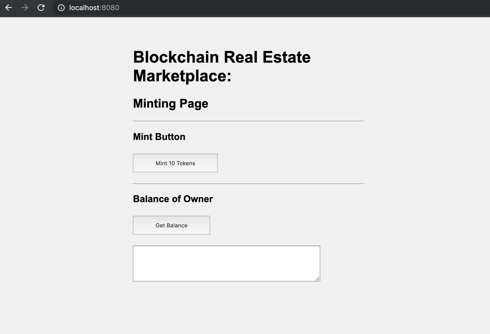

# Udacity Blockchain Capstone

The capstone will build upon the knowledge you have gained in the course in order to build a decentralized housing product. 

## Install

Clone this repository: ``` git clone https://github.com/kiyoasis/my_blockchain_capstone.git ```


To install, `npm install`


## Testing

First, in the terminal, run ganache-cli:
`ganache-cli`

In another terminal, change directory to eth-contracts by `cd eth-contracts`

Make sure that smart contracts can be compiled:
`truffle compile`

And then migrate the compiled contracts:
`truffle migrate`

Then, test each file:
`truffle test test/TestERC721Mintable.js`
`truffle test test/TestSquareVerifier.js`
`truffle test test/TestSolnSquareVerifier.js`


## Renkeby Deployment

In the eth-contracts folder, deploy the contracts in the Rinkeby test network as
```
truffle migrate —-network rinkeby
```

It shows something like...
```

em19-nb1:eth-contracts knakayama$ truffle migrate --network rinkeby

Compiling your contracts...
===========================
> Compiling ./contracts/ERC721Mintable.sol
> Compiling ./contracts/Migrations.sol
> Compiling ./contracts/Oraclize.sol
> Compiling ./contracts/SolnSquareVerifier.sol
> Compiling ./contracts/SquareVerifier.sol
> Compiling ./contracts/Verifier.sol
> Compiling openzeppelin-solidity/contracts/drafts/Counters.sol
> Compiling openzeppelin-solidity/contracts/math/SafeMath.sol
> Compiling openzeppelin-solidity/contracts/token/ERC721/IERC721Receiver.sol
> Compiling openzeppelin-solidity/contracts/utils/Address.sol

    > compilation warnings encountered:

...

> Artifacts written to /Users/knakayama/git/udacity_blockchain/My-Blockchain-Capstone/eth-contracts/build/contracts
> Compiled successfully using:
   - solc: 0.5.7+commit.6da8b019.Emscripten.clang


Migrations dry-run (simulation)
===============================
> Network name:    'rinkeby-fork'
> Network id:      4
> Block gas limit: 0x6ab6ed


1_initial_migration.js
======================

   Deploying 'Migrations'
    ...
    ...

Summary
=======
> Total deployments:   3
> Final cost:          0.05709812 ETH

```

## Etherscan: Record of Transactions


### SquareVerifier contract address
0x245B84Aa41745Ad3de5F4005918f386d2D28e256

https://rinkeby.etherscan.io/address/0x245B84Aa41745Ad3de5F4005918f386d2D28e256


#### contract hash
0xa18a0d87d305710326107d48455d980a4e09c777d175f99556109595e89ebcad

https://rinkeby.etherscan.io/tx/0xa18a0d87d305710326107d48455d980a4e09c777d175f99556109595e89ebcad


### SolnSquareVerifier contract address
0x31654cf800F64BF2f16d4231806F86cA766257A4

https://rinkeby.etherscan.io/address/0x31654cf800f64bf2f16d4231806f86ca766257a4


#### contract hash
0x0c38247aa6eb17473621b772ccd040c5b66adc742f5298e5df663eedc1e0e75c

https://rinkeby.etherscan.io/tx/0x0c38247aa6eb17473621b772ccd040c5b66adc742f5298e5df663eedc1e0e75c


## Client App for Minting

<!-- Change directory: ```cd src```. 

Install hapi and inert just by:

```
npm install
``` -->

Run the server by:
```
node src/server.js
```

Access http://localhost:8080 and input necessary information.

The DApp User Interface when running should look like...

<!--  -->


In  order to mint 10 tokens, click the ```Mint 10 Tokens``` button on the UI.

Check the number of minted tokens by clicking `Get Balance`  button.

## OpenSewas Market Place

Just access to: `https://rinkeby.opensea.io/assets/<your_contract_address>/<token_id>`

For instance, `https://rinkeby.opensea.io/assets/0x31654cf800F64BF2f16d4231806F86cA766257A4/1`


# Project Resources

* [Remix - Solidity IDE](https://remix.ethereum.org/)
* [Visual Studio Code](https://code.visualstudio.com/)
* [Truffle Framework](https://truffleframework.com/)
* [Ganache - One Click Blockchain](https://truffleframework.com/ganache)
* [Open Zeppelin ](https://openzeppelin.org/)
* [Interactive zero knowledge 3-colorability demonstration](http://web.mit.edu/~ezyang/Public/graph/svg.html)
* [Docker](https://docs.docker.com/install/)
* [ZoKrates](https://github.com/Zokrates/ZoKrates)
